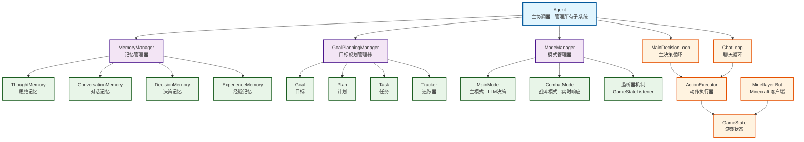
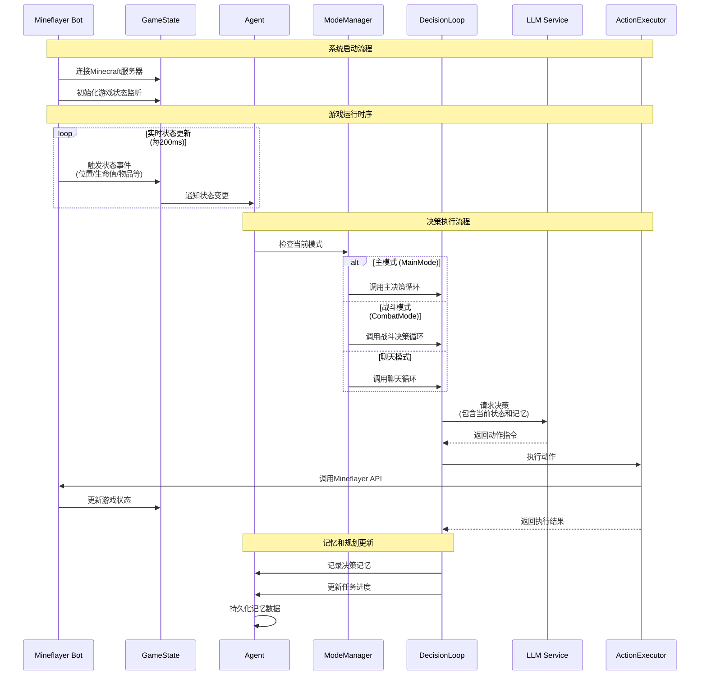

# Maicraft-Next

基于 mineflayer 的 Minecraft AI 代理 - 使用 LLM 驱动的智能游戏 Bot

是对[maicraft](https://github.com/Mai-with-u/Maicraft)项目的Typescript重构，不再需要依赖[maicraft-mcp-server](https://github.com/ChangingSelf/maicraft-mcp-server)

## ✨ 特性

### 🧠 智能决策系统

- **LLM 驱动**：使用 GPT-4/GPT-3.5/Claude 等先进模型进行决策
- **模式驱动架构**：基于原 maicraft 设计的简洁模式系统，支持实时切换
- **GameStateListener**：实时威胁检测和自动响应机制
- **实时状态感知**：无需查询动作，直接访问全局游戏状态

### 💾 先进记忆系统

- **四种记忆类型**：
  - 思维记忆 (ThoughtMemory) - AI 的内部思考过程
  - 对话记忆 (ConversationMemory) - 聊天互动历史
  - 决策记忆 (DecisionMemory) - 行动决策及结果
  - 经验记忆 (ExperienceMemory) - 学习到的经验教训
- **自动持久化**：记忆自动保存，重启后保留
- **智能清理**：自动管理记忆容量，保持最优性能

### 🎯 目标规划系统

- **层次化结构**：目标 (Goal) → 计划 (Plan) → 任务 (Task)
- **编程式追踪**：使用 TaskTracker 自动检测任务完成度
- **灵活组合**：支持任务依赖、子任务、复合追踪器
- **实时进度**：自动计算并更新任务进度百分比

### 🎮 核心功能

- **15+ 种动作**：移动、挖掘、建造、合成、战斗等
- **类型安全**：完整的 TypeScript 类型系统
- **事件驱动**：统一的事件管理系统
- **插件支持**：集成 Pathfinder、PvP、装备管理等插件
- **自动重连**：网络断开后自动重连

### 🔧 开发友好

- **模块化设计**：高内聚、低耦合的架构
- **完整文档**：详细的设计文档和 API 说明
- **单元测试**：核心模块测试覆盖
- **热重载配置**：配置变更无需重启

## 🚀 快速开始

### 前置要求

- Node.js >= 18.0.0
- 一个 Minecraft 服务器（1.16+ 推荐）
- OpenAI API Key（或其他 LLM 服务）

### 安装

```bash
# 克隆仓库
git clone https://github.com/ChangingSelf/maicraft-next.git
cd maicraft-next

# 安装依赖（推荐使用 pnpm）
pnpm install
# 或
npm install
```

### 配置

```bash
# 复制配置模板
cp config-template.toml config.toml

# 编辑配置文件
# 必须配置：
#   - minecraft.host 和 minecraft.port
#   - minecraft.username
#   - llm.openai.api_key
```

**最小配置示例：**

```toml
[minecraft]
host = "localhost"
port = 25565
username = "MaicraftBot"

[llm.openai]
enabled = true
api_key = "sk-..."  # 你的 OpenAI API Key
model = "gpt-4"
```

### 检查配置

运行预检查脚本，确保配置正确：

```bash
pnpm check
```

### 运行

```bash
# 开发模式（推荐）
pnpm dev

# 或生产模式
pnpm build
pnpm start
```

成功启动后，Bot 将连接到服务器并开始自主运行！

## 📖 完整文档中心

### 核心模块文档

#### 基础架构

- **[架构概览](docs/architecture-overview.md)** - 系统整体架构和设计理念
- **[状态管理](docs/state-management.md)** - GameState 及缓存系统（BlockCache、ContainerCache、LocationManager）
- **[缓存优化说明](docs/cache-optimization.md)** - 方块缓存系统优化详解 ✨新增
- **[事件系统](docs/event-system.md)** - 统一的事件管理机制
- **[配置系统](docs/config-system-usage.md)** - 配置文件管理和热重载

#### 核心功能

- **[动作系统](docs/action-system.md)** - 15个核心动作的设计与实现
- **[代理系统](docs/agent-system.md)** - Agent 主协调器及其子系统
- **[决策循环](docs/decision-loop.md)** - MainDecisionLoop 和 ChatLoop 的工作机制
- **[决策策略系统](docs/decision-strategy-system.md)** - 策略模式 + 责任链模式的决策架构 ✨新增

#### AI 能力

- **[记忆系统](docs/memory-system.md)** - 四种记忆类型（Thought、Conversation、Decision、Experience）
- **[规划系统](docs/planning-system.md)** - Goal-Plan-Task 层次化任务管理
- **[模式系统](docs/mode-system.md)** - 模式切换和管理机制
- **[提示词系统](docs/prompt-system.md)** - Prompt 模板管理和生成
- **[LLM 集成](docs/llm-integration.md)** - 多提供商 LLM 管理和调用
- **[依赖注入](docs/dependency-injection.md)** - DI 容器架构和使用指南

#### 开发指南

- **[测试指南](docs/TEST_GUIDE.md)** - 单元测试和集成测试说明
- **[配置使用](docs/config-system-usage.md)** - 配置文件详细使用指南

#### 设计优化

- **[设计优化详解](docs/design-optimizations.md)** - 相比 Maicraft 和 Maicraft-MCP-Server 的核心改进

## 🏗️ 架构概览



## 🔄 系统工作时序图



## 🔄 从 Maicraft 到 Maicraft-Next

### 架构对比

**Maicraft (Python + MCP)**

```
Python Agent → MCP Client → (IPC/stdio) → MCP Server → Mineflayer Bot
└──────────────────── 跨进程通信开销 ────────────────────┘
```

**Maicraft-Next (纯 TypeScript)**

```
TypeScript Agent → ActionExecutor → Mineflayer Bot
└────────── 内存直调，零开销 ──────────┘
```

### 主要改进

| 方面         | Maicraft (Python)                        | Maicraft-Next (TypeScript)       |
| ------------ | ---------------------------------------- | -------------------------------- |
| **架构**     | Python Agent + MCP Server (双进程)       | 纯 TypeScript 单体架构           |
| **通信方式** | MCP 协议 (stdio/IPC)                     | 内存直接调用                     |
| **状态访问** | 通过工具查询（如 `query_player_status`） | GameState 实时访问               |
| **动作数量** | 25+ 个（含多个查询类动作）               | 15 个核心动作（去除查询类）      |
| **类型安全** | Python 动态类型                          | TypeScript 静态类型 + 编译时检查 |
| **记忆系统** | 简单的 thinking_log                      | 4种专门记忆类型 + 持久化         |
| **任务管理** | 简单的 to_do_list                        | Goal-Plan-Task 层次化系统        |
| **性能**     | 跨进程开销                               | 性能提升 10-50x                  |
| **方块缓存** | 定期全量扫描 + 线性查询                  | 区块事件驱动 + 空间索引          |
| **缓存查询** | ~500ms (380万方块)                       | ~5ms (100-1000x 提升)            |
| **内存占用** | ~200 bytes/方块                          | ~50 bytes/方块 (减少75%)         |

### 核心设计理念

#### 1. 去除查询动作，状态全局可访问 ✅

**之前 (Maicraft Python)**

```python
# ❌ 需要通过工具查询状态
result = await mcp_client.call_tool("query_player_status", {})
health = result['data']['health']
```

**现在 (Maicraft-Next)**

```typescript
// ✅ 状态实时可访问，无需查询
const health = gameState.health;
const food = gameState.food;
const position = gameState.position;
```

#### 2. 精简动作列表，优化 LLM 上下文 ✅

- **去除**：7个查询类动作（`query_player_status`、`query_game_state` 等）
- **保留**：15个核心执行动作，基于实际使用频率优化
- **优势**：减少 LLM 上下文占用，提升决策质量

#### 3. 类型安全的动作调用 ✅

```typescript
// ✅ 使用 ActionIds 常量，避免拼写错误
await executor.execute(ActionIds.MOVE, { x: 100, y: 64, z: 200 });

// ✅ 完整的 TypeScript 类型检查
// 编译时就能发现参数错误
```

#### 4. 统一事件系统 ✅

```typescript
// ✅ 保持 mineflayer 原始事件名
context.events.on('entityHurt', (data) => { ... });
context.events.on('health', (data) => { ... });

// ✅ 支持自定义事件
context.events.on('actionComplete', (data) => { ... });
```

#### 5. 完整的 AI 能力系统 ✅

- **记忆系统**：4种专门记忆类型，支持查询和持久化
- **规划系统**：Goal-Plan-Task 三层结构，支持进度追踪
- **模式系统**：灵活的模式切换机制，适应不同场景

#### 6. 高性能缓存系统 ✅ 

```typescript
// ✅ 基于 Minecraft 区块事件的智能缓存
bot.on('chunkColumnLoad', () => scanChunk());    // 区块加载时扫描
bot.on('chunkColumnUnload', () => clearChunk()); // 区块卸载时清理

// ✅ 区块索引 + 空间查询，查询速度提升 100-1000x
const blocks = blockCache.getBlocksInRadius(x, y, z, 50);

// ✅ 可选"只缓存可见方块"，更拟人且节省内存
config.onlyVisibleBlocks = true;
```

**缓存系统优化详情**：查看 [缓存优化说明](docs/cache-optimization.md)

---

## 🎯 快速开始

1. **安装和配置** - 查看项目根目录的 [README.md](../README.md)
2. **了解架构** - 阅读 [架构概览](docs/architecture-overview.md)
3. **学习动作系统** - 阅读 [动作系统](docs/action-system.md)
4. **探索 AI 能力** - 阅读 [记忆系统](docs/memory-system.md) 和 [规划系统](docs/planning-system.md)
5. **深入了解优化** - 阅读 [设计优化详解](docs/design-optimizations.md)

---

## 📝 文档约定

- ✅ 表示已实现的功能
- 🚧 表示正在开发的功能
- 📖 表示设计文档
- 💡 表示最佳实践
- ⚠️ 表示注意事项

---

## 🤝 贡献

发现文档有误或需要补充？欢迎提交 Issue 或 PR！

---

_最后更新: 2025-11-01_  
_版本: 2.0_

---

## 🎯 核心概念

### GameState - 实时游戏状态

无需查询动作，所有状态实时可访问：

```typescript
// 直接访问当前状态
const pos = gameState.blockPosition;
const health = gameState.health;
const inventory = gameState.inventory;
```

### Action - 统一动作系统

所有动作平等，类型安全：

```typescript
await executor.execute('move', { x: 100, y: 64, z: 200 });
await executor.execute('mine_block', { name: 'oak_log', count: 10 });
await executor.execute('craft', { item: 'wooden_pickaxe', count: 1 });
```

### Memory - 分层记忆

四种专门的记忆类型，支持查询和持久化：

```typescript
// 记录思维
await memory.thought.record({
  category: 'planning',
  content: '我需要先收集木头',
  context: { goal: 'build_house' },
});

// 查询相关记忆
const decisions = await memory.decision.query({
  filters: { action: 'mine_block' },
  limit: 10,
});
```

### Goal-Plan-Task - 目标规划

层次化的任务管理：

```typescript
// 创建目标
const goal = await planning.createGoal({
  name: '建造房子',
  description: '在当前位置建造一个木质房子',
  priority: 'high',
});

// 为目标添加计划
const plan = await planning.createPlan(goal.id, {
  name: '收集材料计划',
  tasks: [
    {
      name: '收集64个橡木',
      tracker: { type: 'inventory', item: 'oak_log', count: 64 },
    },
    {
      name: '制作木板',
      tracker: { type: 'inventory', item: 'oak_planks', count: 256 },
    },
  ],
});
```

## 🛠️ 可用动作

| 动作                     | 说明         | 参数                             |
| ------------------------ | ------------ | -------------------------------- |
| `chat`                   | 发送聊天消息 | `message: string`                |
| `move`                   | 移动到坐标   | `x, y, z: number`                |
| `find_block`             | 搜索方块     | `block: string, radius?: number` |
| `mine_block`             | 挖掘方块     | `name: string, count?: number`   |
| `mine_block_by_position` | 挖掘指定位置 | `x, y, z: number`                |
| `place_block`            | 放置方块     | `name: string, x, y, z: number`  |
| `craft`                  | 合成物品     | `item: string, count?: number`   |

更多动作持续开发中...

## 🔌 支持的 LLM 提供商

- ✅ **OpenAI** (GPT-4, GPT-3.5-Turbo)
- 🚧 **Azure OpenAI**
- 🚧 **Anthropic Claude**

## 🧪 测试

```bash
# 运行所有测试
pnpm test

# 监听模式
pnpm test:watch

# 生成覆盖率报告
pnpm test:coverage

# 运行测试 Bot（无 AI）
pnpm test-bot
```

## 📊 实现状态

查看 [IMPLEMENTATION_STATUS.md](IMPLEMENTATION_STATUS.md) 了解当前开发进度。

核心系统：

- ✅ GameState
- ✅ ActionExecutor
- ✅ EventEmitter
- ✅ Agent 架构
- ✅ Memory 系统
- ✅ Goal-Planning 系统
- ✅ Mode 管理
- ✅ LLM 集成

正在开发：

- 🚧 更多动作实现
- 🚧 Web 管理界面
- 🚧 多 Agent 协作

## 🤝 贡献

欢迎贡献！请查看我们的贡献指南（即将推出）。

## 📄 许可证

MIT License - 详见 [LICENSE](LICENSE) 文件

## 🙏 致谢

本项目基于以下优秀的开源项目：

- [Mineflayer](https://github.com/PrismarineJS/mineflayer) - Minecraft Bot 框架
- [OpenAI](https://openai.com/) - LLM 服务
- [TypeScript](https://www.typescriptlang.org/) - 类型安全的 JavaScript

## 📮 联系方式

- GitHub: [@ChangingSelf](https://github.com/ChangingSelf)
- Issues: [提交问题](https://github.com/ChangingSelf/maicraft-next/issues)

---

⭐ 如果这个项目对你有帮助，请给我们一个 Star！
