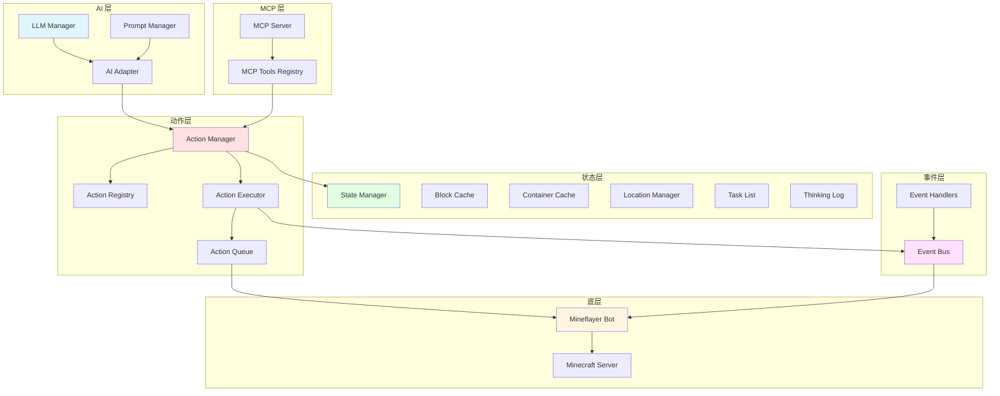

# 动作系统设计评估与改进建议

## 📋 评估概览

本文档基于对 maicraft (Python)、maicraft-mcp-server (TypeScript) 和 maicraft-next 的分析，评估当前 `action-system.md` 的设计，并提出改进方案。

---

## 🔍 主要问题分析

### 1. **架构定位矛盾** ❌

**问题描述:**
- 设计文档声称"去除 MCP 协议中间层"
- 但 ActionExecutor.ts 仍有完整的 MCP 工具定义和发现机制
- 未明确说明 MCP 在新架构中的角色

**影响:**
- 架构目标不清晰
- 可能导致代码冗余或功能缺失

**改进建议:**
```
明确定位：maicraft-next 应该是一个"MCP Server + AI Agent 一体化"架构
- 保留 MCP Server 能力（对外提供标准接口）
- 内置 AI Agent（直接调用动作，无 IPC 开销）
- 支持双模式：作为独立 Agent 运行 OR 作为 MCP Server 被其他 Agent 调用
```

---

### 2. **缺少事件系统集成** ⚠️

**问题描述:**
- maicraft (Python) 有完整的事件系统（25+ 事件类型）
- 设计文档提到 `EventBus` 但没有详细设计
- 动作执行无法响应游戏事件（如受伤、死亡、背包满等）

**Python 事件系统示例:**
```python
# maicraft/agent/events/
- base_event.py
- event_emitter.py
- event_registry.py
- impl/
  - health_event.py
  - death_event.py
  - entity_hurt_event.py
  - item_drop_event.py
  ...
```

**改进建议:**
```typescript
// 1. 事件系统核心接口
export interface GameEvent {
  type: string;
  timestamp: number;
  data: any;
}

export class EventBus {
  on(event: string, handler: (e: GameEvent) => void): void;
  off(event: string, handler: Function): void;
  emit(event: GameEvent): void;
  once(event: string, handler: (e: GameEvent) => void): void;
}

// 2. 动作上下文需要包含事件总线
export interface ActionContext {
  bot: Bot;
  world: WorldInfo;
  executor: ActionExecutor;
  eventBus: EventBus;  // ✅ 已在设计文档中，但需实现
  logger: Logger;
  config: Config;
}

// 3. 动作可以监听和触发事件
export abstract class Action<T extends ActionParams> {
  // 动作执行前后的钩子
  protected onBeforeExecute?(context: ActionContext): Promise<void>;
  protected onAfterExecute?(context: ActionContext, result: ActionResult): Promise<void>;
  
  // 订阅相关事件
  protected subscribeEvents?(eventBus: EventBus): void;
}

// 4. 示例：受伤时中断挖掘动作
class MineBlockAction extends Action<MineParams> {
  protected subscribeEvents(eventBus: EventBus): void {
    eventBus.on('entity_hurt', (e) => {
      if (e.data.attacker) {
        this.interrupt('受到攻击，中断挖掘');
      }
    });
  }
}
```

---

### 3. **缺少状态管理系统** ⚠️

**问题描述:**
- maicraft (Python) 有丰富的状态管理：
  - `block_cache`: 方块缓存
  - `container_cache`: 容器（箱子、熔炉）缓存
  - `location_points`: 位置标记
  - `thinking_log`: 思考日志
  - `to_do_list`: 任务列表
- 设计文档未涉及状态管理

**改进建议:**
```typescript
// 1. 动作上下文应包含状态管理器
export interface ActionContext {
  bot: Bot;
  world: WorldInfo;
  executor: ActionExecutor;
  eventBus: EventBus;
  logger: Logger;
  config: Config;
  
  // 新增状态管理
  stateManager: StateManager;
}

// 2. 状态管理器接口
export interface StateManager {
  blockCache: BlockCache;
  containerCache: ContainerCache;
  locationManager: LocationManager;
  taskList: TaskList;
  thinkingLog: ThinkingLog;
}

// 3. 示例：方块缓存
export class BlockCache {
  remember(position: Vec3, blockType: string, metadata?: any): void;
  recall(position: Vec3): BlockInfo | null;
  forget(position: Vec3): void;
  findNearest(blockType: string, from: Vec3): Vec3 | null;
}

// 4. 示例：容器缓存
export class ContainerCache {
  saveContainer(position: Vec3, type: 'chest' | 'furnace', items: Item[]): void;
  getContainer(position: Vec3): ContainerInfo | null;
  findContainerWithItem(itemName: string): Vec3 | null;
}
```

---

### 4. **错误处理策略不完善** ⚠️

**问题描述:**
- 只有基础的 timeout 和 try-catch
- 缺少重试机制、降级策略、错误分类
- ActionExecutor 的错误处理过于简单

**当前代码问题:**
```typescript
// ActionExecutor.ts - 第 316 行
catch (error) {
  this.logger.error(`执行动作 ${name} 时发生错误:`, error);
  return {
    success: false,
    message: `执行动作 ${name} 时发生错误: ${error.message}`,
    error: 'EXECUTION_ERROR'  // ❌ 错误类型太笼统
  };
}
```

**改进建议:**
```typescript
// 1. 错误分类
export enum ActionErrorType {
  // 可重试错误
  TIMEOUT = 'TIMEOUT',
  NETWORK_ERROR = 'NETWORK_ERROR',
  PATH_NOT_FOUND = 'PATH_NOT_FOUND',
  RESOURCE_BUSY = 'RESOURCE_BUSY',
  
  // 不可重试错误
  INVALID_PARAMS = 'INVALID_PARAMS',
  ACTION_NOT_FOUND = 'ACTION_NOT_FOUND',
  PERMISSION_DENIED = 'PERMISSION_DENIED',
  INVALID_STATE = 'INVALID_STATE',
  
  // 需要人工介入
  FATAL_ERROR = 'FATAL_ERROR',
}

// 2. 重试配置
export interface RetryConfig {
  maxRetries: number;
  retryDelay: number;
  retryableErrors: ActionErrorType[];
  backoffMultiplier?: number;
}

// 3. 错误处理增强
export class ActionExecutor {
  private retryConfig: RetryConfig = {
    maxRetries: 3,
    retryDelay: 1000,
    retryableErrors: [
      ActionErrorType.TIMEOUT,
      ActionErrorType.NETWORK_ERROR,
      ActionErrorType.PATH_NOT_FOUND
    ],
    backoffMultiplier: 2
  };

  private async executeWithRetry(
    name: string,
    bot: Bot,
    params: BaseActionParams,
    timeout?: number
  ): Promise<ActionResult> {
    let lastError: ActionResult | null = null;
    
    for (let attempt = 0; attempt <= this.retryConfig.maxRetries; attempt++) {
      try {
        return await this.executeAction(name, bot, params, timeout);
      } catch (error) {
        const errorType = this.classifyError(error);
        
        // 不可重试错误直接返回
        if (!this.retryConfig.retryableErrors.includes(errorType)) {
          throw error;
        }
        
        // 达到最大重试次数
        if (attempt === this.retryConfig.maxRetries) {
          throw error;
        }
        
        // 等待后重试
        const delay = this.retryConfig.retryDelay * 
          Math.pow(this.retryConfig.backoffMultiplier || 1, attempt);
        this.logger.warn(`动作 ${name} 失败，${delay}ms 后重试 (${attempt + 1}/${this.retryConfig.maxRetries})`);
        await new Promise(resolve => setTimeout(resolve, delay));
      }
    }
    
    throw lastError;
  }

  private classifyError(error: any): ActionErrorType {
    // 根据错误消息或类型分类
    if (error.message?.includes('超时')) return ActionErrorType.TIMEOUT;
    if (error.message?.includes('path')) return ActionErrorType.PATH_NOT_FOUND;
    if (error.message?.includes('参数')) return ActionErrorType.INVALID_PARAMS;
    return ActionErrorType.FATAL_ERROR;
  }
}
```

---

### 5. **复合动作设计过于简单** ⚠️

**问题描述:**
- `BuildHouseAction` 示例过于简化
- 没有说明：
  - 子动作失败如何处理？
  - 是否支持部分成功？
  - 如何回滚已完成的步骤？
  - 如何保存进度以便恢复？

**改进建议:**
```typescript
// 1. 复合动作基类
export abstract class CompositeAction<T extends ActionParams> extends Action<T> {
  protected subActions: ActionStep[] = [];
  protected currentStep: number = 0;
  
  // 子动作步骤
  protected abstract createSubActions(context: ActionContext, params: T): ActionStep[];
  
  async execute(context: ActionContext, params: T): Promise<ActionResult> {
    this.subActions = this.createSubActions(context, params);
    const results: ActionResult[] = [];
    
    for (let i = this.currentStep; i < this.subActions.length; i++) {
      const step = this.subActions[i];
      
      try {
        // 执行子动作
        const result = await context.executor.execute(
          step.actionName,
          context.bot,
          step.params
        );
        
        results.push(result);
        
        // 失败处理
        if (!result.success) {
          if (step.required) {
            // 必需步骤失败，根据策略处理
            return await this.handleStepFailure(context, i, result, results);
          }
          // 可选步骤失败，记录后继续
          this.logger.warn(`可选步骤 ${i} 失败: ${result.message}`);
        }
        
        // 保存进度
        this.currentStep = i + 1;
        await this.saveProgress(context, i + 1);
        
      } catch (error) {
        return await this.handleStepError(context, i, error, results);
      }
    }
    
    return {
      success: true,
      message: '复合动作完成',
      data: { steps: results }
    };
  }
  
  // 处理步骤失败
  protected async handleStepFailure(
    context: ActionContext,
    step: number,
    result: ActionResult,
    completedResults: ActionResult[]
  ): Promise<ActionResult> {
    // 策略1: 回滚已完成的步骤
    if (this.shouldRollback()) {
      await this.rollback(context, completedResults);
      return {
        success: false,
        message: `步骤 ${step} 失败，已回滚`,
        error: 'STEP_FAILED_ROLLBACK'
      };
    }
    
    // 策略2: 返回部分成功
    return {
      success: false,
      message: `步骤 ${step} 失败，已完成 ${completedResults.length} 个步骤`,
      data: { completedSteps: completedResults },
      error: 'PARTIAL_SUCCESS'
    };
  }
  
  // 回滚机制
  protected async rollback(
    context: ActionContext,
    completedResults: ActionResult[]
  ): Promise<void> {
    // 逆序执行回滚动作
    for (let i = completedResults.length - 1; i >= 0; i--) {
      const step = this.subActions[i];
      if (step.rollbackAction) {
        try {
          await context.executor.execute(
            step.rollbackAction,
            context.bot,
            step.rollbackParams || {}
          );
        } catch (error) {
          this.logger.error(`回滚步骤 ${i} 失败:`, error);
        }
      }
    }
  }
  
  // 保存进度
  protected async saveProgress(context: ActionContext, step: number): Promise<void> {
    // 保存到状态管理器，以便恢复
    await context.stateManager.taskList.updateProgress(this.id, {
      currentStep: step,
      totalSteps: this.subActions.length
    });
  }
  
  // 是否应该回滚
  protected shouldRollback(): boolean {
    return false; // 子类可覆盖
  }
}

// 2. 动作步骤接口
export interface ActionStep {
  actionName: string;
  params: ActionParams;
  required: boolean; // 是否必需
  rollbackAction?: string; // 回滚动作名称
  rollbackParams?: ActionParams; // 回滚动作参数
}

// 3. 示例：建造房屋（支持回滚）
export class BuildHouseAction extends CompositeAction<BuildParams> {
  protected createSubActions(context: ActionContext, params: BuildParams): ActionStep[] {
    const { x, y, z, width, height, depth, material } = params;
    const steps: ActionStep[] = [];
    
    // 1. 清理地基
    steps.push({
      actionName: 'clearArea',
      params: { x, y, z, width, depth },
      required: true
    });
    
    // 2. 铺设地板
    for (let i = 0; i < width; i++) {
      for (let j = 0; j < depth; j++) {
        steps.push({
          actionName: 'placeBlock',
          params: { x: x + i, y: y, z: z + j, blockName: material },
          required: true,
          rollbackAction: 'mineBlock', // 回滚时挖掉方块
          rollbackParams: { x: x + i, y: y, z: z + j }
        });
      }
    }
    
    // 3. 建造墙壁
    // ...
    
    return steps;
  }
  
  protected shouldRollback(): boolean {
    return true; // 建造失败时回滚
  }
}
```

---

### 6. **缺少动作执行上下文持久化** ⚠️

**问题描述:**
- maicraft (Python) 有 `thinking_log.py` 和 `to_do_list.py`
- 可以保存和恢复执行状态
- 设计文档没有涉及持久化

**Python 实现参考:**
```python
# maicraft/agent/thinking_log.py
class ThinkingLog:
    def add_entry(self, thinking: str, action: str, result: str): ...
    def save(self): ...
    def load(self): ...

# maicraft/agent/to_do_list.py  
class ToDoList:
    def add_task(self, task: str, priority: int): ...
    def complete_task(self, task_id: str): ...
    def save_state(self): ...
```

**改进建议:**
```typescript
// 1. 执行历史记录
export interface ActionExecutionRecord {
  id: string;
  actionName: string;
  params: ActionParams;
  startTime: number;
  endTime?: number;
  result?: ActionResult;
  status: 'pending' | 'executing' | 'completed' | 'failed';
  retryCount: number;
  parentActionId?: string; // 复合动作的父ID
}

// 2. 执行历史管理器
export class ActionHistory {
  private records: Map<string, ActionExecutionRecord> = new Map();
  
  recordStart(actionId: string, name: string, params: ActionParams): void {
    this.records.set(actionId, {
      id: actionId,
      actionName: name,
      params,
      startTime: Date.now(),
      status: 'executing',
      retryCount: 0
    });
    this.persist();
  }
  
  recordEnd(actionId: string, result: ActionResult): void {
    const record = this.records.get(actionId);
    if (record) {
      record.endTime = Date.now();
      record.result = result;
      record.status = result.success ? 'completed' : 'failed';
      this.persist();
    }
  }
  
  getHistory(limit: number = 100): ActionExecutionRecord[] {
    return Array.from(this.records.values())
      .sort((a, b) => b.startTime - a.startTime)
      .slice(0, limit);
  }
  
  private persist(): void {
    // 持久化到文件或数据库
    fs.writeFileSync(
      'data/action_history.json',
      JSON.stringify(Array.from(this.records.values()), null, 2)
    );
  }
  
  async load(): Promise<void> {
    // 从文件加载
    if (fs.existsSync('data/action_history.json')) {
      const data = JSON.parse(fs.readFileSync('data/action_history.json', 'utf-8'));
      data.forEach((record: ActionExecutionRecord) => {
        this.records.set(record.id, record);
      });
    }
  }
}

// 3. 在 ActionExecutor 中集成
export class ActionExecutor {
  private history = new ActionHistory();
  
  async executeAction(name: string, bot: Bot, params: BaseActionParams): Promise<ActionResult> {
    const actionId = `action_${Date.now()}_${Math.random().toString(36).substr(2, 9)}`;
    
    // 记录开始
    this.history.recordStart(actionId, name, params);
    
    try {
      const result = await this.internalExecute(name, bot, params);
      
      // 记录结束
      this.history.recordEnd(actionId, result);
      
      return result;
    } catch (error) {
      const result = {
        success: false,
        message: error.message,
        error: 'EXECUTION_ERROR'
      };
      this.history.recordEnd(actionId, result);
      throw error;
    }
  }
}
```

---

### 7. **LLM 集成路径不够具体** ⚠️

**问题描述:**
- 提到"从提示词模式到工具调用模式"
- 但没有说明具体的实现步骤
- 没有说明如何兼容现有的 maicraft AI Agent

**改进建议:**
```typescript
// 1. 统一的 AI 接口适配器
export class AIActionAdapter {
  constructor(
    private actionManager: ActionManager,
    private eventBus: EventBus
  ) {}
  
  // 方案A: 工具调用模式 (OpenAI Function Calling)
  async executeToolCalls(toolCalls: ToolCall[]): Promise<ToolCallResult[]> {
    const results: ToolCallResult[] = [];
    
    for (const call of toolCalls) {
      try {
        const result = await this.actionManager.executeAction(
          call.function.name,
          JSON.parse(call.function.arguments)
        );
        
        results.push({
          tool_call_id: call.id,
          output: JSON.stringify(result)
        });
      } catch (error) {
        results.push({
          tool_call_id: call.id,
          output: JSON.stringify({ error: error.message })
        });
      }
    }
    
    return results;
  }
  
  // 方案B: 提示词模式 (maicraft 当前方式)
  async executeFromPrompt(aiResponse: string): Promise<ActionResult> {
    // 解析 AI 返回的动作指令
    const parsed = this.parseActionFromPrompt(aiResponse);
    
    if (!parsed) {
      return {
        success: false,
        message: '无法解析 AI 响应',
        error: 'PARSE_ERROR'
      };
    }
    
    return await this.actionManager.executeAction(
      parsed.actionName,
      parsed.params
    );
  }
  
  // 方案C: MCP 协议模式 (作为 MCP Server)
  async executeFromMCP(request: McpRequest): Promise<McpResponse> {
    const result = await this.actionManager.executeAction(
      request.method,
      request.params
    );
    
    return {
      jsonrpc: '2.0',
      id: request.id,
      result: result
    };
  }
  
  // 获取工具定义 (用于 OpenAI Function Calling)
  getToolDefinitions(): ToolDefinition[] {
    return this.actionManager.getToolDefinitions();
  }
  
  // 解析提示词中的动作
  private parseActionFromPrompt(response: string): { actionName: string; params: any } | null {
    // 支持多种格式:
    // 1. JSON: {"action": "move", "params": {"x": 100, "y": 64, "z": 200}}
    // 2. 结构化: [MOVE] x:100, y:64, z:200
    // 3. 自然语言: "移动到坐标 (100, 64, 200)"
    
    // 示例实现 (JSON 格式)
    try {
      const match = response.match(/\{[\s\S]*"action"[\s\S]*\}/);
      if (match) {
        const parsed = JSON.parse(match[0]);
        return {
          actionName: parsed.action,
          params: parsed.params || {}
        };
      }
    } catch {}
    
    return null;
  }
}

// 2. 在 maicraft-next 中集成
export class MaicraftAgent {
  private aiAdapter: AIActionAdapter;
  
  async think(userInput: string): Promise<void> {
    // 获取工具定义
    const tools = this.aiAdapter.getToolDefinitions();
    
    // 调用 LLM
    const response = await this.llmManager.chat([
      { role: 'user', content: userInput }
    ], { tools });
    
    // 如果 LLM 返回工具调用
    if (response.choices[0].message.tool_calls) {
      const results = await this.aiAdapter.executeToolCalls(
        response.choices[0].message.tool_calls
      );
      
      // 将结果反馈给 LLM
      // ...
    }
  }
}
```

---

### 8. **缺少性能优化和监控** ⚠️

**改进建议:**
```typescript
// 1. 动作执行指标
export interface ActionMetrics {
  actionName: string;
  executionCount: number;
  successCount: number;
  failureCount: number;
  averageExecutionTime: number;
  maxExecutionTime: number;
  minExecutionTime: number;
  lastExecutionTime: number;
}

// 2. 指标收集器
export class MetricsCollector {
  private metrics: Map<string, ActionMetrics> = new Map();
  
  recordExecution(
    actionName: string,
    executionTime: number,
    success: boolean
  ): void {
    let metric = this.metrics.get(actionName);
    
    if (!metric) {
      metric = {
        actionName,
        executionCount: 0,
        successCount: 0,
        failureCount: 0,
        averageExecutionTime: 0,
        maxExecutionTime: 0,
        minExecutionTime: Infinity,
        lastExecutionTime: 0
      };
      this.metrics.set(actionName, metric);
    }
    
    metric.executionCount++;
    if (success) {
      metric.successCount++;
    } else {
      metric.failureCount++;
    }
    
    metric.lastExecutionTime = executionTime;
    metric.maxExecutionTime = Math.max(metric.maxExecutionTime, executionTime);
    metric.minExecutionTime = Math.min(metric.minExecutionTime, executionTime);
    
    // 更新平均执行时间
    metric.averageExecutionTime = 
      (metric.averageExecutionTime * (metric.executionCount - 1) + executionTime) /
      metric.executionCount;
  }
  
  getMetrics(actionName?: string): ActionMetrics[] {
    if (actionName) {
      const metric = this.metrics.get(actionName);
      return metric ? [metric] : [];
    }
    return Array.from(this.metrics.values());
  }
  
  getTopSlowest(limit: number = 10): ActionMetrics[] {
    return Array.from(this.metrics.values())
      .sort((a, b) => b.averageExecutionTime - a.averageExecutionTime)
      .slice(0, limit);
  }
  
  getTopFailing(limit: number = 10): ActionMetrics[] {
    return Array.from(this.metrics.values())
      .filter(m => m.executionCount > 0)
      .sort((a, b) => {
        const failRateA = a.failureCount / a.executionCount;
        const failRateB = b.failureCount / b.executionCount;
        return failRateB - failRateA;
      })
      .slice(0, limit);
  }
}

// 3. 在 ActionExecutor 中集成
export class ActionExecutor {
  private metrics = new MetricsCollector();
  
  private async executeAction(name: string, bot: Bot, params: BaseActionParams): Promise<ActionResult> {
    const startTime = Date.now();
    
    try {
      const result = await this.internalExecute(name, bot, params);
      
      const executionTime = Date.now() - startTime;
      this.metrics.recordExecution(name, executionTime, result.success);
      
      return result;
    } catch (error) {
      const executionTime = Date.now() - startTime;
      this.metrics.recordExecution(name, executionTime, false);
      throw error;
    }
  }
  
  getMetrics(): ActionMetrics[] {
    return this.metrics.getMetrics();
  }
}
```

---

## 📐 改进后的整体架构



---

## 🎯 推荐的改进优先级

### 🔥 P0 - 立即实现
1. **明确架构定位** - 定义 MCP 和 Agent 的关系
2. **事件系统集成** - 实现基础的 EventBus
3. **状态管理系统** - 至少实现 BlockCache 和 TaskList

### ⚡ P1 - 短期实现
4. **增强错误处理** - 实现重试机制和错误分类
5. **复合动作增强** - 支持部分成功和简单回滚
6. **AI 适配器** - 实现工具调用模式

### 🌟 P2 - 中期实现
7. **执行历史持久化** - 保存和恢复执行状态
8. **性能监控** - 指标收集和分析

---

## 📚 参考实现

### 从 maicraft (Python) 迁移建议

| Python 模块 | TypeScript 对应 | 优先级 |
|------------|----------------|--------|
| `agent/events/` | `src/events/` | P0 |
| `agent/block_cache/` | `src/state/BlockCache.ts` | P0 |
| `agent/to_do_list.py` | `src/state/TaskList.ts` | P0 |
| `agent/thinking_log.py` | `src/state/ThinkingLog.ts` | P1 |
| `agent/container_cache/` | `src/state/ContainerCache.ts` | P1 |
| `agent/environment/locations.py` | `src/state/LocationManager.ts` | P1 |

---

## 💡 总结

当前 `action-system.md` 的核心设计是好的，但缺少以下关键组件：

1. ✅ **保留**: Action 基类、ActionManager、分层参数设计
2. ➕ **新增**: EventBus、StateManager、ErrorHandler、AI Adapter
3. 🔄 **增强**: CompositeAction、ActionExecutor、持久化机制
4. 📝 **明确**: MCP 角色定位、迁移路径、实现优先级

**下一步建议:**
1. 先实现 P0 优先级的改进
2. 编写详细的 API 文档
3. 创建示例代码和测试用例
4. 逐步从 maicraft (Python) 迁移功能

---

*本文档基于对三个项目的深入分析，旨在为 maicraft-next 提供清晰的改进方向。*

