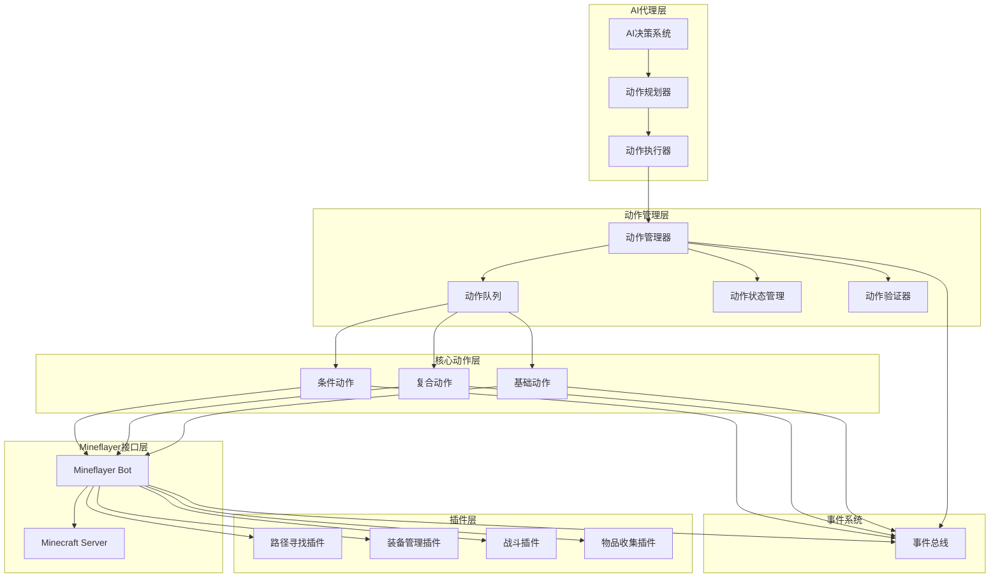
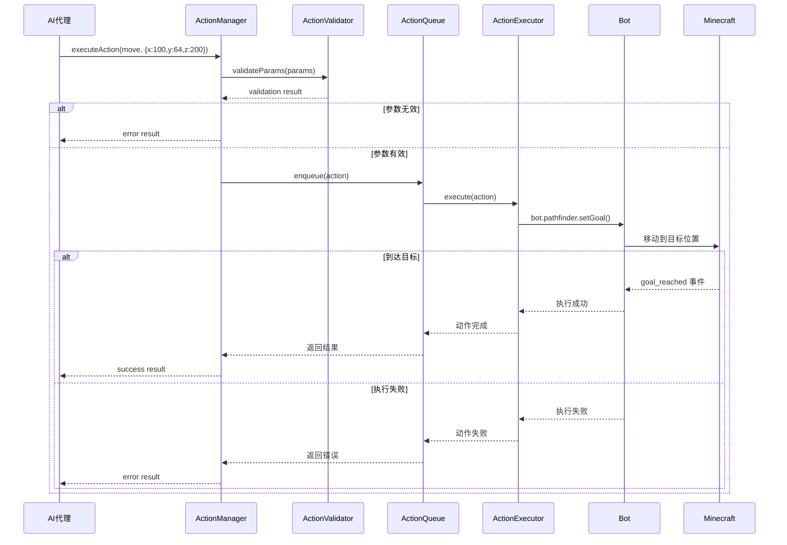

# 动作系统设计文档

## 概述

本设计文档描述了maicraft-next项目的动作系统架构。新架构将maicraft的Python AI代理系统与maicraft-mcp-server的TypeScript MCP服务器合并为统一的mineflayer架构，去除MCP协议中间层，实现更高效的单一进程架构。

## 1. 设计原则

### 1.1 架构原则
- **单一进程**: 使用mineflayer直接操作Minecraft，无需MCP协议中间层
- **模块化设计**: 动作系统采用模块化设计，易于扩展和维护
- **类型安全**: 完整的TypeScript类型定义，编译时保证类型安全
- **异步优先**: 所有动作执行都基于Promise，支持异步操作
- **事件驱动**: 基于事件系统实现动作状态通知

### 1.2 性能原则
- **高效执行**: 减少不必要的中间层和序列化开销
- **资源优化**: 智能的队列管理和资源调度
- **并发控制**: 支持并行动作执行和冲突检测
- **内存管理**: 合理的生命周期管理和内存释放

## 2. 系统架构

### 2.1 总体架构图



### 2.2 核心组件

#### 2.2.1 ActionManager - 动作管理器（支持泛型和工具调用）
```typescript
/**
 * 动作管理器 - 支持类型安全的动作执行和LLM工具调用
 */
export class ActionManager {
    private actions: Map<string, Action<any>> = new Map();
    private actionQueue: ActionQueue;
    private actionExecutor: ActionExecutor;
    private eventBus: EventBus;

    /**
     * 注册动作 - 支持泛型动作
     */
    registerAction<T extends ActionParams>(action: Action<T>): void;

    /**
     * 执行动作 - 类型安全的内部调用
     */
    executeAction<T extends ActionParams>(actionId: string, params: T): Promise<ActionResult>;

    /**
     * 执行工具调用 - 兼容LLM工具调用
     */
    async executeToolCall(toolCall: ToolCall): Promise<ActionResult> {
        const action = this.actions.get(toolCall.function.name);
        if (!action) {
            throw new Error(`Tool not found: ${toolCall.function.name}`);
        }

        const params = JSON.parse(toolCall.function.arguments) as ActionParams;

        // 对AI生成的参数进行基本验证
        const errors = action.validateParams(params);
        if (errors.length > 0) {
            throw new Error(`Invalid parameters: ${errors.join(', ')}`);
        }

        return action.execute(this.createContext(), params);
    }

    /**
     * 获取工具定义 - 为LLM工具调用生成schema
     */
    getToolDefinitions(): ToolDefinition[] {
        return Array.from(this.actions.values()).map(action => action.getAIDescription());
    }

    /**
     * 取消动作
     */
    cancelAction(actionId: string): boolean;

    /**
     * 获取动作状态
     */
    getActionStatus(actionId: string): ActionStatus;
}
```

#### 2.2.2 Action - 动作基类（使用泛型设计）
```typescript
/**
 * 动作参数接口 - 使用TypeScript接口定义
 */
export interface MoveParams {
    x: number;
    y: number;
    z: number;
    allowPartial?: boolean;
    range?: number;
}

export interface MineParams {
    x: number;
    y: number;
    z: number;
    useBestTool?: boolean;
    bypassChecks?: boolean;
}

export interface UseParams {
    itemName: string;
    targetBlock?: { x: number; y: number; z: number };
    duration?: number;
}

// 动作参数联合类型
export type ActionParams = MoveParams | MineParams | UseParams;

/**
 * 动作基类 - 使用泛型支持类型安全的参数传递
 */
export abstract class Action<T extends ActionParams = any> {
    public abstract readonly id: string;
    public abstract readonly name: string;
    public abstract readonly description: string;
    public abstract readonly category: ActionCategory;
    public abstract readonly timeout: number;

    /**
     * 执行动作 - 直接使用类型安全的参数
     */
    public abstract execute(context: ActionContext, params: T): Promise<ActionResult>;

    /**
     * 生成AI工具描述 - 为LLM工具调用提供schema
     */
    public abstract getAIDescription(): AIDescription;

    /**
     * 可选：基本参数验证 - 主要用于AI生成的参数
     */
    protected validateParams(params: T): ValidationError[] {
        return []; // 默认无验证，子类可重写
    }

    /**
     * 检查执行条件
     */
    public canExecute(context: ActionContext): boolean {
        return true; // 默认可执行，子类可重写
    }

    /**
     * 取消动作执行
     */
    public cancel(): void {
        // 默认空实现，子类可重写
    }
}

/**
 * AI工具描述接口 - 兼容LLM工具调用
 */
export interface AIDescription {
    name: string;
    description: string;
    parameters: {
        type: 'object';
        properties: Record<string, {
            type: string;
            description: string;
            required?: boolean;
            default?: any;
        }>;
        required: string[];
    };
    examples?: Array<{
        context: string;
        params: T;
    }>;
}
```

#### 2.2.3 ActionContext - 动作上下文
```typescript
/**
 * 动作执行上下文
 */
export interface ActionContext {
    /** Mineflayer bot实例 */
    bot: Bot;

    /** 游戏世界信息 */
    world: WorldInfo;

    /** 动作执行器 */
    executor: ActionExecutor;

    /** 事件总线 */
    eventBus: EventBus;

    /** 日志器 */
    logger: Logger;

    /** 配置管理器 */
    config: Config;

    /** 自定义数据 */
    data: Record<string, any>;
}
```

## 3. 参数设计策略

### 3.1 分层参数设计

基于深入讨论，我们采用**分层参数设计**，结合了类型安全、性能和AI兼容性：

```typescript
// 示例：移动动作的分层设计
export class MoveAction extends Action<MoveParams> {
    // 执行层：TypeScript类型安全，无运行时验证开销
    async execute(context: ActionContext, params: MoveParams): Promise<ActionResult> {
        const { x, y, z, allowPartial = false } = params;
        // 直接使用类型安全的参数
    }

    // 描述层：为LLM工具调用生成schema
    getAIDescription(): AIDescription {
        return {
            name: 'move',
            description: '移动到指定位置',
            parameters: {
                type: 'object',
                properties: {
                    x: { type: 'number', description: '目标X坐标' },
                    y: { type: 'number', description: '目标Y坐标' },
                    z: { type: 'number', description: '目标Z坐标' },
                    allowPartial: { type: 'boolean', description: '允许部分到达' }
                },
                required: ['x', 'y', 'z']
            }
        };
    }

    // 可选验证层：基本边界检查
    protected validateParams(params: MoveParams): ValidationError[] {
        const errors: ValidationError[] = [];
        if (!Number.isFinite(params.x)) errors.push('x must be finite');
        if (!Number.isFinite(params.y)) errors.push('y must be finite');
        if (!Number.isFinite(params.z)) errors.push('z must be finite');
        return errors;
    }
}
```

### 3.2 设计优势

| 特性 | 实现方式 | 优势 |
|------|----------|------|
| **类型安全** | TypeScript接口 + 泛型 | 编译时检查，IDE智能提示 |
| **性能优化** | 内部调用无验证 | 零运行时开销 |
| **AI兼容** | 自动生成工具schema | 完美支持LLM工具调用 |
| **开发体验** | 对象参数式 | 参数名清晰，易于扩展 |
| **多态支持** | 泛型基类 | 支持面向对象设计模式 |

### 3.3 LLM集成路径

#### 当前：提示词模式
```typescript
// 继续使用现有的提示词渲染
const prompt = await promptManager.renderTemplate('ai-decision', {
    location: 'x:100, y:64, z:200',
    available_actions: 'move, mine, build'
});

const response = await llmManager.chat([{ role: 'user', content: prompt }]);
const action = parseAIResponse(response.choices[0].message.content);
```

#### 未来：工具调用模式
```typescript
// 自动生成工具定义
const tools = actionManager.getToolDefinitions();

const response = await llmManager.chat([
    { role: 'user', content: '移动到x:100, y:64, z:200' }
], { tools });

// 直接执行工具调用
if (response.choices[0].message.tool_calls) {
    for (const toolCall of response.choices[0].message.tool_calls) {
        await actionManager.executeToolCall(toolCall);
    }
}
```

### 3.4 参数传递方式对比

| 方式 | 示例 | 适用场景 |
|------|------|----------|
| **对象参数式**（当前选择） | `execute({x: 100, y: 64, z: 200})` | AI集成、动态调用、可扩展性 |
| **展开参数式** | `execute(100, 64, 200)` | 简单场景、固定参数 |
| **Schema验证式**（原设计） | `execute(unknown)` + Zod验证 | 外部协议、严格验证 |

**对象参数式**被选中是因为：
- 与LLM工具调用的JSON格式天然匹配
- 支持可选参数和参数扩展
- 提供更好的代码可读性和维护性
- 支持完整的面向对象特性

## 4. 动作分类体系

### 3.1 动作分类

```typescript
/**
 * 动作类别枚举
 */
export enum ActionCategory {
    // 移动类
    MOVEMENT = 'movement',
    NAVIGATION = 'navigation',
    PATHFINDING = 'pathfinding',

    // 交互类
    BLOCK = 'block',
    ITEM = 'item',
    ENTITY = 'entity',
    INVENTORY = 'inventory',

    // 战斗类
    COMBAT = 'combat',
    PVP = 'pvp',
    PVE = 'pve',
    DEFENSE = 'defense',

    // 建造类
    BUILDING = 'building',
    CRAFTING = 'crafting',
    MINING = 'mining',
    FARMING = 'farming',

    // 信息类
    QUERY = 'query',
    SCAN = 'scan',
    ANALYZE = 'analyze',

    // 通信类
    COMMUNICATION = 'communication',
    CHAT = 'chat',
    COMMAND = 'command',

    // 高级类
    COMPOSITE = 'composite',
    SEQUENCE = 'sequence',
    PARALLEL = 'parallel',
    CONDITIONAL = 'conditional'
}
```

### 3.2 动作类型

#### 3.2.1 基础动作 (Primitive Actions)
- 移动到指定位置
- 挖掘方块
- 放置方块
- 使用物品
- 攻击实体

#### 3.2.2 复合动作 (Composite Actions)
- 建造结构
- 合成物品链
- 收集资源
- 自动战斗

#### 3.2.3 条件动作 (Conditional Actions)
- 如果满足条件则执行
- 循环执行直到条件满足
- 选择执行多个动作中的一个

## 4. 动作执行流程

### 4.1 执行生命周期



### 4.2 状态管理

```typescript
/**
 * 动作状态枚举
 */
export enum ActionStatus {
    PENDING = 'pending',        // 等待执行
    VALIDATING = 'validating',  // 验证中
    QUEUED = 'queued',          // 已加入队列
    EXECUTING = 'executing',    // 执行中
    PAUSED = 'paused',          // 已暂停
    CANCELLING = 'cancelling',  // 取消中
    COMPLETED = 'completed',    // 已完成
    FAILED = 'failed',         // 失败
    CANCELLED = 'cancelled',   // 已取消
    TIMEOUT = 'timeout'        // 超时
}

/**
 * 动作执行记录
 */
export interface ActionExecution {
    id: string;
    actionId: string;
    params: ActionParams;
    status: ActionStatus;
    startTime: number;
    endTime?: number;
    duration?: number;
    result?: ActionResult;
    error?: string;
    retries: number;
    priority: number;
}
```

## 5. 核心功能设计

### 5.1 动作注册系统

```typescript
/**
 * 动作注册器
 */
export class ActionRegistry {
    private actions: Map<string, ActionConstructor> = new Map();

    /**
     * 注册动作类
     */
    register(actionClass: ActionConstructor): void;

    /**
     * 自动发现并注册动作
     */
    async discoverAndRegister(directory: string): Promise<void>;

    /**
     * 创建动作实例
     */
    createAction(actionId: string, params: ActionParams): Action;

    /**
     * 获取所有已注册动作
     */
    getRegisteredActions(): ActionInfo[];
}
```

### 5.2 动作队列管理

```typescript
/**
 * 动作队列管理器
 */
export class ActionQueue {
    private queue: PriorityQueue<QueuedAction>;
    private activeActions: Map<string, QueuedAction> = new Map();
    private concurrency: number;

    /**
     * 添加动作到队列
     */
    enqueue(action: Action, params: ActionParams, priority: number = 0): string;

    /**
     * 处理队列
     */
    private processQueue(): void;

    /**
     * 检查动作冲突
     */
    private checkConflicts(action: Action): boolean;

    /**
     * 取消队列中的动作
     */
    dequeue(actionId: string): boolean;
}
```

### 5.3 动作验证系统

```typescript
/**
 * 动作验证器
 */
export class ActionValidator {
    /**
     * 验证动作参数
     */
    validateParams(action: Action, params: unknown): ActionValidationResult;

    /**
     * 验证执行条件
     */
    validateConditions(action: Action, context: ActionContext): ValidationResult;

    /**
     * 验证动作依赖
     */
    validateDependencies(action: Action, context: ActionContext): ValidationResult;
}
```

### 5.4 事件系统

```typescript
/**
 * 动作事件类型
 */
export enum ActionType {
    ACTION_REGISTERED = 'action:registered',
    ACTION_STARTED = 'action:started',
    ACTION_PROGRESS = 'action:progress',
    ACTION_COMPLETED = 'action:completed',
    ACTION_FAILED = 'action:failed',
    ACTION_CANCELLED = 'action:cancelled',
    ACTION_TIMEOUT = 'action:timeout'
}

/**
 * 动作事件数据
 */
export interface ActionEvent {
    type: ActionType;
    actionId: string;
    executionId: string;
    timestamp: number;
    data?: any;
}
```

## 6. 具体动作实现

### 6.1 移动动作（使用新的泛型设计）

```typescript
/**
 * 移动动作 - 展示分层参数设计
 */
export class MoveAction extends Action<MoveParams> {
    public readonly id = 'move';
    public readonly name = '移动到目标位置';
    public readonly description = '移动到指定的世界坐标';
    public readonly category = ActionCategory.MOVEMENT;
    public readonly timeout = 60000; // 1分钟

    // 执行层：直接使用TypeScript类型，无运行时验证开销
    async execute(context: ActionContext, params: MoveParams): Promise<ActionResult> {
        const { x, y, z, allowPartial = false, range = 1.0 } = params;
        const bot = context.bot;
        const startTime = Date.now();

        return new Promise((resolve, reject) => {
            const goal = new GoalBlock(x, y, z);

            bot.pathfinder.setGoal(goal, allowPartial);

            const onGoalReached = () => {
                cleanup();
                resolve({
                    success: true,
                    message: '已到达目标位置',
                    data: { target: { x, y, z }, actual: bot.entity.position },
                    duration: Date.now() - startTime
                });
            };

            const onGoalFailed = () => {
                cleanup();
                resolve({
                    success: false,
                    message: '无法到达目标位置',
                    duration: Date.now() - startTime
                });
            };

            const cleanup = () => {
                bot.pathfinder.removeAllListeners('goal_reached');
                bot.pathfinder.removeAllListeners('goal_failed');
            };

            bot.pathfinder.once('goal_reached', onGoalReached);
            bot.pathfinder.once('goal_failed', onGoalFailed);

            // 超时处理
            setTimeout(() => {
                cleanup();
                resolve({
                    success: false,
                    message: '移动超时',
                    duration: Date.now() - startTime
                });
            }, this.timeout);
        });
    }

    // 描述层：为LLM工具调用提供schema
    getAIDescription(): AIDescription {
        return {
            name: this.id,
            description: this.description,
            parameters: {
                type: 'object',
                properties: {
                    x: { type: 'number', description: '目标X坐标' },
                    y: { type: 'number', description: '目标Y坐标' },
                    z: { type: 'number', description: '目标Z坐标' },
                    allowPartial: { type: 'boolean', description: '是否允许部分到达', default: false },
                    range: { type: 'number', description: '到达范围', default: 1.0 }
                },
                required: ['x', 'y', 'z']
            },
            examples: [
                {
                    context: '移动到特定坐标',
                    params: { x: 100, y: 64, z: 200, allowPartial: true }
                }
            ]
        };
    }

    // 可选验证层：仅对AI生成的参数进行基本验证
    protected validateParams(params: MoveParams): ValidationError[] {
        const errors: ValidationError[] = [];

        if (!Number.isFinite(params.x)) errors.push('x must be a finite number');
        if (!Number.isFinite(params.y)) errors.push('y must be a finite number');
        if (!Number.isFinite(params.z)) errors.push('z must be a finite number');
        if (params.range !== undefined && params.range < 0) errors.push('range must be positive');

        return errors;
    }
}
```

### 6.2 挖掘动作

```typescript
/**
 * 挖掘动作
 */
export class MineBlockAction extends Action {
    public readonly id = 'mineBlock';
    public readonly name = '挖掘方块';
    public readonly description = '挖掘指定位置的方块';
    public readonly category = ActionCategory.MINING;
    public readonly timeout = 30000; // 30秒

    public readonly paramsSchema = z.object({
        x: z.number(),
        y: z.number(),
        z: z.number(),
        useBestTool: z.boolean().default(true),
        bypassChecks: z.boolean().default(false)
    });

    async execute(context: ActionContext): Promise<ActionResult> {
        const { x, y, z, useBestTool, bypassChecks } = this.params;
        const bot = context.bot;

        const targetBlock = bot.blockAt(new Vec3(x, y, z));

        if (!targetBlock || targetBlock.name === 'air') {
            return this.createErrorResult('目标位置没有方块');
        }

        // 检查工具
        if (useBestTool) {
            await this.equipBestTool(bot, targetBlock);
        }

        // 移动到方块附近
        if (!bypassChecks) {
            await this.moveToBlock(bot, targetBlock);
        }

        // 执行挖掘
        await bot.dig(targetBlock);

        return this.createSuccessResult('挖掘完成', {
            blockName: targetBlock.name,
            position: { x, y, z }
        });
    }

    private async equipBestTool(bot: Bot, block: Block): Promise<void> {
        // 实现最佳工具选择逻辑
    }

    private async moveToBlock(bot: Bot, block: Block): Promise<void> {
        // 实现移动到方块附近的逻辑
    }
}
```

### 6.3 复合动作示例

```typescript
/**
 * 建造房屋复合动作
 */
export class BuildHouseAction extends CompositeAction {
    public readonly id = 'buildHouse';
    public readonly name = '建造房屋';
    public readonly description = '建造一个简单的房屋结构';
    public readonly category = ActionCategory.BUILDING;
    public readonly timeout = 300000; // 5分钟

    public readonly paramsSchema = z.object({
        x: z.number(),
        y: z.number(),
        z: z.number(),
        width: z.number().default(5),
        height: z.number().default(3),
        depth: z.number().default(5),
        material: z.string().default('oak_planks')
    });

    protected createSubActions(context: ActionContext): Action[] {
        const { x, y, z, width, height, depth, material } = this.params;

        const actions: Action[] = [];

        // 建造地板
        for (let i = 0; i < width; i++) {
            for (let j = 0; j < depth; j++) {
                actions.push(new PlaceBlockAction({
                    x: x + i,
                    y: y,
                    z: z + j,
                    blockName: material
                }));
            }
        }

        // 建造墙壁
        for (let h = 1; h < height; h++) {
            // 前墙和后墙
            for (let i = 0; i < width; i++) {
                actions.push(new PlaceBlockAction({
                    x: x + i,
                    y: y + h,
                    z: z,
                    blockName: material
                }));
                actions.push(new PlaceBlockAction({
                    x: x + i,
                    y: y + h,
                    z: z + depth - 1,
                    blockName: material
                }));
            }

            // 左墙和右墙
            for (let j = 1; j < depth - 1; j++) {
                actions.push(new PlaceBlockAction({
                    x: x,
                    y: y + h,
                    z: z + j,
                    blockName: material
                }));
                actions.push(new PlaceBlockAction({
                    x: x + width - 1,
                    y: y + h,
                    z: z + j,
                    blockName: material
                }));
            }
        }

        // 建造屋顶
        for (let i = 0; i < width; i++) {
            for (let j = 0; j < depth; j++) {
                actions.push(new PlaceBlockAction({
                    x: x + i,
                    y: y + height,
                    z: z + j,
                    blockName: material
                }));
            }
        }

        return actions;
    }
}
```

## 7. 集成设计

### 7.1 与现有系统集成

#### 7.1.1 与配置系统集成
```typescript
// 动作系统配置
const actionConfig = config.get('actions', {
    timeout: 30000,
    retryCount: 3,
    concurrency: 1,
    enableLogging: true,
    enableMetrics: true
});
```

#### 7.1.2 与日志系统集成
```typescript
// 动作专用日志器
const actionLogger = logger.createChild('actions');
actionLogger.info('Action started', { actionId: 'move', params: { x: 100, y: 64, z: 200 } });
```

#### 7.1.3 与LLM系统集成
```typescript
/**
 * 动作描述生成器 - 用于LLM理解
 */
export class ActionDescriptionGenerator {
    /**
     * 为LLM生成动作描述
     */
    generateForLLM(action: Action): LLMActionDescription {
        return {
            name: action.id,
            description: action.description,
            parameters: this.generateParameterDescription(action.paramsSchema),
            examples: this.generateExamples(action)
        };
    }
}
```

### 7.2 性能优化

#### 7.2.1 动作缓存
```typescript
/**
 * 动作结果缓存
 */
export class ActionResultCache {
    private cache: Map<string, CachedResult> = new Map();

    /**
     * 缓存动作结果
     */
    cache(actionId: string, params: ActionParams, result: ActionResult): void;

    /**
     * 获取缓存结果
     */
    get(actionId: string, params: ActionParams): ActionResult | null;

    /**
     * 清理过期缓存
     */
    cleanup(): void;
}
```

#### 7.2.2 批量处理
```typescript
/**
 * 批量动作处理器
 */
export class BatchActionProcessor {
    /**
     * 批量执行动作
     */
    async processBatch(actions: BatchActionItem[]): Promise<BatchActionResult[]> {
        // 实现批量处理逻辑
    }
}
```

## 8. 安全性和错误处理

### 8.1 安全检查

```typescript
/**
 * 动作安全检查器
 */
export class ActionSafetyChecker {
    /**
     * 检查动作安全性
     */
    async checkSafety(action: Action, context: ActionContext): Promise<SafetyCheckResult> {
        const checks = [
            this.checkWorldBounds,
            this.checkInventory,
            this.checkHealth,
            this.checkEnvironment
        ];

        for (const check of checks) {
            const result = await check(action, context);
            if (!result.safe) {
                return result;
            }
        }

        return { safe: true };
    }

    private async checkWorldBounds(action: Action, context: ActionContext): Promise<SafetyCheckResult> {
        // 实现世界边界检查
    }

    private async checkInventory(action: Action, context: ActionContext): Promise<SafetyCheckResult> {
        // 实现物品栏检查
    }

    private async checkHealth(action: Action, context: ActionContext): Promise<SafetyCheckResult> {
        // 实现健康检查
    }

    private async checkEnvironment(action: Action, context: ActionContext): Promise<SafetyCheckResult> {
        // 实现环境安全检查
    }
}
```

### 8.2 错误处理策略

```typescript
/**
 * 动作错误处理器
 */
export class ActionErrorHandler {
    /**
     * 处理动作执行错误
     */
    async handleError(error: Error, action: Action, context: ActionContext): Promise<ErrorHandlingResult> {
        const errorType = this.classifyError(error);

        switch (errorType) {
            case ErrorType.NETWORK:
                return this.handleNetworkError(error, action, context);
            case ErrorType.TIMEOUT:
                return this.handleTimeoutError(error, action, context);
            case ErrorType.VALIDATION:
                return this.handleValidationError(error, action, context);
            default:
                return this.handleGenericError(error, action, context);
        }
    }
}
```

## 9. 监控和指标

### 9.1 性能指标

```typescript
/**
 * 动作性能指标收集器
 */
export class ActionMetricsCollector {
    private metrics: ActionMetrics[] = [];

    /**
     * 记录动作执行指标
     */
    recordExecution(actionId: string, execution: ActionExecution): void;

    /**
     * 获取动作统计信息
     */
    getStats(actionId?: string): ActionStats;

    /**
     * 导出指标
     */
    exportMetrics(): MetricsReport;
}
```

### 9.2 实时监控

```typescript
/**
 * 动作监控器
 */
export class ActionMonitor {
    /**
     * 开始监控动作执行
     */
    startMonitoring(actionId: string, executionId: string): void;

    /**
     * 更新执行进度
     */
    updateProgress(executionId: string, progress: number): void;

    /**
     * 生成监控报告
     */
    generateReport(): MonitoringReport;
}
```

## 10. 实现计划

### 10.1 第一阶段：核心架构
1. 实现Action基类和ActionManager
2. 实现基本的动作注册和执行
3. 实现事件系统和状态管理
4. 实现基础的移动和挖掘动作

### 10.2 第二阶段：功能扩展
1. 实现复合动作和条件动作
2. 实现动作队列和并发控制
3. 实现参数验证和安全检查
4. 实现与现有系统的集成

### 10.3 第三阶段：高级特性
1. 实现性能优化和缓存
2. 实现监控和指标收集
3. 实现批量处理和异步执行
4. 实现高级AI集成功能

### 10.4 测试计划
1. 单元测试：每个动作类的独立测试
2. 集成测试：动作系统与mineflayer的集成测试
3. 性能测试：大量动作执行的性能测试
4. 稳定性测试：长时间运行的稳定性测试

## 11. 总结

本设计文档描述了一个完整的动作系统架构，经过深入讨论和权衡，该架构具有以下特点：

### 11.1 核心设计决策

**分层参数设计**：结合了类型安全、性能优化和AI兼容性
- **执行层**：TypeScript接口 + 泛型，编译时类型安全，零运行时验证开销
- **描述层**：自动生成JSON Schema，完美支持LLM工具调用
- **验证层**：可选的轻量验证，主要针对AI生成的参数

**对象参数式**：选择了最佳的参数传递方式
- 与LLM工具调用的JSON格式天然匹配
- 支持可选参数和无缝扩展
- 提供清晰的代码可读性和维护性
- 支持完整的面向对象特性

### 11.2 技术优势

1. **类型安全**: TypeScript接口 + 泛型，编译时保证，IDE智能提示
2. **高性能**: 内部调用无验证开销，仅对AI参数进行轻量检查
3. **AI友好**: 自动生成工具定义，零成本迁移到LLM工具调用
4. **可扩展性**: 分层设计支持未来功能扩展
5. **开发体验**: 清晰的参数接口，优秀的重构支持

### 11.3 架构特点

1. **统一架构**: 去除了MCP中间层，直接使用mineflayer
2. **模块化设计**: 易于扩展和维护的模块化结构
3. **分层验证**: 执行层和验证层分离，优化性能
4. **双模式支持**: 兼容当前提示词模式和未来工具调用模式
5. **多态友好**: 泛型设计支持面向对象的设计模式

### 11.4 迁移路径

该设计为maicraft-next项目提供了清晰的演进路径：

**当前阶段**：使用成熟的提示词渲染和文本解析
**中期目标**：混合模式，根据LLM能力自动选择
**长期目标**：逐步迁移到工具调用，保留提示词作为备选

该架构将作为maicraft-next项目的核心组件，为AI代理提供强大而灵活的Minecraft操作能力，同时为技术演进奠定了坚实的基础。