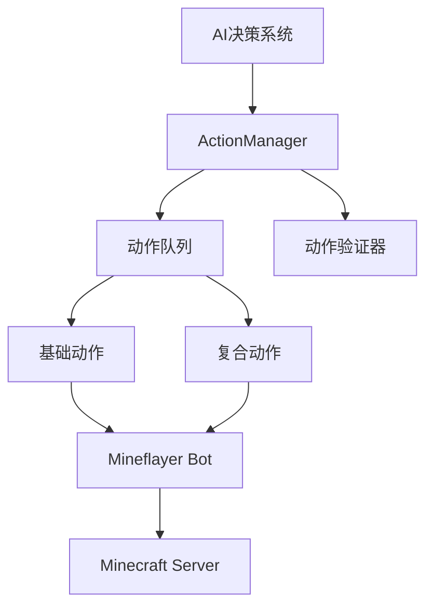

# 动作系统设计文档

## 概述

动作系统是maicraft-next项目的核心组件，负责将AI决策转化为具体的Minecraft游戏操作。采用统一的TypeScript mineflayer架构，去除MCP协议中间层，实现高效的单一进程架构。

## 设计原则

- **类型安全**: TypeScript泛型设计，编译时类型检查
- **AI兼容**: 支持LLM工具调用，自动生成schema
- **高性能**: 内部调用零验证开销
- **模块化**: 易于扩展的动作基类和注册系统

## 系统架构

### 架构图



## 核心组件

### ActionManager - 动作管理器

```typescript
export class ActionManager {
    registerAction<T>(action: Action<T>): void;
    executeAction<T>(actionId: string, params: T): Promise<ActionResult>;
    executeToolCall(toolCall: ToolCall): Promise<ActionResult>;
    getToolDefinitions(): ToolDefinition[];
}
```

### Action - 动作基类

```typescript
export abstract class Action<T extends ActionParams> {
    abstract readonly id: string;
    abstract readonly name: string;
    abstract readonly description: string;
    abstract readonly timeout: number;

    abstract execute(context: ActionContext, params: T): Promise<ActionResult>;
    abstract getAIDescription(): AIDescription;

    protected validateParams(params: T): ValidationError[] { return []; }
    canExecute(context: ActionContext): boolean { return true; }
}
```

### ActionContext - 动作上下文

```typescript
export interface ActionContext {
    bot: Bot;
    world: WorldInfo;
    executor: ActionExecutor;
    eventBus: EventBus;
    logger: Logger;
    config: Config;
}
```

## 参数设计策略

### 分层参数设计

采用**分层参数设计**，结合类型安全、性能和AI兼容性：

```typescript
export class MoveAction extends Action<MoveParams> {
    // 执行层：类型安全，零验证开销
    async execute(context: ActionContext, params: MoveParams): Promise<ActionResult> {
        const { x, y, z, allowPartial = false } = params;
        // 直接使用类型安全的参数
    }

    // 描述层：为LLM生成schema
    getAIDescription(): AIDescription {
        return {
            name: 'move',
            description: '移动到指定位置',
            parameters: {
                type: 'object',
                properties: {
                    x: { type: 'number', description: '目标X坐标' },
                    y: { type: 'number', description: '目标Y坐标' },
                    z: { type: 'number', description: '目标Z坐标' },
                    allowPartial: { type: 'boolean', description: '允许部分到达' }
                },
                required: ['x', 'y', 'z']
            }
        };
    }
}
```

### 设计优势

| 特性 | 实现方式 | 优势 |
|------|----------|------|
| **类型安全** | TypeScript泛型 | 编译时检查，IDE支持 |
| **高性能** | 内部调用无验证 | 零运行时开销 |
| **AI兼容** | 自动生成schema | 支持LLM工具调用 |
| **可扩展** | 对象参数式 | 易于添加新参数 |

### LLM集成路径

**当前：提示词模式** → **未来：工具调用模式**

```typescript
// 工具调用模式
const tools = actionManager.getToolDefinitions();
const response = await llmManager.chat([
    { role: 'user', content: '移动到x:100, y:64, z:200' }
], { tools });

// 直接执行工具调用
for (const toolCall of response.choices[0].message.tool_calls) {
    await actionManager.executeToolCall(toolCall);
}
```

## 动作分类

### 动作类别

```typescript
export enum ActionCategory {
    // 移动类
    MOVEMENT = 'movement',
    NAVIGATION = 'navigation',

    // 交互类
    BLOCK = 'block',
    ITEM = 'item',
    ENTITY = 'entity',

    // 战斗类
    COMBAT = 'combat',
    PVE = 'pve',

    // 建造类
    BUILDING = 'building',
    CRAFTING = 'crafting',
    MINING = 'mining',

    // 高级类
    COMPOSITE = 'composite',
    SEQUENCE = 'sequence',
}
```

### 动作类型

- **基础动作**: 移动、挖掘、放置、使用物品
- **复合动作**: 建造、合成、收集、战斗
- **条件动作**: 条件执行、循环、选择

### 动作状态

```typescript
export enum ActionStatus {
    PENDING = 'pending',
    EXECUTING = 'executing',
    COMPLETED = 'completed',
    FAILED = 'failed',
    CANCELLED = 'cancelled',
    TIMEOUT = 'timeout'
}
```

## 具体实现示例

### 移动动作

```typescript
export class MoveAction extends Action<MoveParams> {
    public readonly id = 'move';
    public readonly name = '移动到目标位置';
    public readonly category = ActionCategory.MOVEMENT;
    public readonly timeout = 60000;

    async execute(context: ActionContext, params: MoveParams): Promise<ActionResult> {
        const { x, y, z, allowPartial = false } = params;
        const bot = context.bot;

        return new Promise((resolve, reject) => {
            const goal = new GoalBlock(x, y, z);
            bot.pathfinder.setGoal(goal, allowPartial);

            bot.pathfinder.once('goal_reached', () => {
                resolve({
                    success: true,
                    message: '已到达目标位置',
                    data: { target: { x, y, z }, actual: bot.entity.position }
                });
            });

            bot.pathfinder.once('goal_failed', () => {
                resolve({
                    success: false,
                    message: '无法到达目标位置'
                });
            });
        });
    }

    getAIDescription(): AIDescription {
        return {
            name: this.id,
            description: this.description,
            parameters: {
                type: 'object',
                properties: {
                    x: { type: 'number', description: '目标X坐标' },
                    y: { type: 'number', description: '目标Y坐标' },
                    z: { type: 'number', description: '目标Z坐标' }
                },
                required: ['x', 'y', 'z']
            }
        };
    }
}
```

## 其他基础动作

### 挖掘动作

```typescript
export class MineBlockAction extends Action<MineParams> {
    public readonly id = 'mineBlock';
    public readonly name = '挖掘方块';
    public readonly category = ActionCategory.MINING;
    public readonly timeout = 30000;

    async execute(context: ActionContext, params: MineParams): Promise<ActionResult> {
        const { x, y, z, useBestTool = true } = params;
        const bot = context.bot;

        const targetBlock = bot.blockAt(new Vec3(x, y, z));
        if (!targetBlock || targetBlock.name === 'air') {
            return { success: false, message: '目标位置没有方块' };
        }

        // 挖掘方块
        await bot.dig(targetBlock);

        return {
            success: true,
            message: '挖掘完成',
            data: { blockName: targetBlock.name, position: { x, y, z } }
        };
    }

    getAIDescription(): AIDescription {
        return {
            name: this.id,
            description: '挖掘指定位置的方块',
            parameters: {
                type: 'object',
                properties: {
                    x: { type: 'number', description: '方块X坐标' },
                    y: { type: 'number', description: '方块Y坐标' },
                    z: { type: 'number', description: '方块Z坐标' },
                    useBestTool: { type: 'boolean', description: '是否使用最佳工具' }
                },
                required: ['x', 'y', 'z']
            }
        };
    }
}
```

### 复合动作

```typescript
export class BuildHouseAction extends CompositeAction<BuildParams> {
    public readonly id = 'buildHouse';
    public readonly name = '建造房屋';
    public readonly category = ActionCategory.BUILDING;
    public readonly timeout = 300000;

    protected createSubActions(context: ActionContext): Action[] {
        const { x, y, z, width = 5, height = 3, depth = 5, material = 'oak_planks' } = this.params;
        const actions: Action[] = [];

        // 生成建造子动作序列
        for (let i = 0; i < width; i++) {
            for (let j = 0; j < depth; j++) {
                actions.push(new PlaceBlockAction({
                    x: x + i, y: y, z: z + j, blockName: material
                }));
            }
        }

        return actions;
    }
}
```

## 集成与扩展

### LLM集成

```typescript
// 提示词模式
const prompt = await promptManager.renderTemplate('ai-decision', {
    location: 'x:100, y:64, z:200',
    available_actions: 'move, mine, build'
});

// 工具调用模式
const tools = actionManager.getToolDefinitions();
const response = await llmManager.chat([
    { role: 'user', content: '移动到x:100, y:64, z:200' }
], { tools });
```

### 配置与日志

```typescript
// 动作配置
const actionConfig = config.get('actions', {
    timeout: 30000,
    retryCount: 3,
    concurrency: 1
});

// 动作日志
const actionLogger = logger.createChild('actions');
actionLogger.info('Action started', { actionId: 'move', params: { x: 100, y: 64, z: 200 } });
```

## 实现计划

### 第一阶段：核心架构
1. 实现Action基类和ActionManager
2. 实现基本的动作注册和执行
3. 实现基础的移动和挖掘动作

### 第二阶段：功能扩展
1. 实现复合动作和条件动作
2. 实现动作队列和并发控制
3. 实现与现有系统的集成

### 第三阶段：高级特性
1. 实现性能优化和缓存
2. 实现监控和指标收集
3. 实现高级AI集成功能

## 总结

该动作系统采用**分层参数设计**，具备以下核心特点：

- **类型安全**: TypeScript泛型设计，编译时类型检查
- **高性能**: 内部调用零验证开销
- **AI兼容**: 自动生成schema，支持LLM工具调用
- **可扩展**: 模块化设计，易于添加新动作

该架构为maicraft-next项目提供了从当前提示词模式到未来工具调用模式的平滑演进路径。