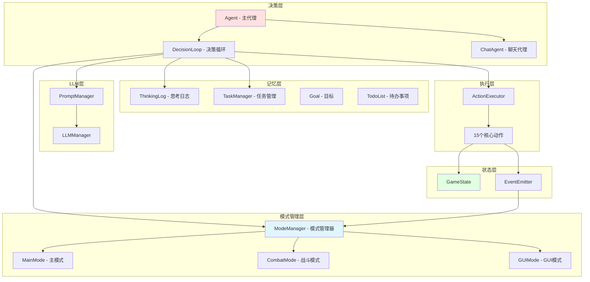

# maicraft-next Agent 架构设计

> **设计目标**: 基于 maicraft (Python) 的 agent 实现，设计适配新架构的 TypeScript Agent 系统

---

## 🎯 设计原则

1. **单体架构，去除跨进程开销** - 所有组件在同一进程内
2. **状态驱动决策** - 基于 `GameState` 的实时状态进行智能决策
3. **模式化管理** - 支持多种运行模式（主模式、战斗模式、GUI模式等）
4. **事件驱动响应** - 通过事件系统响应游戏状态变化
5. **可中断执行** - 支持基于优先级的任务中断
6. **记忆和学习** - 保持上下文记忆，支持长期任务规划

---

## 🏗️ Agent 架构图



---

## 📦 核心组件设计

### 1. Agent - 主代理类

**设计理念**:

- 作为整个 AI 系统的入口和协调者
- 管理决策循环、模式切换、中断处理
- 整合所有子系统（LLM、动作执行、状态管理等）

```typescript
/**
 * 主代理类
 * 负责 AI 决策的整体协调
 */
class Agent {
  private bot: Bot;
  private context: RuntimeContext;
  private decisionLoop: DecisionLoop;
  private chatAgent: ChatAgent;
  private modeManager: ModeManager;
  private taskManager: TaskManager;
  private thinkingLog: ThinkingLog;
  private llmManager: LLMManager;
  private promptManager: PromptManager;

  // 中断控制
  private interruptFlag: boolean = false;
  private interruptReason: string = '';

  // 配置
  private goal: string;
  private config: Config;

  constructor(bot: Bot, config: Config) {
    this.bot = bot;
    this.config = config;
    this.goal = config.agent.goal;

    // 初始化 RuntimeContext
    this.context = this.createContext();

    // 初始化子系统
    this.modeManager = new ModeManager(this.context);
    this.taskManager = new TaskManager();
    this.thinkingLog = new ThinkingLog();
    this.llmManager = new LLMManager(config.llm);
    this.promptManager = new PromptManager();

    // 初始化决策循环和聊天代理
    this.decisionLoop = new DecisionLoop(this);
    this.chatAgent = new ChatAgent(this);

    // 设置事件监听
    this.setupEventListeners();
  }

  /**
   * 创建运行时上下文
   */
  private createContext(): RuntimeContext {
    return {
      bot: this.bot,
      executor: new ActionExecutor(this.bot, this.config),
      gameState: globalGameState,
      blockCache: new BlockCache(),
      containerCache: new ContainerCache(),
      locationManager: new LocationManager(),
      events: new EventEmitter(this.bot),
      interruptSignal: new InterruptSignal(),
      logger: this.logger,
      config: this.config,
    };
  }

  /**
   * 启动代理
   */
  async start(): Promise<void> {
    this.logger.info('🚀 Agent 启动中...');

    // 初始化状态
    await this.context.gameState.initialize(this.bot);

    // 注册所有模式
    await this.modeManager.registerModes();

    // 设置为主模式
    await this.modeManager.setMode(ModeType.MAIN, '初始化');

    // 启动决策循环
    this.decisionLoop.start();

    // 启动聊天代理
    this.chatAgent.start();

    this.logger.info('✅ Agent 启动完成');
  }

  /**
   * 停止代理
   */
  async stop(): Promise<void> {
    this.logger.info('🛑 Agent 停止中...');

    // 停止决策循环
    this.decisionLoop.stop();

    // 停止聊天代理
    this.chatAgent.stop();

    // 保存状态
    await this.saveState();

    this.logger.info('✅ Agent 已停止');
  }

  /**
   * 设置事件监听
   */
  private setupEventListeners(): void {
    // 受伤事件 - 可能触发战斗模式
    this.context.events.on('entityHurt', data => {
      if (data.source) {
        this.handleCombatEvent(data);
      }
    });

    // 死亡事件 - 中断所有动作
    this.context.events.on('death', () => {
      this.triggerInterrupt('玩家死亡');
      this.taskManager.pauseCurrentTask();
    });

    // 聊天事件 - 交给聊天代理处理
    this.context.events.on('chat', data => {
      this.chatAgent.handleChatMessage(data);
    });

    // 健康变化 - 低血量警告
    this.context.events.on('health', data => {
      if (data.health < 6) {
        this.thinkingLog.addLog('⚠️ 生命值过低，需要回血或进食', 'warning');
      }
    });

    // 饥饿变化 - 低饥饿值警告
    this.context.events.on('health', data => {
      if (data.food < 6) {
        this.thinkingLog.addLog('⚠️ 饥饿值过低，需要进食', 'warning');
      }
    });
  }

  /**
   * 处理战斗事件
   */
  private async handleCombatEvent(data: any): Promise<void> {
    // 检查是否应该进入战斗模式
    const shouldEnterCombat = await this.modeManager.checkModeTransition(ModeType.COMBAT, { entityHurt: data });

    if (shouldEnterCombat) {
      await this.modeManager.setMode(ModeType.COMBAT, '受到攻击');
    }
  }

  /**
   * 触发中断
   */
  triggerInterrupt(reason: string): void {
    this.interruptFlag = true;
    this.interruptReason = reason;
    this.context.interruptSignal.interrupt(reason);
    this.logger.warn(`🚨 触发中断: ${reason}`);
  }

  /**
   * 清除中断
   */
  clearInterrupt(): void {
    this.interruptFlag = false;
    this.interruptReason = '';
    this.context.interruptSignal.reset();
  }

  /**
   * 保存状态
   */
  private async saveState(): Promise<void> {
    await Promise.all([
      this.taskManager.save(),
      this.thinkingLog.save(),
      this.context.blockCache.save(),
      this.context.containerCache.save(),
      this.context.locationManager.save(),
    ]);
  }

  /**
   * 获取代理状态
   */
  getStatus(): AgentStatus {
    return {
      isRunning: this.decisionLoop.isRunning,
      currentMode: this.modeManager.getCurrentMode(),
      goal: this.goal,
      currentTask: this.taskManager.getCurrentTask(),
      interrupted: this.interruptFlag,
      interruptReason: this.interruptReason,
    };
  }
}

/**
 * 代理状态
 */
interface AgentStatus {
  isRunning: boolean;
  currentMode: string;
  goal: string;
  currentTask: Task | null;
  interrupted: boolean;
  interruptReason: string;
}
```

---

### 2. DecisionLoop - 决策循环

**设计理念**:

- 负责主要的 AI 决策循环
- 基于当前模式调用 LLM 进行决策
- 解析 LLM 输出并执行动作

```typescript
/**
 * 决策循环
 * 负责 AI 的主要决策流程
 */
class DecisionLoop {
  private agent: Agent;
  private isRunning: boolean = false;
  private loopTask: Promise<void> | null = null;
  private evaluationCounter: number = 0;

  constructor(agent: Agent) {
    this.agent = agent;
  }

  /**
   * 启动决策循环
   */
  start(): void {
    if (this.isRunning) {
      return;
    }

    this.isRunning = true;
    this.loopTask = this.runLoop();
  }

  /**
   * 停止决策循环
   */
  stop(): void {
    this.isRunning = false;
  }

  /**
   * 主循环
   */
  private async runLoop(): Promise<void> {
    while (this.isRunning) {
      try {
        // 检查中断标志
        if (this.agent['interruptFlag']) {
          const reason = this.agent['interruptReason'];
          this.agent.clearInterrupt();
          this.agent['logger'].warn(`⚠️ 决策循环被中断: ${reason}`);
          await this.sleep(1000);
          continue;
        }

        // 检查是否允许 LLM 决策
        if (!this.agent['modeManager'].canUseLLMDecision()) {
          // 在非 LLM 决策模式下，检查自动转换
          const autoSwitched = await this.agent['modeManager'].checkAutoTransitions();
          if (!autoSwitched) {
            await this.sleep(1000);
          }
          continue;
        }

        // 执行一次决策
        await this.nextThinking();

        // 定期评估任务
        this.evaluationCounter++;
        if (this.evaluationCounter % 5 === 0) {
          await this.evaluateTask();
        }
      } catch (error) {
        this.agent['logger'].error('❌ 决策循环异常:', error);
        await this.sleep(1000);
      }
    }
  }

  /**
   * 执行一次思考和决策
   */
  private async nextThinking(): Promise<void> {
    // 1. 收集环境信息
    const environmentData = await this.collectEnvironmentData();

    // 2. 生成提示词
    const prompt = this.agent['promptManager'].generatePrompt('main_thinking', environmentData);

    this.agent['logger'].info('💭 生成提示词完成');

    // 3. 调用 LLM
    const response = await this.agent['llmManager'].chat(prompt);

    this.agent['logger'].info('🤖 LLM 响应完成');

    // 4. 解析响应
    const { success, thinking, actions } = this.parseResponse(response);

    if (!success || actions.length === 0) {
      this.agent['logger'].warn('⚠️ 解析 LLM 响应失败或无动作');
      return;
    }

    // 5. 记录思考过程
    if (thinking) {
      this.agent['thinkingLog'].addLog(thinking, 'thinking');
    }

    // 6. 执行动作
    await this.executeActions(actions);
  }

  /**
   * 收集环境数据
   */
  private async collectEnvironmentData(): Promise<Record<string, any>> {
    const gameState = this.agent['context'].gameState;
    const taskManager = this.agent['taskManager'];
    const thinkingLog = this.agent['thinkingLog'];

    return {
      // 基础信息
      playerName: gameState.playerName,
      gamemode: gameState.gamemode,

      // 状态信息
      position: gameState.getPositionDescription(),
      health: `${gameState.health}/${gameState.healthMax}`,
      food: `${gameState.food}/${gameState.foodMax}`,
      level: gameState.level,

      // 物品栏
      inventory: gameState.getInventoryDescription(),
      equipment: gameState.equipment,
      heldItem: gameState.heldItem,

      // 环境信息
      weather: gameState.weather,
      timeOfDay: gameState.timeOfDay,
      dimension: gameState.dimension,
      biome: gameState.biome,

      // 周围实体
      nearbyEntities: gameState.getNearbyEntitiesDescription(),

      // 目标和任务
      goal: this.agent['goal'],
      currentTask: taskManager.getCurrentTask()?.toString(),
      todoList: taskManager.getTodoListString(),

      // 思考历史
      recentThinking: thinkingLog.getRecentLogs(10),

      // 模式信息
      currentMode: this.agent['modeManager'].getCurrentMode(),
    };
  }

  /**
   * 解析 LLM 响应
   */
  private parseResponse(response: string): {
    success: boolean;
    thinking: string | null;
    actions: ActionCall[];
  } {
    // 尝试提取思考内容
    const thinkingMatch = response.match(/【思考】([\s\S]*?)【动作】/);
    const thinking = thinkingMatch ? thinkingMatch[1].trim() : null;

    // 尝试提取 JSON 动作
    const jsonRegex = /\{[\s\S]*?"action_type"[\s\S]*?\}/g;
    const jsonMatches = response.match(jsonRegex);

    if (!jsonMatches || jsonMatches.length === 0) {
      return { success: false, thinking, actions: [] };
    }

    const actions: ActionCall[] = [];
    for (const jsonStr of jsonMatches) {
      try {
        const actionData = JSON.parse(jsonStr);
        actions.push({
          actionType: actionData.action_type,
          params: actionData,
        });
      } catch (error) {
        this.agent['logger'].warn(`⚠️ 解析动作 JSON 失败: ${jsonStr}`);
      }
    }

    return { success: true, thinking, actions };
  }

  /**
   * 执行动作列表
   */
  private async executeActions(actions: ActionCall[]): Promise<void> {
    this.agent['logger'].info(`📋 准备执行 ${actions.length} 个动作`);

    for (let i = 0; i < actions.length; i++) {
      const action = actions[i];

      this.agent['logger'].info(`🎬 执行动作 ${i + 1}/${actions.length}: ${action.actionType}`);

      try {
        const result = await this.agent['context'].executor.execute(action.actionType as ActionId, action.params);

        // 记录执行结果
        this.agent['thinkingLog'].addLog(`执行动作 ${i + 1}/${actions.length}: ${action.actionType} - ${result.message}`, 'action');

        this.agent['logger'].info(`✅ 动作 ${i + 1}/${actions.length} ${result.success ? '成功' : '失败'}: ${result.message}`);

        // 如果动作失败，停止后续动作
        if (!result.success) {
          this.agent['logger'].warn(`⚠️ 动作失败，停止后续动作执行`);
          break;
        }
      } catch (error) {
        this.agent['logger'].error(`❌ 动作执行异常: ${action.actionType}`, error);
        break;
      }
    }
  }

  /**
   * 评估任务
   */
  private async evaluateTask(): Promise<void> {
    try {
      const environmentData = await this.collectEnvironmentData();

      const prompt = this.agent['promptManager'].generatePrompt('task_evaluation', environmentData);

      const evaluation = await this.agent['llmManager'].chat(prompt);

      if (evaluation) {
        this.agent['thinkingLog'].addLog(evaluation, 'evaluation');
      }
    } catch (error) {
      this.agent['logger'].error('❌ 任务评估异常:', error);
    }
  }

  private sleep(ms: number): Promise<void> {
    return new Promise(resolve => setTimeout(resolve, ms));
  }
}

/**
 * 动作调用
 */
interface ActionCall {
  actionType: string;
  params: Record<string, any>;
}
```

---

### 3. ChatAgent - 聊天代理

**设计理念**:

- 处理玩家聊天和社交互动
- 独立于主决策循环
- 支持主动和被动聊天

```typescript
/**
 * 聊天代理
 * 处理聊天相关的 AI 交互
 */
class ChatAgent {
  private agent: Agent;
  private isRunning: boolean = false;
  private chatTask: Promise<void> | null = null;
  private chatHistory: ChatHistory;
  private activeValue: number = 5; // 活跃度
  private selfTriggered: boolean = false;

  constructor(agent: Agent) {
    this.agent = agent;
    this.chatHistory = new ChatHistory();
  }

  /**
   * 启动聊天代理
   */
  start(): void {
    if (this.isRunning) {
      return;
    }

    this.isRunning = true;
    this.chatTask = this.runChatLoop();
  }

  /**
   * 停止聊天代理
   */
  stop(): void {
    this.isRunning = false;
  }

  /**
   * 聊天循环
   */
  private async runChatLoop(): Promise<void> {
    while (this.isRunning) {
      await this.sleep(500);

      try {
        // 检查是否被直接呼叫
        if (this.chatHistory.hasCallMessage()) {
          await this.respondToChat();
          this.chatHistory.clearCallMessage();
          this.activeValue += 3;
          this.selfTriggered = false;
        }
        // 检查是否有新消息
        else if (this.chatHistory.hasNewMessage()) {
          // 根据活跃度决定是否回应
          if (this.activeValue > 0) {
            await this.respondToChat();
            this.chatHistory.clearNewMessage();
            this.activeValue -= 1;
            this.selfTriggered = false;
          } else if (Math.random() < 0.1) {
            await this.respondToChat();
            this.chatHistory.clearNewMessage();
            this.activeValue += 2;
            this.selfTriggered = false;
          }
        }
        // 随机自发聊天
        else if (Math.random() < 0.02 && !this.selfTriggered) {
          await this.initiateChat();
          this.selfTriggered = true;
        }
      } catch (error) {
        this.agent['logger'].error('❌ 聊天循环异常:', error);
      }
    }
  }

  /**
   * 响应聊天
   */
  private async respondToChat(): Promise<void> {
    // 收集环境信息
    const environmentData = await this.collectChatContext();

    // 生成聊天提示词
    const prompt = this.agent['promptManager'].generatePrompt('chat_response', environmentData);

    // 调用 LLM
    const response = await this.agent['llmManager'].chat(prompt);

    // 解析响应
    const { thinking, message } = this.parseChatResponse(response);

    if (thinking) {
      this.agent['thinkingLog'].addLog(thinking, 'chat_thinking');
    }

    if (message) {
      // 发送聊天消息
      await this.agent['context'].executor.execute(ActionIds.CHAT, { message });

      this.agent['thinkingLog'].addLog(`发送聊天: ${message}`, 'chat');
    }
  }

  /**
   * 主动发起聊天
   */
  private async initiateChat(): Promise<void> {
    const environmentData = await this.collectChatContext();

    const prompt = this.agent['promptManager'].generatePrompt('chat_initiate', environmentData);

    const response = await this.agent['llmManager'].chat(prompt);

    const { message } = this.parseChatResponse(response);

    if (message) {
      await this.agent['context'].executor.execute(ActionIds.CHAT, { message });
    }
  }

  /**
   * 处理聊天消息
   */
  handleChatMessage(data: { username: string; message: string }): void {
    this.chatHistory.addMessage(data);

    // 检查是否直接呼叫
    const botName = this.agent['config'].bot.name;
    if (data.message.includes(botName)) {
      this.chatHistory.markAsCallMessage();
    } else {
      this.chatHistory.markAsNewMessage();
    }
  }

  /**
   * 收集聊天上下文
   */
  private async collectChatContext(): Promise<Record<string, any>> {
    const gameState = this.agent['context'].gameState;

    return {
      playerName: gameState.playerName,
      position: gameState.getPositionDescription(),
      recentChat: this.chatHistory.getRecentMessages(10),
      currentActivity: this.agent['taskManager'].getCurrentTask()?.description,
      mood: this.calculateMood(),
    };
  }

  /**
   * 解析聊天响应
   */
  private parseChatResponse(response: string): {
    thinking: string | null;
    message: string | null;
  } {
    const thinkingMatch = response.match(/【思考】([\s\S]*?)【回复】/);
    const thinking = thinkingMatch ? thinkingMatch[1].trim() : null;

    const messageMatch = response.match(/【回复】([\s\S]*?)$/);
    const message = messageMatch ? messageMatch[1].trim() : null;

    // 尝试解析 JSON 格式
    if (!message) {
      try {
        const json = JSON.parse(response);
        return { thinking: json.thinking, message: json.message };
      } catch {}
    }

    return { thinking, message };
  }

  /**
   * 计算情绪
   */
  private calculateMood(): string {
    const gameState = this.agent['context'].gameState;

    const healthPercent = gameState.health / gameState.healthMax;
    const foodPercent = gameState.food / gameState.foodMax;

    if (healthPercent < 0.3 || foodPercent < 0.3) {
      return '紧张';
    } else if (healthPercent > 0.8 && foodPercent > 0.8) {
      return '愉快';
    } else {
      return '平静';
    }
  }

  private sleep(ms: number): Promise<void> {
    return new Promise(resolve => setTimeout(resolve, ms));
  }
}

/**
 * 聊天历史
 */
class ChatHistory {
  private messages: Array<{ username: string; message: string; timestamp: number }> = [];
  private hasCall: boolean = false;
  private hasNew: boolean = false;

  addMessage(data: { username: string; message: string }): void {
    this.messages.push({
      ...data,
      timestamp: Date.now(),
    });

    // 限制历史消息数量
    if (this.messages.length > 50) {
      this.messages.shift();
    }
  }

  markAsCallMessage(): void {
    this.hasCall = true;
  }

  markAsNewMessage(): void {
    this.hasNew = true;
  }

  hasCallMessage(): boolean {
    return this.hasCall;
  }

  hasNewMessage(): boolean {
    return this.hasNew;
  }

  clearCallMessage(): void {
    this.hasCall = false;
  }

  clearNewMessage(): void {
    this.hasNew = false;
  }

  getRecentMessages(count: number): string {
    const recent = this.messages.slice(-count);
    return recent.map(m => `${m.username}: ${m.message}`).join('\n');
  }
}
```

---

### 4. ModeManager - 模式管理器

**设计理念**:

- 管理不同的运行模式（主模式、战斗模式、GUI模式等）
- 支持基于优先级的模式切换
- 自动检测环境变化触发模式转换

```typescript
/**
 * 模式类型
 */
enum ModeType {
  MAIN = 'main', // 主模式 - 正常探索和任务执行
  COMBAT = 'combat', // 战斗模式 - 自动战斗响应
  CHEST_GUI = 'chest_gui', // 箱子 GUI 模式
  FURNACE_GUI = 'furnace_gui', // 熔炉 GUI 模式
}

/**
 * 模式基类
 */
abstract class Mode {
  abstract readonly type: ModeType;
  abstract readonly name: string;
  abstract readonly description: string;
  abstract readonly priority: number; // 优先级，数字越大优先级越高
  abstract readonly requiresLLMDecision: boolean; // 是否需要 LLM 决策

  protected context: RuntimeContext;
  protected isActive: boolean = false;

  constructor(context: RuntimeContext) {
    this.context = context;
  }

  /**
   * 激活模式
   */
  async activate(reason: string): Promise<void> {
    this.isActive = true;
    this.context.logger.info(`🔵 激活模式: ${this.name} (原因: ${reason})`);
  }

  /**
   * 停用模式
   */
  async deactivate(reason: string): Promise<void> {
    this.isActive = false;
    this.context.logger.info(`⚪ 停用模式: ${this.name} (原因: ${reason})`);
  }

  /**
   * 检查是否应该转换到其他模式
   */
  abstract checkTransitions(): ModeTransition[];
}

/**
 * 模式转换
 */
interface ModeTransition {
  targetMode: ModeType;
  priority: number;
  conditionName: string;
}

/**
 * 主模式
 */
class MainMode extends Mode {
  readonly type = ModeType.MAIN;
  readonly name = '主模式';
  readonly description = '正常探索和任务执行';
  readonly priority = 0;
  readonly requiresLLMDecision = true;

  checkTransitions(): ModeTransition[] {
    const transitions: ModeTransition[] = [];

    // 检查是否应该进入战斗模式
    if (this.shouldEnterCombat()) {
      transitions.push({
        targetMode: ModeType.COMBAT,
        priority: 10,
        conditionName: '受到攻击',
      });
    }

    return transitions;
  }

  private shouldEnterCombat(): boolean {
    // 检查最近是否受到攻击
    // 可以通过 context.events 或 gameState 判断
    return false;
  }
}

/**
 * 战斗模式
 */
class CombatMode extends Mode {
  readonly type = ModeType.COMBAT;
  readonly name = '战斗模式';
  readonly description = '自动战斗响应';
  readonly priority = 10;
  readonly requiresLLMDecision = false; // 不需要 LLM 决策，完全自动

  private combatTask: Promise<void> | null = null;

  async activate(reason: string): Promise<void> {
    await super.activate(reason);

    // 启动战斗逻辑
    this.combatTask = this.runCombatLogic();
  }

  async deactivate(reason: string): Promise<void> {
    await super.deactivate(reason);

    // 停止战斗逻辑
    this.combatTask = null;
  }

  checkTransitions(): ModeTransition[] {
    const transitions: ModeTransition[] = [];

    // 检查是否应该退出战斗模式
    if (this.shouldExitCombat()) {
      transitions.push({
        targetMode: ModeType.MAIN,
        priority: 5,
        conditionName: '战斗结束',
      });
    }

    return transitions;
  }

  /**
   * 战斗逻辑
   */
  private async runCombatLogic(): Promise<void> {
    while (this.isActive) {
      // 查找最近的敌对实体
      const nearestEnemy = this.findNearestEnemy();

      if (!nearestEnemy) {
        // 没有敌人，退出战斗模式
        break;
      }

      // 执行战斗动作
      await this.context.executor.execute(ActionIds.KILL_MOB, {
        entity: nearestEnemy.name,
        timeout: 30,
      });

      await this.sleep(500);
    }
  }

  private findNearestEnemy(): Entity | null {
    const entities = this.context.gameState.nearbyEntities;

    // 查找最近的敌对生物
    const enemies = entities.filter(e => ['zombie', 'skeleton', 'spider', 'creeper'].includes(e.name));

    if (enemies.length === 0) {
      return null;
    }

    // 返回最近的敌人
    return enemies.reduce((nearest, current) => (current.distance < nearest.distance ? current : nearest));
  }

  private shouldExitCombat(): boolean {
    // 如果附近没有敌对实体，退出战斗模式
    return this.findNearestEnemy() === null;
  }

  private sleep(ms: number): Promise<void> {
    return new Promise(resolve => setTimeout(resolve, ms));
  }
}

/**
 * 模式管理器
 */
class ModeManager {
  private modes: Map<ModeType, Mode> = new Map();
  private currentMode: Mode | null = null;
  private context: RuntimeContext;

  constructor(context: RuntimeContext) {
    this.context = context;
  }

  /**
   * 注册所有模式
   */
  async registerModes(): Promise<void> {
    this.registerMode(new MainMode(this.context));
    this.registerMode(new CombatMode(this.context));
    // 注册其他模式...
  }

  /**
   * 注册模式
   */
  private registerMode(mode: Mode): void {
    this.modes.set(mode.type, mode);
    this.context.logger.info(`📝 注册模式: ${mode.name}`);
  }

  /**
   * 设置当前模式
   */
  async setMode(modeType: ModeType, reason: string): Promise<boolean> {
    const newMode = this.modes.get(modeType);
    if (!newMode) {
      this.context.logger.warn(`⚠️ 未知模式: ${modeType}`);
      return false;
    }

    // 检查是否已经是当前模式
    if (this.currentMode === newMode) {
      return true;
    }

    // 检查优先级
    if (this.currentMode && this.currentMode.priority > newMode.priority) {
      this.context.logger.warn(`⚠️ 无法切换到低优先级模式: ${newMode.name} (当前: ${this.currentMode.name})`);
      return false;
    }

    // 停用当前模式
    if (this.currentMode) {
      await this.currentMode.deactivate(reason);
    }

    // 激活新模式
    await newMode.activate(reason);
    this.currentMode = newMode;

    return true;
  }

  /**
   * 获取当前模式
   */
  getCurrentMode(): string {
    return this.currentMode?.type || '';
  }

  /**
   * 是否允许 LLM 决策
   */
  canUseLLMDecision(): boolean {
    return this.currentMode?.requiresLLMDecision ?? true;
  }

  /**
   * 检查自动转换
   */
  async checkAutoTransitions(): Promise<boolean> {
    if (!this.currentMode) {
      return false;
    }

    const transitions = this.currentMode.checkTransitions();

    if (transitions.length === 0) {
      return false;
    }

    // 按优先级排序
    transitions.sort((a, b) => b.priority - a.priority);

    // 尝试第一个转换
    const transition = transitions[0];
    const success = await this.setMode(transition.targetMode, transition.conditionName);

    return success;
  }

  /**
   * 检查模式转换条件
   */
  async checkModeTransition(modeType: ModeType, context: any): Promise<boolean> {
    const mode = this.modes.get(modeType);
    if (!mode) {
      return false;
    }

    // 这里可以实现更复杂的转换条件检查
    // 例如基于 context 参数判断是否应该转换

    return true;
  }
}
```

---

### 5. TaskManager - 任务管理器

**设计理念**:

- 管理目标和待办事项
- 支持任务的创建、更新、完成和删除
- 提供任务进度跟踪

```typescript
/**
 * 任务项
 */
class Task {
  id: string;
  details: string;
  doneCriteria: string;
  progress: string;
  done: boolean = false;
  createdAt: number;
  updatedAt: number;

  constructor(details: string, doneCriteria: string) {
    this.id = this.generateId();
    this.details = details;
    this.doneCriteria = doneCriteria;
    this.progress = '尚未开始';
    this.createdAt = Date.now();
    this.updatedAt = Date.now();
  }

  private generateId(): string {
    return `task_${Date.now()}_${Math.random().toString(36).substr(2, 9)}`;
  }

  /**
   * 更新进度
   */
  updateProgress(progress: string): void {
    this.progress = progress;
    this.updatedAt = Date.now();
  }

  /**
   * 标记为完成
   */
  markAsDone(): void {
    this.done = true;
    this.progress = '已完成';
    this.updatedAt = Date.now();
  }

  /**
   * 转换为字符串
   */
  toString(): string {
    const status = this.done ? '✅ 已完成' : '⏳ 进行中';
    return `${status} [${this.id}] ${this.details}\n完成条件: ${this.doneCriteria}\n进度: ${this.progress}`;
  }

  /**
   * 转换为 JSON
   */
  toJSON(): any {
    return {
      id: this.id,
      details: this.details,
      doneCriteria: this.doneCriteria,
      progress: this.progress,
      done: this.done,
      createdAt: this.createdAt,
      updatedAt: this.updatedAt,
    };
  }

  /**
   * 从 JSON 创建
   */
  static fromJSON(json: any): Task {
    const task = new Task(json.details, json.doneCriteria);
    task.id = json.id;
    task.progress = json.progress;
    task.done = json.done;
    task.createdAt = json.createdAt;
    task.updatedAt = json.updatedAt;
    return task;
  }
}

/**
 * 任务管理器
 */
class TaskManager {
  private goal: string = '';
  private tasks: Task[] = [];
  private currentTaskId: string | null = null;
  private maxTasks: number = 10;

  private dataFile: string = 'data/tasks.json';

  constructor() {
    this.loadFromFile();
  }

  /**
   * 设置目标
   */
  setGoal(goal: string): void {
    this.goal = goal;
    this.save();
  }

  /**
   * 获取目标
   */
  getGoal(): string {
    return this.goal;
  }

  /**
   * 添加任务
   */
  addTask(details: string, doneCriteria: string): Task {
    const task = new Task(details, doneCriteria);
    this.tasks.push(task);

    // 清理旧任务
    this.cleanupOldTasks();

    this.save();
    return task;
  }

  /**
   * 删除任务
   */
  deleteTask(taskId: string): boolean {
    const index = this.tasks.findIndex(t => t.id === taskId);
    if (index === -1) {
      return false;
    }

    this.tasks.splice(index, 1);

    if (this.currentTaskId === taskId) {
      this.currentTaskId = null;
    }

    this.save();
    return true;
  }

  /**
   * 更新任务进度
   */
  updateTaskProgress(taskId: string, progress: string): boolean {
    const task = this.getTask(taskId);
    if (!task) {
      return false;
    }

    task.updateProgress(progress);
    this.save();
    return true;
  }

  /**
   * 标记任务完成
   */
  markTaskDone(taskId: string): boolean {
    const task = this.getTask(taskId);
    if (!task) {
      return false;
    }

    task.markAsDone();

    if (this.currentTaskId === taskId) {
      this.currentTaskId = null;
    }

    this.save();
    return true;
  }

  /**
   * 设置当前任务
   */
  setCurrentTask(taskId: string): boolean {
    const task = this.getTask(taskId);
    if (!task) {
      return false;
    }

    this.currentTaskId = taskId;
    return true;
  }

  /**
   * 获取当前任务
   */
  getCurrentTask(): Task | null {
    if (!this.currentTaskId) {
      return null;
    }

    return this.getTask(this.currentTaskId);
  }

  /**
   * 暂停当前任务
   */
  pauseCurrentTask(): void {
    this.currentTaskId = null;
  }

  /**
   * 获取任务
   */
  getTask(taskId: string): Task | null {
    return this.tasks.find(t => t.id === taskId) || null;
  }

  /**
   * 获取所有任务
   */
  getAllTasks(): Task[] {
    return [...this.tasks];
  }

  /**
   * 获取待办事项字符串
   */
  getTodoListString(): string {
    if (this.tasks.length === 0) {
      return '当前没有任务';
    }

    const lines: string[] = [];
    lines.push(`目标: ${this.goal}`);
    lines.push('');
    lines.push('待办事项:');

    for (const task of this.tasks) {
      const isCurrent = task.id === this.currentTaskId;
      const prefix = isCurrent ? '👉' : '  ';
      lines.push(`${prefix} ${task.toString()}`);
      lines.push('');
    }

    return lines.join('\n');
  }

  /**
   * 清理旧任务
   */
  private cleanupOldTasks(): void {
    // 如果任务数超过上限
    if (this.tasks.length <= this.maxTasks) {
      return;
    }

    // 获取已完成的任务
    const doneTasks = this.tasks.filter(t => t.done);
    const undoneTasks = this.tasks.filter(t => !t.done);

    // 如果未完成任务数 >= 上限，删除所有已完成任务
    if (undoneTasks.length >= this.maxTasks) {
      this.tasks = undoneTasks;
      return;
    }

    // 否则，按时间排序，保留最新的任务
    const sortedTasks = [...this.tasks].sort((a, b) => b.updatedAt - a.updatedAt);
    this.tasks = sortedTasks.slice(0, this.maxTasks);
  }

  /**
   * 保存到文件
   */
  async save(): Promise<void> {
    const data = {
      goal: this.goal,
      currentTaskId: this.currentTaskId,
      tasks: this.tasks.map(t => t.toJSON()),
    };

    await fs.writeFile(this.dataFile, JSON.stringify(data, null, 2), 'utf-8');
  }

  /**
   * 从文件加载
   */
  private loadFromFile(): void {
    try {
      if (!fs.existsSync(this.dataFile)) {
        return;
      }

      const content = fs.readFileSync(this.dataFile, 'utf-8');
      const data = JSON.parse(content);

      this.goal = data.goal || '';
      this.currentTaskId = data.currentTaskId || null;
      this.tasks = (data.tasks || []).map((t: any) => Task.fromJSON(t));
    } catch (error) {
      // 加载失败，使用默认值
      this.goal = '';
      this.tasks = [];
      this.currentTaskId = null;
    }
  }
}
```

---

### 6. ThinkingLog - 思考日志

**设计理念**:

- 记录 AI 的思考过程和行动历史
- 支持不同类型的日志（思考、动作、事件、警告等）
- 提供时间线视图

```typescript
/**
 * 日志类型
 */
enum LogType {
  THINKING = 'thinking',
  ACTION = 'action',
  EVENT = 'event',
  CHAT = 'chat',
  CHAT_THINKING = 'chat_thinking',
  WARNING = 'warning',
  EVALUATION = 'evaluation',
  NOTICE = 'notice',
}

/**
 * 日志条目
 */
interface LogEntry {
  type: LogType;
  content: string;
  timestamp: number;
}

/**
 * 思考日志
 */
class ThinkingLog {
  private logs: LogEntry[] = [];
  private maxLogs: number = 100;
  private dataFile: string = 'data/thinking_log.json';

  constructor() {
    this.loadFromFile();
  }

  /**
   * 添加日志
   */
  addLog(content: string, type: LogType | string): void {
    const logType = typeof type === 'string' ? LogType[type.toUpperCase() as keyof typeof LogType] || LogType.NOTICE : type;

    this.logs.push({
      type: logType,
      content,
      timestamp: Date.now(),
    });

    // 限制日志数量
    if (this.logs.length > this.maxLogs) {
      this.logs = this.logs.slice(-this.maxLogs);
    }

    this.save();
  }

  /**
   * 获取最近的日志
   */
  getRecentLogs(count: number): string {
    const recent = this.logs.slice(-count);
    return this.formatLogs(recent);
  }

  /**
   * 获取指定类型的日志
   */
  getLogsByType(type: LogType, count: number): LogEntry[] {
    const filtered = this.logs.filter(log => log.type === type);
    return filtered.slice(-count);
  }

  /**
   * 清空日志
   */
  clear(): void {
    this.logs = [];
    this.save();
  }

  /**
   * 格式化日志
   */
  private formatLogs(logs: LogEntry[]): string {
    return logs
      .map(log => {
        const time = new Date(log.timestamp).toLocaleTimeString();
        const icon = this.getLogIcon(log.type);
        return `[${time}] ${icon} ${log.content}`;
      })
      .join('\n');
  }

  /**
   * 获取日志图标
   */
  private getLogIcon(type: LogType): string {
    switch (type) {
      case LogType.THINKING:
        return '💭';
      case LogType.ACTION:
        return '🎬';
      case LogType.EVENT:
        return '📢';
      case LogType.CHAT:
        return '💬';
      case LogType.WARNING:
        return '⚠️';
      case LogType.EVALUATION:
        return '📊';
      default:
        return '📝';
    }
  }

  /**
   * 保存到文件
   */
  async save(): Promise<void> {
    await fs.writeFile(this.dataFile, JSON.stringify(this.logs, null, 2), 'utf-8');
  }

  /**
   * 从文件加载
   */
  private loadFromFile(): void {
    try {
      if (!fs.existsSync(this.dataFile)) {
        return;
      }

      const content = fs.readFileSync(this.dataFile, 'utf-8');
      this.logs = JSON.parse(content);
    } catch (error) {
      this.logs = [];
    }
  }
}
```

---

## 🔄 完整工作流程

### 主决策循环流程

```
1. 启动 Agent
   ↓
2. 初始化所有子系统
   ├─ GameState (状态管理)
   ├─ ModeManager (模式管理)
   ├─ TaskManager (任务管理)
   ├─ ThinkingLog (日志记录)
   └─ ActionExecutor (动作执行)
   ↓
3. 启动 DecisionLoop
   ↓
4. 决策循环
   ├─ 检查中断标志
   ├─ 检查当前模式是否允许 LLM 决策
   ├─ 收集环境数据
   ├─ 生成提示词
   ├─ 调用 LLM
   ├─ 解析响应
   ├─ 记录思考
   └─ 执行动作
   ↓
5. 定期评估任务
   ↓
6. 循环返回步骤 4
```

### 模式切换流程

```
1. 事件触发 (如受到攻击)
   ↓
2. ModeManager 检测条件
   ↓
3. 检查优先级
   ├─ 新模式优先级 > 当前模式 → 允许切换
   └─ 新模式优先级 ≤ 当前模式 → 拒绝切换
   ↓
4. 停用当前模式
   ↓
5. 激活新模式
   ↓
6. 新模式开始运行
```

### 聊天交互流程

```
1. 收到聊天消息
   ↓
2. ChatAgent 处理
   ├─ 检查是否直接呼叫
   ├─ 根据活跃度决定是否响应
   └─ 随机主动聊天
   ↓
3. 收集聊天上下文
   ↓
4. 生成聊天提示词
   ↓
5. 调用 LLM
   ↓
6. 解析响应
   ↓
7. 发送聊天消息
```

---

## 📊 架构对比

### maicraft (Python) vs maicraft-next (TypeScript)

| 特性       | maicraft (Python)                    | maicraft-next (TypeScript) |
| ---------- | ------------------------------------ | -------------------------- |
| 架构       | Python Agent + TypeScript MCP Server | TypeScript 单体架构        |
| 跨进程开销 | ❌ 高 (IPC)                          | ✅ 无                      |
| 状态访问   | ❌ 需要轮询查询                      | ✅ 实时访问                |
| 类型安全   | ❌ 弱类型                            | ✅ 强类型                  |
| 模式管理   | ✅ 支持                              | ✅ 支持（增强）            |
| 事件驱动   | ✅ 支持                              | ✅ 支持（统一）            |
| 任务管理   | ✅ 支持                              | ✅ 支持（增强）            |
| 聊天代理   | ✅ 支持                              | ✅ 支持                    |
| 可维护性   | ❌ 两个项目                          | ✅ 单一项目                |

---

## 🚀 实施路线

### Phase 1: 核心 Agent 框架 (Week 1-2)

```
✅ Agent 主类
✅ RuntimeContext 管理
✅ DecisionLoop 决策循环
✅ 基础事件监听
```

### Phase 2: 模式管理系统 (Week 3)

```
✅ ModeManager
✅ MainMode (主模式)
✅ CombatMode (战斗模式)
✅ 模式切换逻辑
```

### Phase 3: 记忆和任务系统 (Week 4)

```
✅ TaskManager (任务管理)
✅ ThinkingLog (思考日志)
✅ 持久化存储
```

### Phase 4: 聊天代理 (Week 5)

```
✅ ChatAgent
✅ ChatHistory
✅ 聊天提示词生成
```

### Phase 5: 集成和测试 (Week 6-7)

```
✅ 完整集成测试
✅ 性能优化
✅ 文档完善
```

---

## 📝 使用示例

### 启动 Agent

```typescript
import { Agent } from './agent';
import { Config } from './config';

// 创建 bot
const bot = mineflayer.createBot({
  host: 'localhost',
  port: 25565,
  username: 'MaiBot',
});

// 加载配置
const config = Config.load('config.toml');

// 创建 Agent
const agent = new Agent(bot, config);

// 启动 Agent
await agent.start();

// 设置目标
agent.taskManager.setGoal('收集 64 个铁矿石');

// 添加任务
agent.taskManager.addTask('制作铁镐', '背包中有至少 1 把铁镐');

// 查看状态
console.log(agent.getStatus());
```

### 自定义模式

```typescript
class CustomMode extends Mode {
  readonly type = 'custom' as ModeType;
  readonly name = '自定义模式';
  readonly description = '自定义逻辑';
  readonly priority = 5;
  readonly requiresLLMDecision = false;

  async activate(reason: string): Promise<void> {
    await super.activate(reason);
    // 自定义激活逻辑
  }

  async deactivate(reason: string): Promise<void> {
    await super.deactivate(reason);
    // 自定义停用逻辑
  }

  checkTransitions(): ModeTransition[] {
    // 自定义转换条件
    return [];
  }
}

// 注册自定义模式
agent.modeManager.registerMode(new CustomMode(agent.context));
```

---

## 🎯 总结

### 核心优势

1. **单体架构** ✅
   - 零跨进程开销
   - 类型安全
   - 易于维护

2. **状态驱动** ✅
   - 实时状态访问
   - 去除轮询查询
   - 事件驱动响应

3. **模式化管理** ✅
   - 支持多种运行模式
   - 基于优先级的模式切换
   - 自动模式转换

4. **记忆和学习** ✅
   - 思考日志
   - 任务管理
   - 上下文保持

5. **可扩展性** ✅
   - 易于添加新模式
   - 支持自定义逻辑
   - 插件化设计

---

_设计版本: v1.0_  
_创建日期: 2024-11-01_  
_基于: maicraft (Python) 深度分析_
