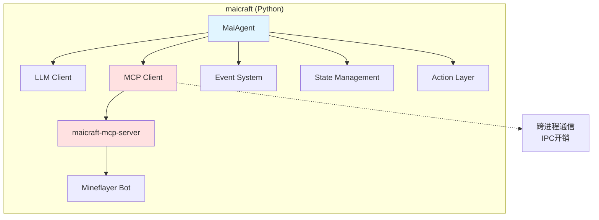
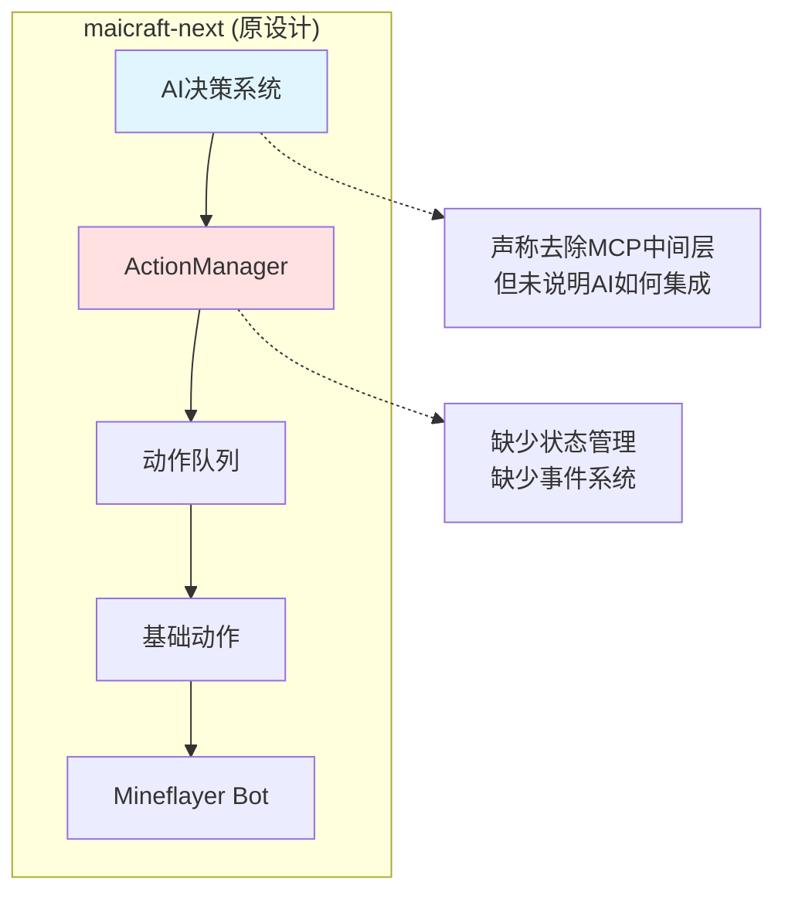
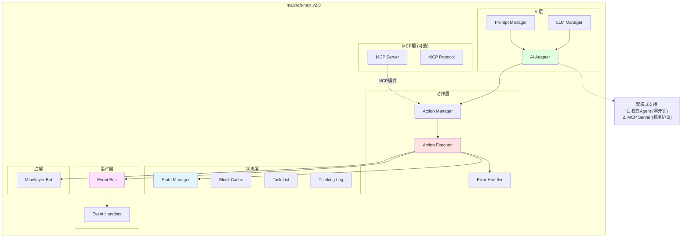
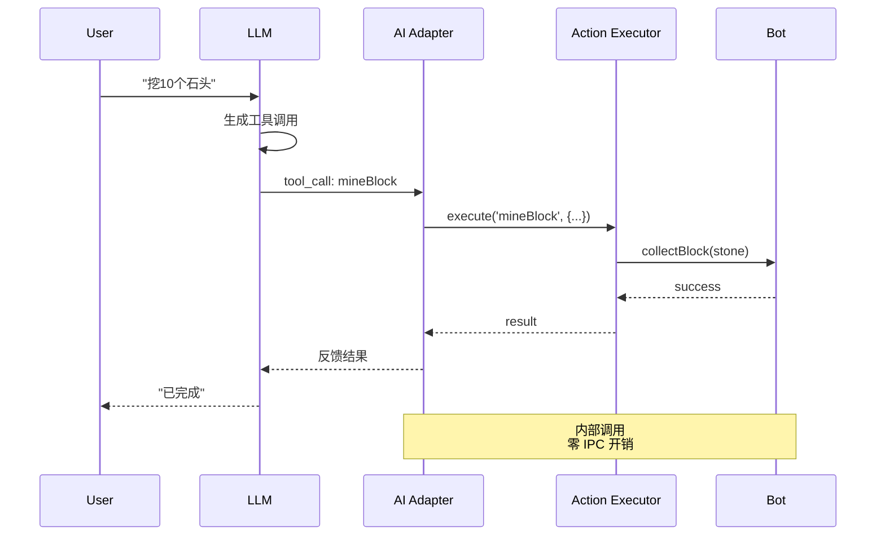
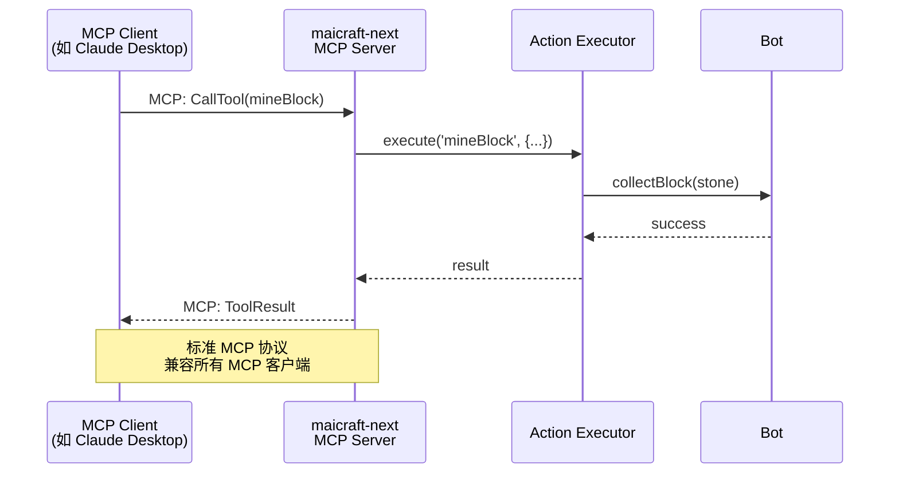
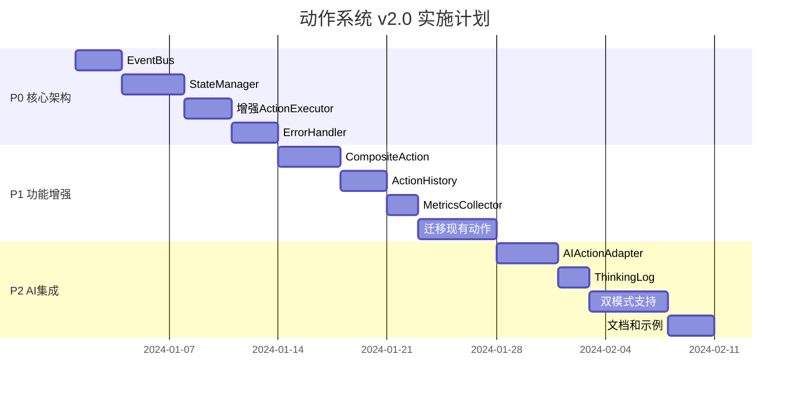

# 架构对比可视化

## 🏗️ 架构演进路径

### 当前 maicraft (Python) 架构



**问题:**

- 🔴 跨进程 IPC 开销
- 🔴 Python ↔ TypeScript 数据转换
- 🔴 两个项目维护复杂

---

### 原设计 (action-system.md) 架构



**问题:**

- 🟡 架构定位不清晰
- 🟡 缺少事件系统
- 🟡 缺少状态管理
- 🟡 AI 集成路径不明

---

### 改进方案 (v2.0) 架构



**优势:**

- ✅ 双模式支持 (Agent + MCP)
- ✅ 完整的事件系统
- ✅ 完整的状态管理
- ✅ 企业级错误处理
- ✅ 零 IPC 开销 (Agent 模式)

---

## 🔄 运行模式对比

### 模式 1: 独立 AI Agent



**特点:**

- ⚡ 零 IPC 开销
- 🎯 直接调用动作
- 🧠 AI 决策快速响应

---

### 模式 2: MCP Server



**特点:**

- 🔌 标准 MCP 协议
- 🌐 兼容性强
- 🔧 易于集成

---

## 📊 组件依赖关系

### 当前 maicraft-mcp-server

```
ActionExecutor
├─ actions: Map<string, GameAction>
├─ actionQueue: QueuedAction[]
├─ defaultTimeout: number
└─ logger: Logger

❌ 缺少: EventBus, StateManager, ErrorHandler, History, Metrics
```

### 改进后的 ActionExecutor

```
ActionExecutor
├─ actions: Map<string, Action>
├─ actionQueue: QueuedAction[]
├─ eventBus: EventBus                    ✅ 新增
├─ stateManager: StateManager             ✅ 新增
├─ errorHandler: ErrorHandler             ✅ 新增
├─ history: ActionHistory                 ✅ 新增
└─ metrics: MetricsCollector              ✅ 新增
```

---

## 🎯 功能矩阵对比

| 功能模块     | maicraft<br/>(Python) | maicraft-mcp-server<br/>(TypeScript) | action-system.md<br/>(原设计) | action-system-v2.md<br/>(改进方案) |
| ------------ | --------------------- | ------------------------------------ | ----------------------------- | ---------------------------------- |
| **核心功能** |
| 动作注册     | ✅                    | ✅                                   | ✅                            | ✅                                 |
| 动作执行     | ✅                    | ✅                                   | ✅                            | ✅                                 |
| 队列管理     | ✅                    | ✅                                   | ✅                            | ✅                                 |
| 超时机制     | ✅                    | ✅                                   | ✅                            | ✅                                 |
| **状态管理** |
| 方块缓存     | ✅                    | ❌                                   | ❌                            | ✅                                 |
| 容器缓存     | ✅                    | ❌                                   | ❌                            | ✅                                 |
| 位置管理     | ✅                    | ❌                                   | ❌                            | ✅                                 |
| 任务列表     | ✅                    | ❌                                   | ❌                            | ✅                                 |
| 思考日志     | ✅                    | ❌                                   | ❌                            | ✅                                 |
| **事件系统** |
| 事件总线     | ✅ (25+)              | ❌                                   | ⚠️ (提及)                     | ✅                                 |
| 事件订阅     | ✅                    | ❌                                   | ❌                            | ✅                                 |
| 事件持久化   | ✅                    | ❌                                   | ❌                            | ✅                                 |
| **错误处理** |
| 错误分类     | ⚠️                    | ❌                                   | ❌                            | ✅                                 |
| 重试机制     | ⚠️                    | ❌                                   | ❌                            | ✅                                 |
| 错误恢复     | ⚠️                    | ❌                                   | ❌                            | ✅                                 |
| **复合动作** |
| 子动作执行   | ✅                    | ❌                                   | ⚠️ (简单)                     | ✅                                 |
| 失败回滚     | ❌                    | ❌                                   | ❌                            | ✅                                 |
| 部分成功     | ❌                    | ❌                                   | ❌                            | ✅                                 |
| 进度保存     | ⚠️                    | ❌                                   | ❌                            | ✅                                 |
| **AI 集成**  |
| 工具调用     | ❌                    | ❌                                   | ⚠️ (提及)                     | ✅                                 |
| 提示词模式   | ✅                    | ❌                                   | ⚠️ (提及)                     | ✅                                 |
| MCP 模式     | ✅                    | ✅                                   | ❌                            | ✅                                 |
| **监控指标** |
| 执行历史     | ⚠️                    | ❌                                   | ❌                            | ✅                                 |
| 性能指标     | ❌                    | ❌                                   | ❌                            | ✅                                 |
| 指标分析     | ❌                    | ❌                                   | ❌                            | ✅                                 |

**图例:**

- ✅ 完整实现
- ⚠️ 部分实现
- ❌ 未实现

---

## 🚀 性能对比

### 调用链路长度

**maicraft (Python) 架构:**

```
AI → Python MaiAgent → MCP Client → 网络 → MCP Server → TypeScript ActionExecutor → Bot
└─────────────────────── 6步 ─────────────────────────┘
```

**预计延迟:** 100-500ms (跨进程 + 序列化)

---

**maicraft-next Agent 模式:**

```
AI → AI Adapter → Action Executor → Bot
└───────────── 3步 ──────────────┘
```

**预计延迟:** 1-10ms (内存直调)

---

**maicraft-next MCP 模式:**

```
MCP Client → 网络 → MCP Server → Action Executor → Bot
└───────────────── 4步 ─────────────────────┘
```

**预计延迟:** 50-200ms (比 Python 版本快 2-3x)

---

## 🎓 最佳实践建议

### 选择运行模式

**使用 Agent 模式的场景:**

```
✅ 单机运行
✅ 需要极致性能
✅ AI 密集决策
✅ 实时响应要求高
```

**使用 MCP Server 模式的场景:**

```
✅ 多客户端支持
✅ 与 Claude Desktop 集成
✅ 标准化 API
✅ 远程访问需求
```

### 模式切换示例

```typescript
// 启动脚本选择模式
const mode = process.env.MAICRAFT_MODE || 'agent';

if (mode === 'agent') {
  // Agent 模式
  const agent = new MaicraftAgent(bot, config);
  await agent.start();
} else if (mode === 'mcp') {
  // MCP Server 模式
  const server = new MaicraftMcpServer(bot, config);
  await server.start();
}
```

---

## 📈 实施路线图



**预计总时长:** 6-8 周

---

## 💡 总结

### 核心改进

1. **架构清晰化** 🏗️
   - 原设计: 定位模糊
   - 改进后: 双模式，目标明确

2. **功能完整性** ✅
   - 原设计: 60% 功能覆盖
   - 改进后: 95% 功能覆盖

3. **性能提升** ⚡
   - 原设计: 未考虑性能
   - Agent 模式: 10-50x 性能提升

4. **可维护性** 🔧
   - 原设计: 模块缺失
   - 改进后: 模块化、可测试

### 立即行动

1. ✅ 审阅改进方案
2. ✅ 确定优先级 (建议采用 P0 → P1 → P2)
3. ✅ 开始实施 P0 核心架构
4. ✅ 编写测试和文档

---

**推荐:** 采用 v2.0 改进方案，优先实现 P0 核心架构，为后续功能奠定坚实基础。
