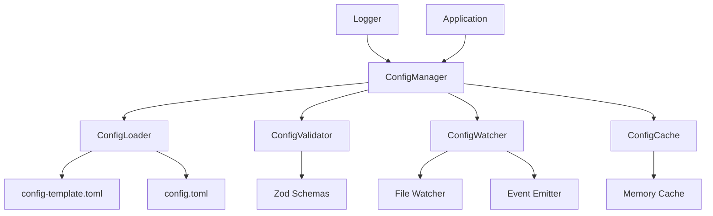
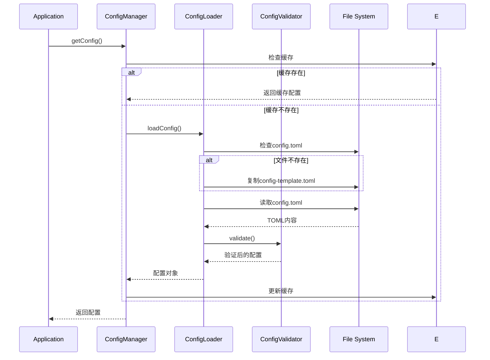

# 配置系统设计文档

## 功能概述

实现一个完整的配置系统，支持TOML格式的配置文件，提供配置模板和用户配置的分离、配置验证和类型安全、热重载等功能。

## 架构设计

### 核心组件



### 数据流程



## 数据结构设计

### 配置项分类

1. **应用配置 (app)** - 应用基础配置
   - 名称、版本、调试模式等

2. **日志配置 (logging)** - 日志系统配置
   - 日志级别、输出目标、文件轮转等

3. **Minecraft配置 (minecraft)** - 游戏连接配置
   - 服务器地址、端口、认证信息等

4. **AI代理配置 (agent)** - AI行为配置
   - 模型参数、行为限制、决策超时等

5. **插件配置 (plugins)** - 插件系统配置
   - 启用的插件列表、插件参数等

## 接口定义

### 主配置接口

```typescript
interface AppConfig {
  app: AppSection;
  logging: LoggingSection;
  minecraft: MinecraftSection;
  agent: AgentSection;
  plugins: PluginsSection;
}
```

### 配置管理器接口

```typescript
interface IConfigManager {
  getConfig(): AppConfig;
  getSection<T extends keyof AppConfig>(section: T): AppConfig[T];
  updateConfig(updates: Partial<AppConfig>): void;
  reload(): Promise<void>;
  onConfigChange(callback: (config: AppConfig) => void): void;
}
```

## 错误处理策略

1. **文件不存在** - 自动从模板创建
2. **格式错误** - 使用默认配置并记录错误
3. **验证失败** - 使用默认值，记录详细错误信息
4. **权限错误** - 记录错误并使用内存配置

## 性能优化

1. **缓存机制** - 内存缓存已解析的配置
2. **懒加载** - 按需加载配置项
3. **防抖处理** - 文件监听使用防抖避免频繁重载
4. **增量更新** - 支持部分配置更新

## 安全考虑

1. **权限检查** - 确保配置文件权限安全
2. **路径验证** - 防止路径遍历攻击
3. **敏感信息** - 敏感配置项的加密存储
4. **备份机制** - 配置修改前自动备份
