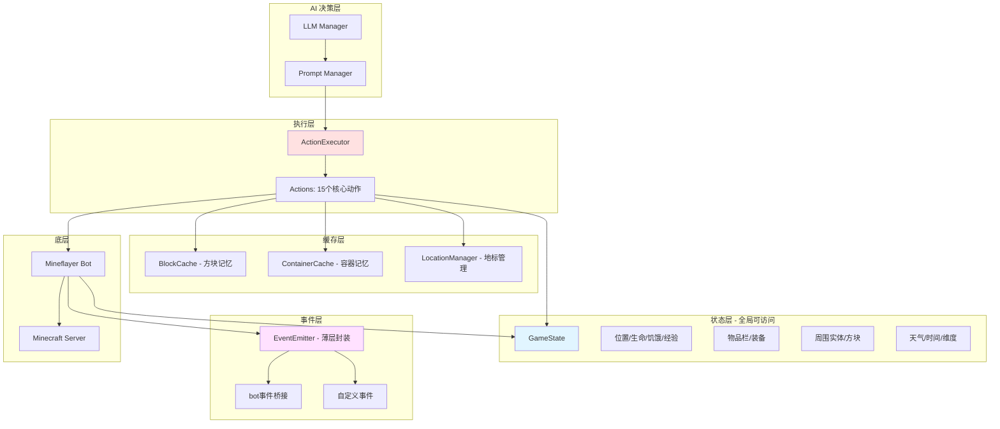

# maicraft-next 核心架构设计

> **设计目标**: 将 maicraft (Python) 和 maicraft-mcp-server (TypeScript) 合并为高内聚的单体架构

***

## 🎯 设计原则

1. **高内聚单体架构** - TypeScript 一体化，零跨进程开销
2. **状态实时可访问** - 去除查询类动作，状态作为全局上下文
3. **动作平等统一** - 不区分简单/复合动作，通过 context 灵活组合
4. **类型安全** - 避免硬编码字符串，使用类型安全的动作调用
5. **事件驱动** - 薄层 EventEmitter 封装，统一管理游戏事件和自定义事件
6. **LLM 兼容** - Schema 支持，兼容提示词模式和工具调用模式

***

## 🏗️ 核心架构图



***

## 📦 核心组件设计

### 1. GameState - 全局游戏状态（去除查询动作）

**命名说明**:

- ~~Environment~~ → **GameState** (更具体，表示游戏状态)
- 也可考虑: `BotState`, `WorldState`

**设计理念**:

- ❌ **不是**查询动作（`query_player_status`, `query_game_state`）
- ✅ **是**全局可访问的实时状态
- ✅ 通过 `bot.on()` 事件实时更新
- ✅ 任何地方都可以直接访问 `context.gameState`

```typescript
/**
 * 全局游戏状态
 * 实时同步，无需查询
 */
class GameState {
  // 玩家基础信息
  readonly playerName: string;
  readonly gamemode: string;
  
  // 位置信息（实时更新）
  position: Vec3;
  blockPosition: Vec3;
  
  // 状态信息（实时更新）
  health: number;
  healthMax: number;
  food: number;
  foodMax: number;
  foodSaturation: number;
  experience: number;
  level: number;
  oxygen: number;
  armor: number;
  
  // 物品栏（实时更新）
  inventory: Item[];
  equipment: Record<string, Item | null>;
  heldItem: Item | null;
  
  // 环境信息（实时更新）
  weather: string;
  timeOfDay: number;
  dimension: string;
  biome: string;
  
  // 周围实体（定期更新）
  nearbyEntities: Entity[];
  
  // 视角信息
  yaw: number;
  pitch: number;
  onGround: boolean;
  
  /**
   * 初始化环境，设置 bot 事件监听
   */
  initialize(bot: Bot): void {
    // 监听健康变化
    bot.on('health', () => {
      this.health = bot.health;
      this.food = bot.food;
      this.foodSaturation = bot.foodSaturation;
    });
    
    // 监听位置移动
    bot.on('move', () => {
      this.position = bot.entity.position.clone();
      this.blockPosition = this.position.floored();
    });
    
    // 监听经验变化
    bot.on('experience', () => {
      this.experience = bot.experience.points;
      this.level = bot.experience.level;
    });
    
    // 监听物品栏变化
    bot.on('windowUpdate', () => {
      this.updateInventory(bot);
    });
    
    // 监听天气和时间
    bot.on('time', () => {
      this.timeOfDay = bot.time.timeOfDay;
    });
    
    bot.on('weather', () => {
      this.weather = bot.thunderState ? 'thunder' : 
                     bot.isRaining ? 'rain' : 'clear';
    });
    
    // 定期更新周围实体 (每秒一次)
    setInterval(() => {
      this.updateNearbyEntities(bot);
    }, 1000);
  }
  
  /**
   * 更新物品栏
   */
  private updateInventory(bot: Bot): void {
    this.inventory = bot.inventory.items().map(item => ({
      name: item.name,
      count: item.count,
      slot: item.slot,
      displayName: item.displayName
    }));
    
    this.heldItem = bot.heldItem ? {
      name: bot.heldItem.name,
      count: bot.heldItem.count,
      slot: bot.heldItem.slot,
      displayName: bot.heldItem.displayName
    } : null;
  }
  
  /**
   * 更新周围实体
   */
  private updateNearbyEntities(bot: Bot): void {
    const entities = Object.values(bot.entities)
      .filter(e => e.position.distanceTo(bot.entity.position) <= 16)
      .map(e => ({
        type: e.type,
        name: e.name || e.displayName,
        position: e.position,
        distance: e.position.distanceTo(bot.entity.position),
        health: e.metadata?.[8],  // health metadata
      }));
    
    this.nearbyEntities = entities;
  }
  
  /**
   * 生成状态描述（用于 LLM 提示词）
   */
  getStatusDescription(): string {
    return `
当前状态:
  生命值: ${this.health}/${this.healthMax}
  饥饿值: ${this.food}/${this.foodMax}
  等级: ${this.level} (经验: ${this.experience})
  
位置: (${this.blockPosition.x}, ${this.blockPosition.y}, ${this.blockPosition.z})
维度: ${this.dimension}
生物群系: ${this.biome}
天气: ${this.weather}
时间: ${this.timeOfDay}

物品栏: ${this.inventory.length} 个物品
手持: ${this.heldItem?.name || '无'}
    `.trim();
  }
  
  /**
   * 获取物品栏描述
   */
  getInventoryDescription(): string {
    if (this.inventory.length === 0) {
      return '物品栏为空';
    }
    
    const lines = this.inventory.map(item => 
      `  ${item.name} x${item.count}`
    );
    
    return `物品栏 (${this.inventory.length}/36):\n${lines.join('\n')}`;
  }
  
  /**
   * 获取周围实体描述
   */
  getNearbyEntitiesDescription(): string {
    if (this.nearbyEntities.length === 0) {
      return '周围没有实体';
    }
    
    const lines = this.nearbyEntities.map((e, i) => 
      `  ${i + 1}. ${e.name} (距离: ${e.distance.toFixed(1)}格)`
    );
    
    return `周围实体 (${this.nearbyEntities.length}):\n${lines.join('\n')}`;
  }
}

/**
 * 全局游戏状态实例
 */
export const globalGameState = new GameState();
```

**关键改进**:

- ✅ 去除 `query_player_status`, `query_game_state`, `query_recent_events` 等查询动作
- ✅ 状态实时同步，无轮询开销
- ✅ 任何地方都可以通过 `context.gameState` 访问
- ✅ 提供格式化方法用于生成 LLM 提示词

***

### 2. Actions - 15个核心动作（精简版）

基于 maicraft 提示词中实际使用的动作，精简为 **15 个核心动作**：

| 动作 ID                  | 动作名称       | 来源                                                      | 优先级 |
| ------------------------ | -------------- | --------------------------------------------------------- | ------ |
| `mine_block`             | 挖掘附近方块   | Python: `mine_action.py`<br/>TS: `MineBlockAction.ts`     | P0     |
| `mine_block_by_position` | 按坐标挖掘     | Python: `mine_action.py`                                  | P0     |
| `mine_in_direction`      | 按方向持续挖掘 | Python: `mine_action.py`                                  | P1     |
| `place_block`            | 放置方块       | Python: `place_action.py`<br/>TS: `PlaceBlockAction.ts`   | P0     |
| `move`                   | 移动到坐标     | Python: `move_action.py`<br/>TS: `MoveAction.ts`          | P0     |
| `find_block`             | 寻找可见方块   | Python: `find_action.py`                                  | P0     |
| `craft`                  | 智能合成       | Python: `craft_action.py`<br/>TS: `CraftItemAction.ts`    | P0     |
| `use_furnace`            | 使用熔炉       | Python: `view_container.py`<br/>TS: `UseFurnaceAction.ts` | P1     |
| `use_chest`              | 使用箱子       | Python: `view_container.py`<br/>TS: `UseChestAction.ts`   | P1     |
| `eat`                    | 吃食物         | TS: `UseItemAction.ts`                                    | P1     |
| `toss_item`              | 丢弃物品       | -                                                         | P1     |
| `kill_mob`               | 击杀生物       | TS: `KillMobAction.ts`                                    | P1     |
| `set_location`           | 设置地标       | Python: locations                                         | P1     |
| `chat`                   | 发送聊天       | TS: `ChatAction.ts`                                       | P2     |
| `swim_to_land`           | 游到陆地       | TS: `SwimToLandAction.ts`                                 | P2     |

**去除的动作** (变为全局状态):

- ❌ `query_player_status` → `context.gameState.health/food/...`
- ❌ `query_game_state` → `context.gameState.weather/timeOfDay/...`
- ❌ `query_recent_events` → 通过 `EventEmitter` 订阅
- ❌ `query_block` → 使用 `bot.blockAt()` 直接查询
- ❌ `query_area_blocks` → 内部使用，不暴露给 LLM
- ❌ `query_surroundings` → `context.gameState.nearbyEntities`
- ❌ `query_recipe` → 合成动作内部调用
- ❌ `query_raw_recipe` → 合成动作内部调用

***

### 3. RuntimeContext - 运行时上下文

**命名说明**:

- ~~ActionContext~~ → **RuntimeContext** (更通用，不仅限于动作)
- 也可考虑: `ExecutionContext`, `BotContext`

```typescript
/**
 * 运行时上下文
 * 提供动作执行所需的所有资源和能力
 */
interface RuntimeContext {
  // 核心资源
  bot: Bot;
  executor: ActionExecutor;
  
  // 全局状态（实时可访问）
  gameState: GameState;
  
  // 缓存管理
  blockCache: BlockCache;
  containerCache: ContainerCache;
  locationManager: LocationManager;
  
  // 事件系统
  events: EventEmitter;
  
  // 中断控制
  interruptSignal: InterruptSignal;
  
  // 日志（每个动作自动分配独立的 logger）
  logger: Logger;  // 自动带上动作名前缀，如 "[MoveAction]"
  
  // 配置
  config: Config;
}
```

**Logger 说明**:
  
每个动作执行时，`context.logger` 会自动创建一个带有动作名前缀的 logger 实例：

```typescript
// 在 MoveAction 中
context.logger.info('开始移动到目标位置');  
// 输出: [MoveAction] 开始移动到目标位置

// 在 MineBlockAction 中
context.logger.info('找到目标方块');
// 输出: [MineBlockAction] 找到目标方块
```

这样可以轻松区分不同动作的日志。

***

### 4. ActionExecutor - 类型安全 + 动态注册

**问题 1**: 硬编码字符串 `executor.execute('move', params)` 不友好
  
**问题 2**: 类型安全的方法无法支持动态注册

**解决方案**: 使用常量 + 类型映射，兼顾类型安全和动态注册

```typescript
/**
 * 动作 ID 常量（避免硬编码字符串）
 */
export const ActionIds = {
  MOVE: 'move',
  MINE_BLOCK: 'mine_block',
  MINE_BLOCK_BY_POSITION: 'mine_block_by_position',
  MINE_IN_DIRECTION: 'mine_in_direction',
  PLACE_BLOCK: 'place_block',
  FIND_BLOCK: 'find_block',
  CRAFT: 'craft',
  USE_CHEST: 'use_chest',
  USE_FURNACE: 'use_furnace',
  EAT: 'eat',
  TOSS_ITEM: 'toss_item',
  KILL_MOB: 'kill_mob',
  SET_LOCATION: 'set_location',
  CHAT: 'chat',
  SWIM_TO_LAND: 'swim_to_land',
} as const;

/**
 * 动作 ID 类型
 */
export type ActionId = typeof ActionIds[keyof typeof ActionIds];

/**
 * 动作参数类型映射
 */
export interface ActionParamsMap {
  [ActionIds.MOVE]: MoveParams;
  [ActionIds.MINE_BLOCK]: MineBlockParams;
  [ActionIds.MINE_BLOCK_BY_POSITION]: MineBlockByPositionParams;
  [ActionIds.MINE_IN_DIRECTION]: MineInDirectionParams;
  [ActionIds.PLACE_BLOCK]: PlaceBlockParams;
  [ActionIds.FIND_BLOCK]: FindBlockParams;
  [ActionIds.CRAFT]: CraftParams;
  [ActionIds.USE_CHEST]: UseChestParams;
  [ActionIds.USE_FURNACE]: UseFurnaceParams;
  [ActionIds.EAT]: EatParams;
  [ActionIds.TOSS_ITEM]: TossItemParams;
  [ActionIds.KILL_MOB]: KillMobParams;
  [ActionIds.SET_LOCATION]: SetLocationParams;
  [ActionIds.CHAT]: ChatParams;
  [ActionIds.SWIM_TO_LAND]: SwimToLandParams;
}

/**
 * 动作执行器
 */
class ActionExecutor {
  private actions: Map<ActionId, Action> = new Map();
  
  /**
   * 注册动作（支持动态注册）
   */
  register(action: Action): void {
    this.actions.set(action.id as ActionId, action);
  }
  
  /**
   * 执行动作（类型安全）
   */
  async execute<T extends ActionId>(
    actionId: T,
    params: ActionParamsMap[T],
    options?: ExecuteOptions
  ): Promise<ActionResult> {
    const action = this.actions.get(actionId);
    if (!action) {
      throw new Error(`动作 ${actionId} 未注册`);
    }
    
    // 创建带有动作名前缀的 logger
    const actionLogger = this.createActionLogger(action.name);
    
    // 创建运行时上下文
    const context: RuntimeContext = {
      bot: this.bot,
      executor: this,
      gameState: globalGameState,
      blockCache: this.blockCache,
      containerCache: this.containerCache,
      locationManager: this.locationManager,
      events: this.events,
      interruptSignal: new InterruptSignal(),
      logger: actionLogger,  // 每个动作独立的 logger
      config: this.config,
    };
    
    try {
      actionLogger.info(`开始执行动作: ${action.name}`);
      const result = await action.execute(context, params);
      actionLogger.info(`动作执行${result.success ? '成功' : '失败'}: ${result.message}`);
      return result;
    } catch (error) {
      actionLogger.error(`动作执行异常:`, error);
      throw error;
    }
  }
  
  /**
   * 创建带动作名前缀的 logger
   */
  private createActionLogger(actionName: string): Logger {
    return {
      debug: (msg: string, ...args: any[]) => 
        this.logger.debug(`[${actionName}] ${msg}`, ...args),
      info: (msg: string, ...args: any[]) => 
        this.logger.info(`[${actionName}] ${msg}`, ...args),
      warn: (msg: string, ...args: any[]) => 
        this.logger.warn(`[${actionName}] ${msg}`, ...args),
      error: (msg: string, ...args: any[]) => 
        this.logger.error(`[${actionName}] ${msg}`, ...args),
    };
  }
  
  /**
   * 生成 LLM 提示词
   */
  generatePrompt(): string {
    // 只包含 15 个核心动作的 schema
    // ...
  }
}
```

**使用示例:**

```typescript
// 使用 ActionIds 常量
await context.executor.execute(ActionIds.MOVE, { x: 100, y: 64, z: 200 });
await context.executor.execute(ActionIds.MINE_BLOCK, { name: 'iron_ore', count: 5 });
```

**优势:**

- ✅ **类型安全**: `ActionIds` 常量避免拼写错误，编译时检查
- ✅ **动态注册**: 支持运行时注册新动作
- ✅ **IDE 友好**: 自动补全和参数提示
- ✅ **重构友好**: 改动作 ID 只需修改 `ActionIds` 常量
- ✅ **参数类型映射**: `ActionParamsMap` 确保参数类型正确
- ✅ **独立 Logger**: 每个动作自动获得带前缀的 logger

***

### 5. EventEmitter - 薄层封装（方案 B）

**设计原则**: 保持 mineflayer 事件名不变，统一管理游戏事件和自定义事件

```typescript
/**
 * 事件发射器（薄层封装）
 * 
 * 设计目标:
 * 1. 保持 mineflayer 事件名不变（entityHurt, health, death 等）
 * 2. 统一管理游戏事件和自定义事件（actionComplete, actionError 等）
 * 3. 解耦：动作不直接依赖 bot.on
 * 4. 薄层封装，性能开销 < 1%
 */
class EventEmitter {
  private bot: Bot;
  private listeners: Map<string, EventListener[]> = new Map();
  
  constructor(bot: Bot) {
    this.bot = bot;
    this.bridgeBotEvents();  // 桥接 bot 事件
  }
  
  /**
   * 桥接 bot 事件到统一事件系统
   * 保持原始事件名
   */
  private bridgeBotEvents(): void {
    // ✅ 保持 mineflayer 原始事件名
    this.bot.on('entityHurt', (entity, source) => {
      this.emit('entityHurt', { entity, source });
    });
    
    this.bot.on('health', () => {
      this.emit('health', { 
        health: this.bot.health,
        food: this.bot.food
      });
    });
    
    this.bot.on('death', () => {
      this.emit('death', {});
    });
    
    this.bot.on('kicked', (reason) => {
      this.emit('kicked', { reason });
    });
    
    this.bot.on('spawn', () => {
      this.emit('spawn', {});
    });
    
    this.bot.on('chat', (username, message) => {
      this.emit('chat', { username, message });
    });
    
    // 更多 bot 事件...
  }
  
  /**
   * 订阅事件
   */
  on(event: string, handler: EventHandler): ListenerHandle {
    const listener = {
      id: this.generateId(),
      handler,
      once: false
    };
    
    const listeners = this.listeners.get(event) || [];
    listeners.push(listener);
    this.listeners.set(event, listeners);
    
    return {
      remove: () => this.off(event, listener.id)
    };
  }
  
  /**
   * 订阅一次
   */
  once(event: string, handler: EventHandler): ListenerHandle {
    const listener = {
      id: this.generateId(),
      handler,
      once: true
    };
    
    const listeners = this.listeners.get(event) || [];
    listeners.push(listener);
    this.listeners.set(event, listeners);
    
    return {
      remove: () => this.off(event, listener.id)
    };
  }
  
  /**
   * 发射事件（游戏事件 + 自定义事件）
   */
  emit(event: string, data: any): void {
    const listeners = this.listeners.get(event);
    if (!listeners) return;
    
    for (let i = listeners.length - 1; i >= 0; i--) {
      const listener = listeners[i];
      
      try {
        listener.handler(data);
      } catch (error) {
        this.bot.emit('error', error);
      }
      
      // 移除一次性监听器
      if (listener.once) {
        listeners.splice(i, 1);
      }
    }
  }
  
  /**
   * 取消订阅
   */
  off(event: string, listenerId: string): void {
    const listeners = this.listeners.get(event);
    if (!listeners) return;
    
    const index = listeners.findIndex(l => l.id === listenerId);
    if (index !== -1) {
      listeners.splice(index, 1);
    }
  }
  
  private generateId(): string {
    return `listener_${Date.now()}_${Math.random().toString(36).substr(2, 9)}`;
  }
}
```

**使用示例:**

```typescript
// ✅ 订阅 mineflayer 原始事件（事件名不变）
context.events.on('entityHurt', (data) => {
  if (data.source) {
    // 受到攻击，中断当前动作
    context.executor.interruptAll('受到攻击');
  }
});

// ✅ 订阅自定义事件
context.events.on('actionComplete', (data) => {
  console.log(`动作 ${data.actionId} 完成`);
});
```

**优势:**

- ✅ 保持 mineflayer 事件名一致（entityHurt, health, death）
- ✅ 统一管理游戏事件和自定义事件
- ✅ 解耦，动作不直接依赖 bot.on
- ✅ 薄层封装，性能开销极小

***

### 6. 中断机制

```typescript
/**
 * 中断信号
 */
class InterruptSignal {
  private interrupted: boolean = false;
  private reason: string = '';
  
  interrupt(reason: string): void {
    this.interrupted = true;
    this.reason = reason;
  }
  
  isInterrupted(): boolean {
    return this.interrupted;
  }
  
  getReason(): string {
    return this.reason;
  }
  
  reset(): void {
    this.interrupted = false;
    this.reason = '';
  }
  
  throwIfInterrupted(): void {
    if (this.interrupted) {
      throw new InterruptError(this.reason);
    }
  }
}
```

**使用示例:**

```typescript
// 动作中定期检查
class MoveAction extends Action {
  async execute(context: RuntimeContext, params: MoveParams): Promise<ActionResult> {
    const checkInterval = setInterval(() => {
      context.interruptSignal.throwIfInterrupted();
    }, 100);
    
    // 移动逻辑...
  }
}

// 事件触发中断
context.events.on('entityHurt', () => {
  context.executor.interruptAll('受到攻击');
});
```

***

## 📝 LLM 提示词生成

### 精简的动作列表

```typescript
class ActionExecutor {
  generatePrompt(): string {
    return `
## 可用动作

### 移动和探索
**move** - 移动到指定坐标
{
  "action_type": "move",
  "position": {"x": 100, "y": 64, "z": 200}
}

**find_block** - 寻找可见方块
{
  "action_type": "find_block",
  "block": "iron_ore",
  "radius": 8
}

### 挖掘
**mine_block** - 挖掘附近方块
{
  "action_type": "mine_block",
  "name": "stone",
  "count": 10
}

**mine_block_by_position** - 按坐标挖掘
{
  "action_type": "mine_block_by_position",
  "x": 100, "y": 64, "z": 200
}

**mine_in_direction** - 按方向持续挖掘
{
  "action_type": "mine_in_direction",
  "direction": "+y",
  "timeout": 60
}

### 建造和合成
**place_block** - 放置方块
{
  "action_type": "place_block",
  "block": "cobblestone",
  "x": 100, "y": 64, "z": 200
}

**craft** - 智能合成物品
{
  "action_type": "craft",
  "item": "iron_pickaxe",
  "count": 1
}

### 容器操作
**use_chest** - 使用箱子
{
  "action_type": "use_chest",
  "position": {"x": 100, "y": 64, "z": 200}
}

**use_furnace** - 使用熔炉
{
  "action_type": "use_furnace",
  "position": {"x": 100, "y": 64, "z": 200}
}

### 生存
**eat** - 吃食物
{
  "action_type": "eat",
  "item": "apple"
}

**toss_item** - 丢弃物品
{
  "action_type": "toss_item",
  "item": "dirt",
  "count": 64
}

**kill_mob** - 击杀生物
{
  "action_type": "kill_mob",
  "entity": "zombie",
  "timeout": 30
}

### 地标和交流
**set_location** - 设置地标
{
  "action_type": "set_location",
  "type": "set",
  "name": "home",
  "info": "我的家",
  "position": {"x": 100, "y": 64, "z": 200}
}

**chat** - 发送聊天
{
  "action_type": "chat",
  "message": "Hello!"
}

**swim_to_land** - 游到陆地
{
  "action_type": "swim_to_land"
}
    `.trim();
  }
}
```

**优势:**

- ✅ 只有 15 个核心动作，LLM 上下文空间充足
- ✅ 去除了查询类动作，状态直接可访问
- ✅ 清晰的分类和说明

***

## 🚀 完整使用示例

### 示例 1: 动作调用其他动作

```typescript
class CraftItemAction extends Action {
  async execute(context: RuntimeContext, params: CraftParams): Promise<ActionResult> {
    const { item, count } = params;
    
    // 1. 检查是否有工作台
    const hasCraftingTable = await this.findNearbyCraftingTable(context);
    
    if (!hasCraftingTable) {
      // 2. 寻找工作台
      const foundTable = await context.executor.actions.findBlock('crafting_table', 16);
      
      if (!foundTable.success) {
        // 3. 没有工作台，先合成一个
        const craftTableResult = await context.executor.actions.craft('crafting_table', 1);
        if (!craftTableResult.success) {
          return { success: false, message: '无法合成工作台' };
        }
        
        // 4. 放置工作台
        const placeResult = await context.executor.actions.placeBlock(
          'crafting_table',
          context.gameState.blockPosition.x + 1,
          context.gameState.blockPosition.y,
          context.gameState.blockPosition.z
        );
      } else {
        // 5. 移动到工作台
        await context.executor.actions.move(
          foundTable.data.x,
          foundTable.data.y,
          foundTable.data.z
        );
      }
    }
    
    // 6. 执行合成
    // ... 合成逻辑
    
    return { success: true, message: `成功合成 ${item}` };
  }
}
```

### 示例 2: 事件驱动中断

```typescript
// 启动时设置事件监听
function setupEventListeners(context: RuntimeContext) {
  // 受伤时中断动作
  context.events.on('entityHurt', (data) => {
    if (data.source) {
      context.executor.interruptAll('受到攻击，需要战斗或逃跑');
    }
  });
  
  // 死亡时中断所有动作
  context.events.on('death', () => {
    context.executor.interruptAll('死亡');
  });
  
  // 饥饿值低时提醒
  context.events.on('health', (data) => {
    if (data.food < 6) {
      context.logger.warn('饥饿值过低，需要进食！');
    }
  });
}
```

### 示例 3: 访问全局状态

```typescript
class EatAction extends Action {
  async execute(context: RuntimeContext, params: EatParams): Promise<ActionResult> {
    // ✅ 直接访问全局状态，无需查询
    if (context.gameState.food >= 20) {
      return { 
        success: false, 
        message: '饱食度已满，无需进食' 
      };
    }
    
    // 检查物品栏中是否有食物
    const foodItem = context.gameState.inventory.find(item => 
      item.name === params.item
    );
    
    if (!foodItem) {
      return {
        success: false,
        message: `物品栏中没有 ${params.item}`
      };
    }
    
    // 装备并使用食物
    await context.bot.equip(foodItem, 'hand');
    await context.bot.consume();
    
    return { 
      success: true, 
      message: `吃了 ${params.item}` 
    };
  }
}
```

***

## 📊 架构对比

### maicraft (Python) 架构

````
MaiAgent (Python)
    ↓
MCP Client (跨进程)
    ↓
MCP Server (TypeScript)
    ↓
Mineflayer Bot
    ↓
轮询查询状态 (query_player_status, query_game_state)
````

**问题:**

- ❌ 跨进程 IPC 开销
- ❌ 轮询查询状态，效率低
- ❌ 两个项目维护复杂

***

### maicraft-next 架构

````
AI决策
    ↓
ActionExecutor (类型安全)
    ↓
15个核心动作
    ↓
直接访问 globalGameState (实时状态)
    ↓
Mineflayer Bot
````

**优势:**

- ✅ 零跨进程开销
- ✅ 状态实时同步，无轮询
- ✅ 单一项目，易维护
- ✅ 类型安全，重构友好

***

## 🎯 总结

### 核心改进

1. **去除查询类动作** ✅

   - `query_player_status` → `context.gameState.health/food/...`
   - `query_game_state` → `context.gameState.weather/timeOfDay/...`
   - 状态实时可访问，无需轮询

2. **精简动作列表** ✅

   - 从 25 个 → 15 个核心动作
   - 基于 maicraft 实际使用的动作
   - LLM 上下文空间充足

3. **类型安全调用** ✅

   - 使用 `ActionIds` 常量避免硬编码字符串
   - 支持动态注册 + 类型安全
   - IDE 自动补全，重构友好

4. **事件名保持一致** ✅

   - `entityHurt`, `health`, `death` 等保持 mineflayer 原名
   - 统一管理游戏事件和自定义事件

5. **GameState 全局状态** ✅

   - 通过 bot 事件实时更新
   - 任何地方都可直接访问
   - 去除轮询查询的糟糕设计

6. **独立 Logger** ✅

   - 每个动作自动获得带前缀的 logger
   - 轻松区分不同动作的日志


***

## 📝 实施路线

### Phase 1: 核心基础 (Week 1-2)

````
✅ GameState - 全局游戏状态管理
✅ EventEmitter - 薄层事件封装
✅ ActionExecutor - 类型安全调用 + 动态注册
✅ InterruptSignal - 中断机制
✅ BlockCache, LocationManager, ContainerCache
✅ Logger - 带前缀的日志系统
````

### Phase 2: P0 动作 (Week 3-4)

````
✅ move, find_block
✅ mine_block, mine_block_by_position
✅ place_block
✅ craft
````

### Phase 3: P1 动作 (Week 5-6)

````
✅ mine_in_direction
✅ use_chest, use_furnace
✅ eat, toss_item
✅ kill_mob
✅ set_location
````

### Phase 4: AI 集成 (Week 7-8)

````
✅ Prompt 生成
✅ LLM Manager
✅ 完整测试和文档
````

***

*设计版本: v2.0*  
*创建日期: 2024-11-01*  
*基于: maicraft (Python) + maicraft-mcp-server (TypeScript) 深度分析*