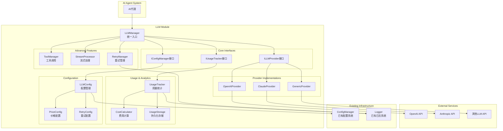

# LLM调用及用量统计模块设计文档

## 功能描述

本模块提供一个统一的LLM调用及用量统计系统，支持多种LLM服务提供商（OpenAI、Claude等），实现完善的用量统计、费用计算、重试机制和错误处理功能。模块将完全集成到现有的配置系统和日志系统中，为AI代理系统提供可靠的LLM调用能力。

## 设计思路

### 核心架构原则

1. **提供商抽象化**：通过接口抽象不同的LLM提供商，实现统一调用方式
2. **类型安全**：全面使用TypeScript和Zod进行类型约束和验证
3. **可扩展性**：支持动态添加新的LLM提供商
4. **配置驱动**：所有配置通过配置文件管理，支持热重载
5. **用量统计**：完整的token计数、费用计算和使用量持久化
6. **错误处理**：完善的错误分类、重试机制和降级策略

### 模块化设计

- **核心接口层**：定义统一的LLM服务接口
- **提供商实现层**：各种LLM服务的具体实现
- **用量统计层**：token计数、费用计算和持久化
- **配置管理层**：LLM配置的加载、验证和热重载
- **工具支持层**：工具调用、流式响应等高级功能

## 架构图



## 数据结构设计

### 1. 核心配置接口

```typescript
interface LLMProviderConfig {
  name: string;
  type: 'openai' | 'claude' | 'generic';
  api_key: string;
  base_url?: string;
  models: LLMModelConfig[];
  enabled: boolean;
  timeout: number;
  max_retries: number;
}

interface LLMModelConfig {
  name: string;
  display_name: string;
  max_tokens: number;
  supports_vision: boolean;
  supports_tools: boolean;
  supports_streaming: boolean;
  pricing?: ModelPricing;
}

interface ModelPricing {
  currency: string;
  unit: 'tokens' | 'million_tokens';
  input_price: number;
  output_price: number;
}
```

### 2. 请求和响应接口

```typescript
interface LLMRequest {
  model: string;
  messages: LLMMessage[];
  temperature?: number;
  max_tokens?: number;
  stream?: boolean;
  tools?: LLMTool[];
  tool_choice?: 'auto' | 'required' | 'none';
  stop?: string[];
}

interface LLMMessage {
  role: 'system' | 'user' | 'assistant' | 'tool';
  content: string | LLMContent[];
  tool_calls?: LLMToolCall[];
  tool_call_id?: string;
}

interface LLMContent {
  type: 'text' | 'image_url';
  text?: string;
  image_url?: {
    url: string;
    detail?: 'low' | 'high' | 'auto';
  };
}

interface LLMResponse {
  success: boolean;
  content?: string;
  model: string;
  usage: TokenUsage;
  finish_reason?: string;
  tool_calls?: LLMToolCall[];
  error?: LLMError;
  metadata: ResponseMetadata;
}

interface TokenUsage {
  prompt_tokens: number;
  completion_tokens: number;
  total_tokens: number;
  cost?: number;
}
```

### 3. 用量统计接口

```typescript
interface UsageRecord {
  model_name: string;
  provider_name: string;
  timestamp: number;
  request_id: string;
  prompt_tokens: number;
  completion_tokens: number;
  total_tokens: number;
  cost: number;
  success: boolean;
  error_type?: string;
  response_time: number;
}

interface UsageSummary {
  model_name: string;
  provider_name: string;
  total_requests: number;
  successful_requests: number;
  failed_requests: number;
  total_prompt_tokens: number;
  total_completion_tokens: number;
  total_tokens: number;
  total_cost: number;
  average_response_time: number;
  first_request_time: number;
  last_request_time: number;
}
```

## 接口定义

### 1. LLM提供商接口

```typescript
interface ILLMProvider {
  readonly name: string;
  readonly type: string;
  readonly config: LLMProviderConfig;

  initialize(): Promise<void>;
  isHealthy(): Promise<boolean>;

  chatCompletion(request: LLMRequest): Promise<LLMResponse>;
  streamCompletion(request: LLMRequest): AsyncIterable<LLMStreamChunk>;

  validateRequest(request: LLMRequest): ValidationResult;
  estimateTokens(text: string): number;

  dispose(): void;
}
```

### 2. 用量统计接口

```typescript
interface IUsageTracker {
  recordUsage(record: UsageRecord): Promise<void>;
  getUsageSummary(filter?: UsageFilter): Promise<UsageSummary[]>;
  getModelUsage(modelName: string, timeRange?: TimeRange): Promise<UsageSummary>;
  getTotalCost(timeRange?: TimeRange): Promise<number>;

  exportUsage(format: 'json' | 'csv'): Promise<string>;
  cleanupOldRecords(retentionDays: number): Promise<number>;
}
```

### 3. 配置管理接口

```typescript
interface ILLMConfigManager {
  getProviderConfig(name: string): LLMProviderConfig | null;
  getAllProviders(): LLMProviderConfig[];
  getDefaultProvider(): string | null;
  getModelConfig(providerName: string, modelName: string): LLMModelConfig | null;

  addProvider(config: LLMProviderConfig): Promise<void>;
  updateProvider(name: string, updates: Partial<LLMProviderConfig>): Promise<void>;
  removeProvider(name: string): Promise<void>;

  reloadConfig(): Promise<void>;
  onConfigChanged(callback: (config: LLMProviderConfig[]) => void): void;
}
```

## 核心组件设计

### 1. LLMManager（统一管理器）

**职责：**

- 提供统一的LLM调用入口
- 管理多个LLM提供商
- 协调用量统计和错误处理
- 实现负载均衡和故障转移

**核心方法：**

```typescript
class LLMManager {
  async chatCompletion(request: LLMRequest): Promise<LLMResponse>;
  async streamCompletion(request: LLMRequest): AsyncIterable<LLMStreamChunk>;
  async callWithTools(request: LLMRequest, tools: LLMTool[]): Promise<LLMToolResponse>;
  async visionCompletion(request: LLMMultiModalRequest): Promise<LLMResponse>;

  getProviderInfo(): ProviderInfo[];
  getUsageSummary(): Promise<UsageSummary[]>;
  healthCheck(): Promise<HealthStatus>;
}
```

### 2. UsageTracker（用量统计器）

**职责：**

- 记录每次LLM调用的详细用量
- 计算费用并持久化存储
- 提供用量查询和分析功能
- 支持数据导出和清理

**特性：**

- 内存缓存 + 文件持久化
- 异步批量写入优化
- 支持时间范围查询
- 自动数据清理机制

### 3. RetryManager（重试管理器）

**职责：**

- 实现智能重试策略
- 错误分类和重试决策
- 指数退避算法
- 断路器模式

**重试策略：**

- 网络错误：3次重试，指数退避
- 限流错误：5次重试，线性退避
- 服务器错误：2次重试，固定延迟
- 认证错误：不重试，直接失败

## 配置设计

### 1. 主配置文件结构

```toml
[llm]
default_provider = "openai"
enable_usage_tracking = true
usage_data_dir = "./data/llm-usage"
cost_tracking = true

[llm.providers.openai]
type = "openai"
api_key = "${OPENAI_API_KEY}"
base_url = "https://api.openai.com/v1"
enabled = true
timeout = 30000
max_retries = 3

[llm.providers.openai.models.gpt-4]
display_name = "GPT-4"
max_tokens = 8192
supports_vision = true
supports_tools = true
supports_streaming = true

[llm.providers.openai.models.gpt-4.pricing]
currency = "USD"
unit = "million_tokens"
input_price = 30.0
output_price = 60.0

[llm.providers.claude]
type = "claude"
api_key = "${CLAUDE_API_KEY}"
enabled = true
timeout = 30000
max_retries = 3

[llm.retry]
max_attempts = 3
base_delay = 1000
max_delay = 10000
backoff_factor = 2.0
retryable_errors = ["network", "rate_limit", "server_error"]
```

### 2. 价格配置独立管理

支持动态加载价格配置，可以从文件或API获取最新价格信息。

## 错误处理设计

### 1. 错误分类

```typescript
enum LLMErrorType {
  NETWORK_ERROR = 'network',
  AUTHENTICATION_ERROR = 'auth',
  RATE_LIMIT_ERROR = 'rate_limit',
  TOKEN_LIMIT_ERROR = 'token_limit',
  MODEL_NOT_FOUND = 'model_not_found',
  INVALID_REQUEST = 'invalid_request',
  SERVER_ERROR = 'server_error',
  TIMEOUT_ERROR = 'timeout',
  UNKNOWN_ERROR = 'unknown',
}

class LLMError extends Error {
  constructor(
    public type: LLMErrorType,
    message: string,
    public providerName: string,
    public statusCode?: number,
    public retryable: boolean = false,
  ) {
    super(message);
    this.name = 'LLMError';
  }
}
```

### 2. 降级策略

- 主提供商失败时自动切换到备用提供商
- 支持只读模式和离线模式
- 优雅降级，保持核心功能可用

## 性能优化

### 1. 连接池管理

- HTTP连接复用
- 请求队列管理
- 并发限制

### 2. 缓存策略

- 相同请求结果缓存（可选）
- 用量数据内存缓存
- 配置信息缓存

### 3. 批量处理

- 用量数据批量写入
- 多个请求并行处理
- 异步IO优化

## 测试策略

### 1. 单元测试

- 每个提供商独立测试
- 用量统计功能测试
- 错误处理逻辑测试
- 配置管理测试

### 2. 集成测试

- 端到端LLM调用测试
- 多提供商切换测试
- 并发请求测试
- 故障恢复测试

### 3. 性能测试

- 响应时间基准测试
- 并发能力测试
- 内存使用测试
- 长时间运行稳定性测试

## 安全考虑

### 1. API密钥管理

- 支持环境变量
- 配置文件加密存储
- 密钥轮换支持
- 审计日志记录

### 2. 数据安全

- 敏感数据脱敏
- 请求内容加密存储
- 访问权限控制
- 数据保留策略

### 3. 网络安全

- HTTPS强制使用
- 请求签名验证
- 证书固定
- 超时和限流保护

## 注意事项

### 1. 兼容性考虑

- 向后兼容现有LLM调用接口
- 支持旧配置格式迁移
- 渐进式升级策略

### 2. 监控和告警

- 关键指标监控
- 异常情况告警
- 性能指标收集
- 健康状态检查

### 3. 可维护性

- 模块化设计，低耦合
- 完善的日志和调试信息
- 配置热重载支持
- 插件化架构

### 4. 扩展性

- 新提供商易于添加
- 自定义中间件支持
- 事件驱动架构
- 微服务友好设计

## 实施计划

模块将分阶段实施：

1. **第一阶段**：核心接口和OpenAI提供商实现
2. **第二阶段**：用量统计和配置管理
3. **第三阶段**：Claude提供商和工具支持
4. **第四阶段**：高级功能和性能优化
5. **第五阶段**：测试完善和文档编写

每个阶段都确保模块可独立运行和测试，为AI代理系统提供可靠的LLM调用能力。
