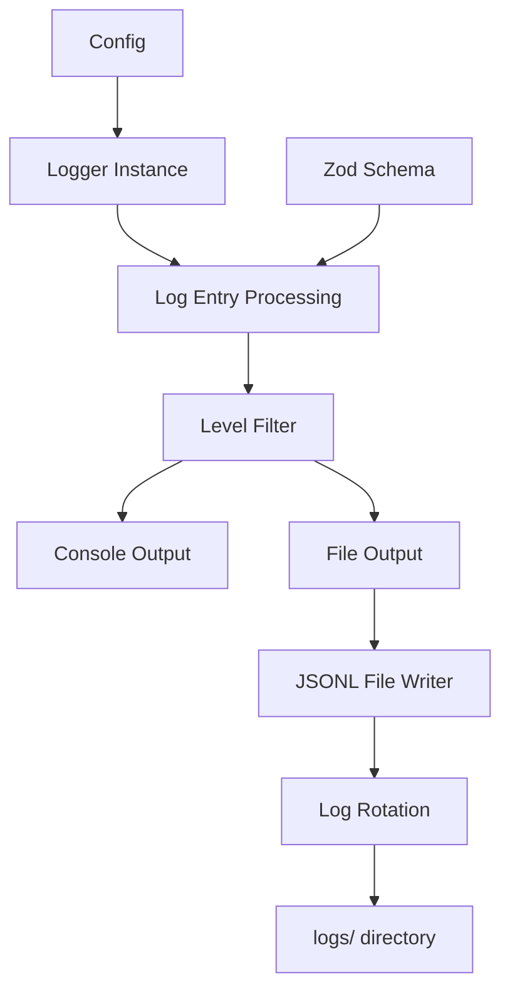

# Logger 设计文档

## 功能描述

实现一个结构化日志系统，支持多级别日志、JSONL格式文件输出和控制台输出，为maicraft-next项目提供统一的日志记录能力。

## 设计思路

### 核心原则
1. **结构化日志**: 使用JSON格式记录日志，便于解析和查询
2. **多级别支持**: 支持error、warn、info、debug四个级别
3. **双输出**: 同时支持文件输出和控制台输出
4. **自动管理**: 自动创建logs目录，支持日志轮转
5. **类型安全**: 使用TypeScript确保类型安全

### 架构设计



## 数据结构

### LogLevel 枚举
```typescript
enum LogLevel {
  ERROR = 0,
  WARN = 1,
  INFO = 2,
  DEBUG = 3
}
```

### LogEntry 接口
```typescript
interface LogEntry {
  timestamp: string;      // ISO 8601格式
  level: LogLevel;        // 日志级别
  message: string;        // 日志消息
  context?: any;          // 上下文数据
  module?: string;        // 模块名称
  error?: Error;          // 错误对象
}
```

### LoggerConfig 接口
```typescript
interface LoggerConfig {
  level: LogLevel;        // 最小日志级别
  console: boolean;       // 是否输出到控制台
  file: boolean;          // 是否输出到文件
  maxFileSize?: number;   // 最大文件大小（字节）
  maxFiles?: number;      // 最大文件数量
  dateFormat?: string;    // 时间格式
}
```

## 接口定义

### Logger 类主要方法
```typescript
class Logger {
  constructor(config?: LoggerConfig)

  // 基础日志方法
  error(message: string, context?: any): void
  warn(message: string, context?: any): void
  info(message: string, context?: any): void
  debug(message: string, context?: any): void

  // 通用日志方法
  log(level: LogLevel, message: string, context?: any): void

  // 模块专用日志器
  child(module: string): Logger

  // 配置更新
  updateConfig(config: Partial<LoggerConfig>): void

  // 清理资源
  close(): void
}
```

## 实现细节

### 文件命名策略
- 日志文件按日期命名: `app-YYYY-MM-DD.jsonl`
- 使用UTC时间确保时区一致性
- 自动创建logs目录

### 日志轮转
- 当文件大小超过`maxFileSize`时创建新文件
- 保留最近的`maxFiles`个文件
- 文件命名格式: `app-YYYY-MM-DD-{index}.jsonl`

### 控制台输出格式
- 使用chalk库进行彩色输出
- 错误: 红色
- 警告: 黄色
- 信息: 蓝色
- 调试: 灰色

### 性能优化
- 异步文件写入，不阻塞主线程
- 批量写入优化
- 内存使用控制

## 使用示例

### 基础使用
```typescript
import { Logger } from '@/utils/Logger';

const logger = new Logger({
  level: LogLevel.INFO,
  console: true,
  file: true
});

logger.info('应用启动', { port: 3000 });
logger.error('连接失败', new Error('Network error'));
```

### 模块专用日志器
```typescript
const minecraftLogger = logger.child('minecraft');
minecraftLogger.info('玩家连接', { username: 'player1' });
```

### 上下文日志
```typescript
logger.info('处理请求', {
  method: 'GET',
  path: '/api/status',
  duration: 150
});
```

## 注意事项

1. **线程安全**: 确保并发写入的安全性
2. **错误处理**: 文件写入失败时的降级策略
3. **内存泄漏**: 及时清理文件句柄
4. **配置验证**: 使用zod验证配置参数
5. **测试覆盖**: 单元测试覆盖所有功能

## 依赖关系

- 内置模块: `fs`, `path`, `events`
- 可选依赖: `chalk` (控制台颜色)
- 类型安全: `zod` (配置验证)