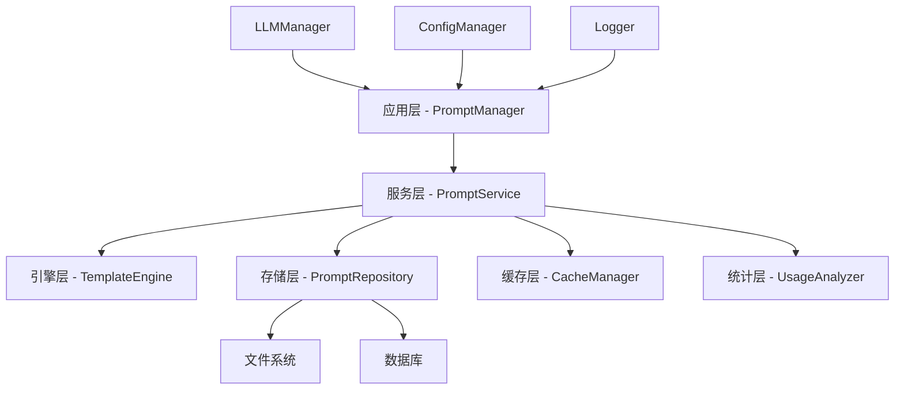
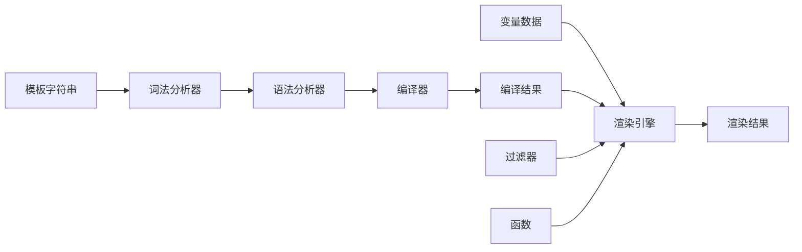
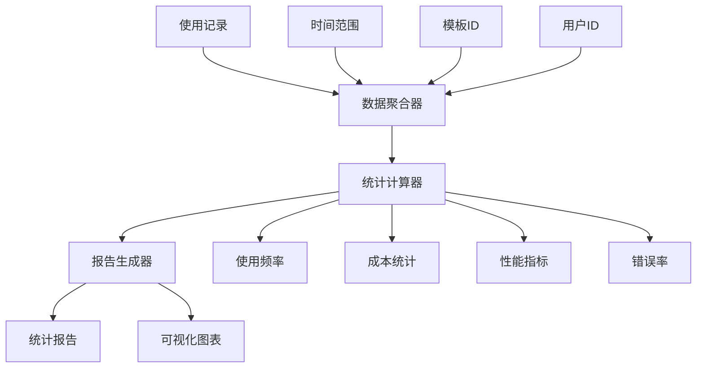

# 提示词管理系统设计文档

## 功能描述

提示词管理系统是一个灵活的模板管理引擎，为AI决策系统提供动态提示词生成、版本控制、分类管理和使用统计功能。系统支持变量替换、模板继承、多版本管理，并与现有的配置系统、日志系统和LLM管理系统深度集成。

## 设计思路

### 核心设计原则

1. **模板驱动**: 使用模板引擎实现灵活的提示词生成
2. **类型安全**: 全面使用TypeScript类型系统和Zod验证
3. **性能优化**: 实现智能缓存和懒加载机制
4. **可扩展性**: 支持自定义变量处理器和模板过滤器
5. **版本管理**: 完整的版本控制和历史追踪
6. **集成友好**: 与现有LLM系统无缝集成

### 架构分层



## 数据结构设计

### 核心类型定义

```typescript
// 提示词模板接口
interface IPromptTemplate {
  id: string;
  name: string;
  description: string;
  category: string;
  tags: string[];
  template: string;
  variables: IPromptVariable[];
  version: string;
  createdAt: Date;
  updatedAt: Date;
  metadata: Record<string, any>;
}

// 变量定义
interface IPromptVariable {
  name: string;
  type: 'string' | 'number' | 'boolean' | 'object' | 'array';
  required: boolean;
  defaultValue?: any;
  description: string;
  validation?: VariableValidation;
}

// 变量验证规则
interface VariableValidation {
  pattern?: string; // 正则表达式
  min?: number;
  max?: number;
  options?: any[]; // 枚举值
  custom?: (value: any) => boolean | string;
}

// 版本信息
interface IPromptVersion {
  templateId: string;
  version: string;
  template: string;
  variables: IPromptVariable[];
  changelog: string;
  createdAt: Date;
  createdBy: string;
}

// 使用记录
interface IUsageRecord {
  templateId: string;
  version: string;
  timestamp: Date;
  variables: Record<string, any>;
  renderedPrompt: string;
  executionTime: number;
  tokensUsed?: number;
  cost?: number;
  success: boolean;
  errorMessage?: string;
}
```

### 存储结构设计

```
prompts/
├── templates/
│   ├── chat/
│   │   ├── greeting.toml
│   │   └── task-planning.toml
│   ├── action/
│   │   ├── mining.toml
│   │   └── building.toml
│   └── system/
│       ├── error-handling.toml
│       └── status-report.toml
├── versions/
│   ├── {templateId}/
│   │   ├── v1.0.0.toml
│   │   ├── v1.1.0.toml
│   │   └── current.json -> v1.1.0.toml
├── cache/
│   ├── compiled-templates.json
│   └── variable-cache.json
└── usage/
    ├── usage-2024-01.jsonl
    ├── usage-2024-02.jsonl
    └── statistics.json
```

## 接口定义

### 核心服务接口

```typescript
interface IPromptService {
  // 模板管理
  createTemplate(template: CreatePromptTemplateDto): Promise<IPromptTemplate>;
  updateTemplate(id: string, updates: Partial<IPromptTemplate>): Promise<IPromptTemplate>;
  deleteTemplate(id: string): Promise<void>;
  getTemplate(id: string, version?: string): Promise<IPromptTemplate>;
  listTemplates(filter?: TemplateFilter): Promise<IPromptTemplate[]>;

  // 版本管理
  createVersion(templateId: string, changes: VersionChanges): Promise<IPromptVersion>;
  getVersionHistory(templateId: string): Promise<IPromptVersion[]>;
  rollbackVersion(templateId: string, version: string): Promise<IPromptTemplate>;

  // 渲染引擎
  renderTemplate(templateId: string, variables: Record<string, any>, options?: RenderOptions): Promise<string>;
  validateVariables(templateId: string, variables: Record<string, any>): Promise<ValidationResult>;

  // 使用统计
  recordUsage(record: UsageRecordDto): Promise<void>;
  getUsageStatistics(filter?: UsageFilter): Promise<UsageStatistics>;
  getPopularTemplates(limit?: number): Promise<IPromptTemplate[]>;
}

interface ITemplateEngine {
  compile(template: string): CompiledTemplate;
  render(compiled: CompiledTemplate, variables: Record<string, any>): string;
  validate(template: string): ValidationResult;
  addFilter(name: string, filter: TemplateFilter): void;
  addFunction(name: string, fn: TemplateFunction): void;
}

interface IPromptRepository {
  save(template: IPromptTemplate): Promise<void>;
  findById(id: string): Promise<IPromptTemplate | null>;
  findByName(name: string): Promise<IPromptTemplate | null>;
  findAll(filter?: TemplateFilter): Promise<IPromptTemplate[]>;
  delete(id: string): Promise<void>;
  saveVersion(version: IPromptVersion): Promise<void>;
  getVersionHistory(templateId: string): Promise<IPromptVersion[]>;
}
```

## 核心组件设计

### 1. 模板引擎



**特性**:

- 支持 `${variable}` 语法
- 支持条件渲染 `${variable ? 'yes' : 'no'}`
- 支持循环渲染 `${#each items}${this}${/each}`
- 支持模板包含 `${include 'other-template'}`
- 内置过滤器：`upper`, `lower`, `capitalize`, `truncate`等
- 自定义函数和过滤器支持

### 2. 缓存管理器

```typescript
interface ICacheManager {
  get<T>(key: string): Promise<T | null>;
  set<T>(key: string, value: T, ttl?: number): Promise<void>;
  delete(key: string): Promise<void>;
  clear(): Promise<void>;
  has(key: string): Promise<boolean>;

  // 编译模板缓存
  getCompiledTemplate(templateId: string): Promise<CompiledTemplate | null>;
  setCompiledTemplate(templateId: string, compiled: CompiledTemplate): Promise<void>;

  // 变量验证缓存
  getValidationSchema(templateId: string): Promise<z.ZodSchema | null>;
  setValidationSchema(templateId: string, schema: z.ZodSchema): Promise<void>;
}
```

### 3. 使用分析器



## 集成接口设计

### 与LLM管理器集成

```typescript
interface IPromptLLMIntegration {
  // 直接使用提示词调用LLM
  promptLLM(templateId: string, variables: Record<string, any>, options?: LLMPromptOptions): Promise<LLMResponse>;

  // 批量提示词处理
  promptLLMBatch(requests: PromptLLMRequest[]): Promise<LLMResponse[]>;

  // 流式提示词处理
  promptLLMStream(templateId: string, variables: Record<string, any>, options?: LLMPromptOptions): AsyncIterable<string>;
}

interface LLMPromptOptions {
  model?: string;
  temperature?: number;
  maxTokens?: number;
  stream?: boolean;
  // 其他LLM选项
  trackUsage?: boolean;
  cacheResults?: boolean;
}
```

### 与配置系统集成

```toml
[prompt]
# 提示词模板存储路径
templates_path = "prompts/templates"
# 版本存储路径
versions_path = "prompts/versions"
# 缓存配置
cache_enabled = true
cache_ttl = 3600
# 使用统计
usage_tracking = true
usage_retention_days = 90
# 默认设置
default_category = "general"
auto_version = true
max_versions_per_template = 10

[prompt.filters]
# 自定义过滤器配置
custom_filters_path = "prompts/filters"

[prompt.functions]
# 自定义函数配置
custom_functions_path = "prompts/functions"
```

## 错误处理策略

### 错误类型定义

```typescript
enum PromptErrorType {
  TEMPLATE_NOT_FOUND = 'TEMPLATE_NOT_FOUND',
  INVALID_TEMPLATE = 'INVALID_TEMPLATE',
  VARIABLE_VALIDATION_FAILED = 'VARIABLE_VALIDATION_FAILED',
  VERSION_NOT_FOUND = 'VERSION_NOT_FOUND',
  RENDER_ERROR = 'RENDER_ERROR',
  STORAGE_ERROR = 'STORAGE_ERROR',
  CACHE_ERROR = 'CACHE_ERROR',
}

class PromptError extends Error {
  constructor(
    public type: PromptErrorType,
    message: string,
    public details?: any,
  ) {
    super(message);
    this.name = 'PromptError';
  }
}
```

### 错误处理机制

1. **模板验证错误**: 提供详细的错误位置和修复建议
2. **变量验证错误**: 明确指出哪个变量不符合要求
3. **渲染错误**: 提供上下文信息和调试信息
4. **存储错误**: 自动重试和降级处理
5. **缓存错误**: 自动降级到直接计算

## 性能优化策略

### 1. 编译缓存

- 模板编译结果缓存，避免重复编译
- 变量验证Schema缓存，加速验证过程
- 智能缓存失效机制

### 2. 懒加载

- 按需加载模板文件
- 延迟编译大型模板
- 分批处理批量操作

### 3. 内存管理

- LRU缓存策略
- 定期清理过期数据
- 内存使用监控

### 4. 并发控制

- 模板加载并发限制
- 渲染队列管理
- 资源池化

## 安全考虑

### 1. 输入验证

- 严格的变量类型验证
- 模板语法安全检查
- 防止代码注入攻击

### 2. 访问控制

- 模板访问权限控制
- 敏感变量保护
- 操作审计日志

### 3. 数据保护

- 敏感信息脱敏
- 安全的文件存储
- 传输加密

## 测试策略

### 单元测试覆盖

- 模板引擎各个组件
- 变量验证逻辑
- 缓存机制
- 错误处理

### 集成测试

- 端到端模板渲染流程
- 版本管理功能
- 统计分析功能
- 外部系统集成

### 性能测试

- 大量模板的加载性能
- 高频渲染的性能表现
- 内存使用情况监控
- 并发处理能力测试

## 扩展性设计

### 1. 插件系统

```typescript
interface IPromptPlugin {
  name: string;
  version: string;
  install(manager: PromptManager): void;
  uninstall(manager: PromptManager): void;
}
```

### 2. 自定义扩展

- 自定义变量类型
- 自定义过滤器
- 自定义函数
- 自定义存储后端

### 3. 多语言支持

- 国际化模板支持
- 多语言变量处理
- 本地化错误消息

## 监控和调试

### 1. 性能监控

- 模板渲染时间统计
- 缓存命中率监控
- 内存使用情况跟踪
- 错误率统计

### 2. 调试工具

- 模板渲染步骤跟踪
- 变量替换过程可视化
- 错误详细信息输出
- 性能分析报告

### 3. 日志记录

- 结构化日志格式
- 不同级别的日志记录
- 敏感信息过滤
- 日志轮转和归档

## 部署和维护

### 1. 配置管理

- 环境配置分离
- 配置热重载
- 配置验证机制

### 2. 数据迁移

- 模板版本升级
- 数据格式转换
- 向后兼容性保证

### 3. 备份和恢复

- 定期数据备份
- 灾难恢复方案
- 数据一致性检查

---

**注意**: 此设计文档将在实现过程中持续更新和完善。所有设计决策都应该通过实际实现来验证和调整。
