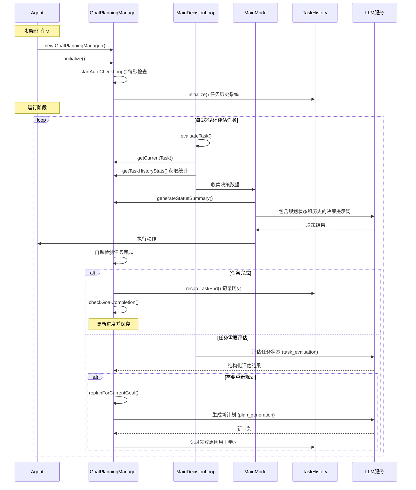
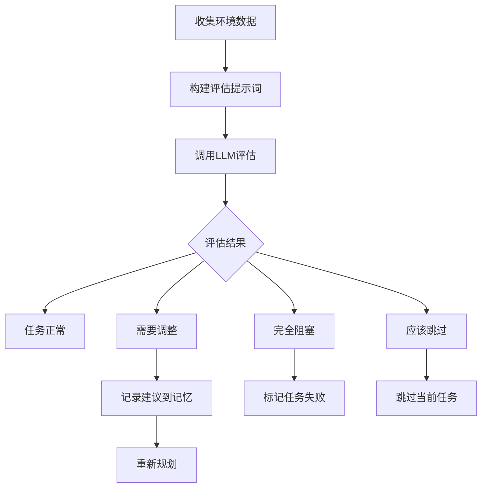
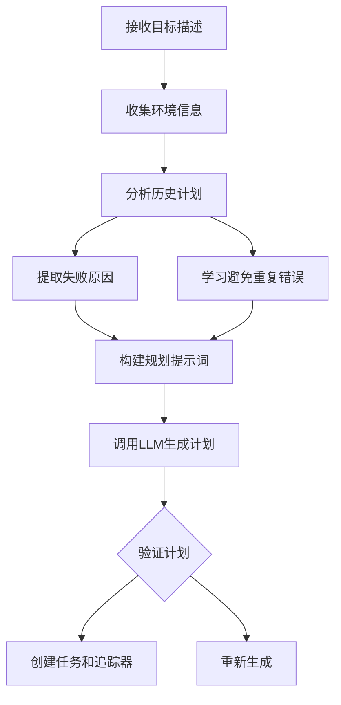

# 规划系统 (Goal-Plan-Task System)

> 本文档介绍 Maicraft-Next 的层次化任务规划系统

---

## 🎯 设计理念

### Maicraft Python 的局限

```python
# ❌ 简单的 to_do_list
todo_list = [
    "收集木头",
    "制作工作台",
    "制作木镐"
]
```

**问题**：

- 扁平结构，无层次关系
- 无法表达任务依赖
- 无进度追踪
- 难以管理复杂任务

### Maicraft-Next 的改进

**增强的三层结构**：Goal → Plan → Task + TaskHistory + 任务评估系统

```typescript
// ✅ 层次化规划
const goal = await planning.createGoal({
  name: '建造房子',
  description: '在当前位置建造一个木质房子',
  priority: 'high',
});

// ✅ LLM 自动生成计划（分析历史避免重复错误）
const plan = await planning.generatePlanForCurrentGoal();
console.log(`生成计划: ${plan.title} (${plan.tasks.length} 个任务)`);

// ✅ 自动进度追踪 + 任务历史统计
const currentTask = planning.getCurrentTask();
const taskStats = planning.getTaskHistoryStats(currentTask.title);
console.log(`任务执行统计: ${taskStats.totalCompleted}/${taskStats.totalExecuted} 成功`);

// ✅ 智能任务评估和自动调整
await planning.handleTaskEvaluation({
  task_status: 'struggling',
  progress_assessment: '缺少铁矿石',
  issues: ['找不到铁矿石', '铁镐耐久不足'],
  suggestions: ['向地下探索', '先合成铁镐'],
  should_replan: true,
  confidence: 0.85,
});
// 系统自动重新规划，避免重复错误
```

---

## 🔄 工作流程

### Mermaid 时序图



### 关键代码流程

#### 1. Agent 初始化规划系统

```typescript
// Agent.ts - 初始化
const planningManager = new GoalPlanningManager(gameContext);
await this.state.planningManager.initialize();
```

#### 2. 自动检查循环

```typescript
// GoalPlanningManager.ts - 自动检查
private startAutoCheckLoop(): void {
  this.autoCheckInterval = setInterval(() => {
    this.autoCheckCompletion().catch(error => {
      this.logger.error('自动检查任务完成失败:', {}, error as Error);
    });
  }, 1000); // 每秒检查一次
}
```

#### 3. 决策循环中使用规划状态

```typescript
// MainDecisionLoop.ts - 任务评估
private async evaluateTask(): Promise<void> {
  const { planningManager } = this.state;
  const currentTask = planningManager?.getCurrentTask()?.title || '暂无任务';

  // 构建包含规划状态的评估数据
  const evaluationData = {
    goal: this.state.goal,
    current_task: currentTask,
    // ... 其他数据
  };
}
```

#### 4. 在决策提示词中包含规划信息

```typescript
// PromptDataCollector.ts - 收集规划状态
const planningStatus = planningManager?.generateStatusSummary() || '暂无任务';

// 生成的提示词包含：
// 🎯 当前目标: 建造房子
// 📋 收集材料 (75%)
//   ✅ 收集64个橡木 (100%)
//   🔄 制作256个木板 (50%)
// 🔄 当前任务: 制作256个木板
//    进度: 128/256 橡木板
//    完成条件: 背包中至少有 256 个 oak_planks
```

#### 5. 任务自动完成检测

```typescript
// Task.ts - 自动检测完成
checkCompletion(context: GameContext): boolean {
  const completed = this.tracker.checkCompletion(context);
  if (completed && this.status !== 'completed') {
    this.complete(); // 自动标记完成
  }
  return completed;
}
```

---

## 📐 系统架构

```
GoalPlanningManager (规划管理器)
├── Goal (目标)
│   ├── Plan 1 (计划)
│   │   ├── Task 1.1 (任务)
│   │   │   ├── Tracker (追踪器)
│   │   │   ├── Evaluations (评估记录)
│   │   │   └── Dependencies (依赖关系)
│   │   ├── Task 1.2
│   │   │   └── ...
│   │   └── Task 1.3
│   └── Plan 2
├── TaskHistory (任务历史系统)
│   ├── TaskHistoryEntry[] (执行记录)
│   ├── TaskStats (统计信息)
│   └── ProgressSnapshots (进度快照)
├── TrackerFactory (追踪器工厂)
└── AutoCheckLoop (自动检查循环)
    ├── 任务完成检测 (每秒)
    ├── 进度更新
    └── 数据持久化 (每30秒)
```

### 核心组件

1. **Goal (目标)** - 高层次的目标，如"建造房子"、"探索矿洞"
2. **Plan (计划)** - 实现目标的具体计划，如"收集材料"、"建造地基"
3. **Task (任务)** - 计划中的具体任务，如"收集64个木头"，包含追踪器和依赖管理
4. **TaskHistory (任务历史)** - 记录任务执行历史、统计信息和失败原因分析
5. **TaskTracker (追踪器)** - 自动检测任务完成状态，支持多种追踪类型
6. **TaskEvaluation (任务评估)** - LLM 驱动的任务状态评估和自动调整机制

---

## 💻 基本使用

### 创建目标

```typescript
import { GoalPlanningManager } from '@/core/agent/planning/GoalPlanningManager';

const planning = new GoalPlanningManager(gameContext);

// 初始化系统（包含自动检查循环和持久化）
await planning.initialize();

// 设置目标完成回调
planning.setOnGoalCompleted(goal => {
  console.log(`🎯 目标完成: ${goal.description}`);
  // 触发后续逻辑...
});

// 创建目标
const goal = planning.createGoal('建造一个木质房子在当前位置');
console.log(`创建目标: ${goal.description}`);
```

### 创建计划

```typescript
// 方法1: 手动创建计划
const plan = planning.createPlan({
  title: '收集材料',
  description: '收集建造所需的木材',
  goalId: goal.id,
  tasks: [
    {
      title: '收集64个橡木',
      description: '去森林收集橡木原木',
      tracker: {
        type: 'inventory',
        item: 'oak_log',
        count: 64,
      },
    },
    {
      title: '制作256个木板',
      description: '将橡木原木制作成木板',
      tracker: {
        type: 'inventory',
        item: 'oak_planks',
        count: 256,
      },
    },
  ],
});

// 方法2: LLM 自动生成计划（推荐）
await planning.setCurrentGoal(goal.id);
const autoPlan = await planning.generatePlanForCurrentGoal();
console.log(`LLM 生成计划: ${autoPlan.title} (${autoPlan.tasks.length} 个任务)`);
```

### 追踪进度

```typescript
// 获取当前任务和进度（自动）
const currentTask = planning.getCurrentTask();
if (currentTask) {
  const progress = currentTask.getProgress(context);
  console.log(`当前任务: ${currentTask.title} (${progress.percentage.toFixed(0)}%)`);
}

// 获取任务历史统计
const taskStats = planning.getTaskHistoryStats('收集64个橡木');
if (taskStats.totalExecuted > 0) {
  console.log(`任务统计: ${taskStats.totalCompleted}/${taskStats.totalExecuted} 成功`);
  console.log(`成功率: ${(taskStats.successRate * 100).toFixed(0)}%`);
  console.log(`平均耗时: ${taskStats.averageDuration.toFixed(0)}ms`);
}

// 获取最近的任务执行历史
const recentHistory = planning.getRecentTaskHistory(5);
console.log(
  '最近任务历史:',
  recentHistory.map(h => `${h.taskTitle}: ${h.status}`),
);
```

### 管理目标

```typescript
// 获取所有目标
const goals = planning.getAllGoals();
console.log(`共有 ${goals.size} 个目标`);

// 获取当前目标
const current = planning.getCurrentGoal();
if (current) {
  console.log(`当前目标: ${current.description}`);
}

// 切换目标
const success = planning.setCurrentGoal(goal.id);
if (success) {
  console.log('目标切换成功');
}

// 目标会自动完成（通过自动检查循环）
// 也可以手动完成
if (current && current.status === 'completed') {
  console.log(`目标已完成: ${current.description}`);
}
```

---

## 📊 任务历史系统 (TaskHistory)

任务历史系统自动记录所有任务的执行过程、统计信息和失败原因分析，为LLM提供学习数据，避免重复错误。

### 核心功能

- **自动记录**: 任务开始、结束、进度快照自动记录
- **统计分析**: 成功率、平均耗时、常见失败模式
- **历史查询**: 支持按任务类型和时间范围查询
- **持久化存储**: 数据自动保存到 `data/task-history.json`

### 使用示例

```typescript
// 初始化历史系统（GoalPlanningManager.initialize() 中自动调用）
await taskHistory.initialize();

// 系统自动记录任务执行
// 开始任务时自动调用 recordTaskStart
// 每秒自动记录进度快照 recordTaskProgress
// 结束任务时自动调用 recordTaskEnd

// 获取任务统计
const stats = planning.getTaskHistoryStats('收集64个橡木');
console.log(`任务统计:
  执行次数: ${stats.totalExecuted}
  成功次数: ${stats.totalCompleted}
  成功率: ${(stats.successRate * 100).toFixed(0)}%
  平均耗时: ${stats.averageDuration.toFixed(0)}ms
  常见失败原因: ${Object.entries(stats.commonFailurePatterns).slice(0, 3)}`);

// 获取任务执行历史
const history = planning.getTaskExecutionHistory('收集64个橡木', 5);
console.log(
  '最近5次执行:',
  history.map(h => ({
    开始时间: new Date(h.startTime).toLocaleString(),
    耗时: h.duration ? `${h.duration}ms` : '未完成',
    状态: h.status,
    进度快照: h.progressSnapshots.length,
  })),
);

// 获取最近的历史记录
const recent = planning.getRecentTaskHistory(10);
console.log(
  '最近10个任务:',
  recent.map(h => `${h.taskTitle}: ${h.status}`),
);
```

### 数据结构

#### TaskHistoryEntry (历史条目)

```typescript
interface TaskHistoryEntry {
  id: string; // 唯一标识
  taskId: string; // 任务ID
  taskTitle: string; // 任务标题
  planId: string; // 所属计划ID
  goalId: string; // 所属目标ID
  startTime: number; // 开始时间戳
  endTime?: number; // 结束时间戳
  duration?: number; // 执行时长(毫秒)
  status: 'completed' | 'failed' | 'abandoned'; // 最终状态
  progressSnapshots: TaskProgressSnapshot[]; // 进度快照
  context: Record<string, any>; // 执行上下文
}
```

#### TaskProgressSnapshot (进度快照)

```typescript
interface TaskProgressSnapshot {
  timestamp: number; // 时间戳
  current: number; // 当前值
  target: number; // 目标值
  percentage: number; // 完成百分比
  description: string; // 进度描述
}
```

#### TaskStats (统计信息)

```typescript
interface TaskStats {
  totalExecuted: number; // 总执行次数
  totalCompleted: number; // 成功完成次数
  totalFailed: number; // 失败次数
  totalAbandoned: number; // 放弃次数
  averageDuration: number; // 平均执行时长
  successRate: number; // 成功率 (0-1)
  commonFailurePatterns: Record<string, number>; // 常见失败模式
}
```

### 存储和清理

- **存储位置**: `data/task-history.json`
- **自动保存**: 每30秒自动保存（与规划系统同步）
- **清理策略**: 保留最近200条记录，超出时自动清理旧记录
- **数据恢复**: 系统重启时自动加载历史数据

### 在规划中的应用

任务历史数据用于：

1. **LLM 提示词**: 在 `plan_generation` 模板中提供历史失败原因
2. **任务评估**: 在 `task_evaluation` 模板中提供执行统计
3. **学习改进**: 分析失败模式，优化未来计划
4. **性能监控**: 跟踪任务执行效率和成功率

---

## 🔧 任务追踪器 (Trackers)

### 内置追踪器类型

#### 1. InventoryTracker - 物品栏追踪

```typescript
{
  type: 'inventory',
  item: 'iron_ore',
  count: 10
}
```

检查物品栏中是否有指定数量的物品。

#### 2. LocationTracker - 位置追踪

```typescript
{
  type: 'location',
  x: 100,
  y: 64,
  z: 200,
  radius: 5
}
```

检查是否到达指定位置（在半径范围内）。

#### 3. CraftTracker - 合成追踪

```typescript
{
  type: 'craft',
  item: 'wooden_pickaxe',
  count: 1
}
```

检查是否完成指定物品的合成。

#### 4. CompositeTracker - 组合追踪

```typescript
{
  type: 'composite',
  operator: 'AND',  // 或 'OR'
  trackers: [
    { type: 'inventory', item: 'diamond', count: 3 },
    { type: 'location', x: 0, y: 64, z: 0, radius: 10 }
  ]
}
```

组合多个追踪器，支持 AND/OR 逻辑。

#### TrackerFactory - 追踪器工厂

```typescript
import { TrackerFactory } from '@/core/agent/planning/trackers/TrackerFactory';

// 从JSON创建追踪器
const tracker = TrackerFactory.fromJSON({
  type: 'inventory',
  item: 'iron_ore',
  targetCount: 10,
});

// 支持所有追踪器类型
const locationTracker = TrackerFactory.fromJSON({
  type: 'location',
  targetX: 100,
  targetY: 64,
  targetZ: 200,
  radius: 5,
});

const compositeTracker = TrackerFactory.fromJSON({
  type: 'composite',
  logic: 'and',
  trackers: [
    { type: 'inventory', item: 'diamond', targetCount: 3 },
    { type: 'location', targetX: 0, targetY: 64, targetZ: 0, radius: 10 },
  ],
});
```

---

## 🎯 任务评估系统 (TaskEvaluation)

任务评估系统使用LLM定期评估当前任务的执行状态，自动触发重新规划、跳过任务或调整策略等行为。

### 评估时机

- **定期评估**: 每5次决策循环自动触发
- **状态触发**: 当任务状态发生变化时
- **手动评估**: 可通过API主动触发

### 评估流程



### 评估输出格式

```typescript
interface TaskEvaluation {
  task_status: 'on_track' | 'struggling' | 'blocked' | 'needs_adjustment';
  progress_assessment: string; // 进度评估描述
  issues: string[]; // 发现的问题
  suggestions: string[]; // 改进建议
  should_replan: boolean; // 是否需要重新规划
  should_skip_task: boolean; // 是否跳过任务
  confidence: number; // 置信度 (0.0-1.0)
}
```

### 自动行为触发

```typescript
// 系统自动处理评估结果
await planning.handleTaskEvaluation({
  task_status: 'struggling',
  progress_assessment: '铁矿石采集进度缓慢',
  issues: ['铁镐耐久不足', '找不到铁矿石位置'],
  suggestions: ['先合成铁镐', '向地下探索'],
  should_replan: true, // → 触发重新规划
  should_skip_task: false,
  confidence: 0.85,
});

// 评估结果自动触发相应行为：
// 1. 记录评估到任务历史
// 2. 如果 should_skip_task: 跳过当前任务
// 3. 如果 should_replan && confidence > 0.7: 重新规划
// 4. 如果 task_status === 'blocked': 标记失败
// 5. 记录建议到思考记忆
```

### 评估提示词示例

评估系统使用 `task_evaluation` 提示词模板，包含：

- **目标信息**: 当前目标描述
- **任务信息**: 任务标题、描述、进度
- **环境状态**: 位置、物品栏、健康值
- **周边信息**: 方块、实体、容器
- **历史数据**: 任务执行统计、聊天记录
- **决策历史**: 最近的决策记录

### 评估状态说明

| 状态               | 说明             | 自动行为               |
| ------------------ | ---------------- | ---------------------- |
| `on_track`         | 任务进展顺利     | 记录鼓励信息到记忆     |
| `struggling`       | 遇到困难但可继续 | 记录建议，监控进展     |
| `blocked`          | 任务完全阻塞     | 标记任务失败           |
| `needs_adjustment` | 需要调整策略     | 记录建议，考虑重新规划 |

### 与重新规划的集成

```typescript
// 评估发现问题 → 自动重新规划
const newPlan = await planning.replanForCurrentGoal('任务评估发现: 缺少铁矿石，铁镐耐久不足');

// 重新规划时会：
// 1. 分析历史计划的失败原因
// 2. 避免重复错误（如"再次生成合成铁板的计划"）
// 3. 生成改进的计划
// 4. 自动切换到新计划
```

---

## 🤖 LLM 自动计划生成 (Auto Planning)

系统支持使用LLM自动为目标生成执行计划，分析历史数据避免重复错误，提供智能的任务分解和资源规划。

### 自动生成时机

- **目标创建后**: 新目标自动生成初始计划
- **任务评估触发**: 当评估发现问题时自动重新规划
- **手动触发**: 可通过API主动生成计划

### 计划生成流程



### 环境信息收集

自动收集的规划数据包括：

```typescript
const planningContext = {
  // 目标信息
  goal: goal.description,

  // 玩家状态
  position: `${position.x}, ${position.y}, ${position.z}`,
  health: health.toString(),
  food: food.toString(),
  inventory: gameState.getInventoryDescription(),

  // 环境感知
  nearbyBlocks: nearbyBlocks.slice(0, 10).join(', '),
  nearbyEntities: nearbyEntities.slice(0, 5).join(', '),

  // 历史经验
  experiences: relevantExperiences.map(e => `- ${e.content} (置信度: ${(e.confidence * 100).toFixed(0)}%)`).join('\n'),

  // 历史计划分析
  planHistory: collectPlanHistory(goal),
};
```

### 历史分析和学习

系统分析该目标的所有历史计划，避免重复错误：

```typescript
private collectPlanHistory(goal: Goal): string {
  const historyLines: string[] = [];

  for (const planId of goal.planIds) {
    const plan = this.plans.get(planId);
    if (!plan || planId === this.currentPlanId) continue;

    const status = plan.status === 'completed' ? '✅ 成功' : '❌ 失败';
    historyLines.push(`\n计划: ${plan.title} (${status})`);

    // 分析失败的任务和原因
    for (const task of plan.tasks) {
      const lastEvaluation = task.getLastEvaluation();
      if (lastEvaluation?.status === 'blocked') {
        historyLines.push(`  ❌ ${task.title}: ${lastEvaluation.issues.join('; ')}`);
        if (lastEvaluation.should_replan) {
          historyLines.push(`    建议: 重新规划 (置信度: ${(lastEvaluation.confidence * 100).toFixed(0)}%)`);
        }
      }
    }
  }

  return historyLines.length > 0
    ? `已尝试 ${goal.planIds.length} 次规划，历史如下:\n${historyLines.join('\n')}\n\n⚠️ 请分析以上失败原因，生成不同的计划以避免重复错误！`
    : '这是首次为该目标生成计划。';
}
```

### 计划生成提示词

使用 `plan_generation` 模板，包含：

```
你是一个 Minecraft 任务规划专家。请根据目标生成一个详细的执行计划。

【目标】
{goal}

【当前状态】
位置: {position}
生命值: {health}/20, 饥饿值: {food}/20
物品栏: {inventory}

【周边环境】
{environment}

【已有经验】
{experiences}

【该目标的历史计划】
{plan_history}

⚠️ **重要提醒**：
- 仔细分析历史失败，避免重复错误
- 如果历史显示"橡木原木数量严重不足"，不要再生成合成木板的计划
- 如果历史显示"未执行资源采集"，确保计划包含采集步骤
- 如果历史显示"合成配方识别失败"，先检查材料再合成

【可用追踪器类型】
1. inventory - 物品收集任务
2. craft - 合成任务
3. location - 到达位置任务
4. composite - 组合任务

【输出格式】
必须返回JSON格式的计划...
```

### 任务创建和验证

```typescript
// 从LLM响应创建任务
for (const taskDef of planResponse.tasks) {
  try {
    // 使用TrackerFactory从JSON创建追踪器
    const tracker = TrackerFactory.fromJSON(taskDef.tracker);

    // 创建任务
    const task = new Task({
      title: taskDef.title,
      description: taskDef.description,
      tracker,
      dependencies: taskDef.dependencies || [],
    });

    tasks.push(task);
  } catch (error) {
    this.logger.error(`创建任务失败: ${taskDef.title}`, {}, error as Error);
  }
}
```

### 智能任务分解

系统自动生成的任务具有以下特点：

1. **依赖关系**: 自动识别任务间的先后顺序
2. **资源规划**: 根据当前物品栏状态规划材料收集
3. **风险评估**: 避免生成明显不可行的任务
4. **进度追踪**: 为每个任务配置合适的追踪器

### 重新规划机制

当任务评估发现问题时，自动触发重新规划：

```typescript
async replanForCurrentGoal(reason: string): Promise<Plan | null> {
  this.logger.info(`🔄 重新规划: ${reason}`);

  // 记录当前计划失败原因
  const currentPlan = this.getCurrentPlan();
  if (currentPlan) {
    this.logger.info(`📋 标记旧计划为失败: ${currentPlan.title}`);
  }

  // 生成新计划（会自动包含历史分析）
  const newPlan = await this.generatePlanForCurrentGoal();

  if (newPlan) {
    this.setCurrentPlan(newPlan.id);
    this.logger.info(`✅ 成功生成新计划: ${newPlan.title}`);
  }

  return newPlan;
}
```

### 示例输出

```json
{
  "title": "铁镐制作计划",
  "description": "制作铁镐所需的完整流程，包括材料收集和合成",
  "tasks": [
    {
      "title": "收集4个铁矿石",
      "description": "开采或寻找铁矿石",
      "tracker": {
        "type": "inventory",
        "item": "iron_ore",
        "targetCount": 4
      },
      "dependencies": []
    },
    {
      "title": "合成铁锭",
      "description": "将铁矿石烧制成铁锭",
      "tracker": {
        "type": "craft",
        "item": "iron_ingot",
        "targetCount": 3
      },
      "dependencies": ["0"]
    },
    {
      "title": "合成铁镐",
      "description": "使用铁锭和木棍合成铁镐",
      "tracker": {
        "type": "craft",
        "item": "iron_pickaxe",
        "targetCount": 1
      },
      "dependencies": ["1"]
    }
  ]
}
```

---

## 🔄 与 Maicraft Python 的对比

| 方面         | Maicraft Python  | Maicraft-Next                  |
| ------------ | ---------------- | ------------------------------ |
| **结构**     | 扁平的 todo_list | 三层 Goal-Plan-Task + 历史系统 |
| **层次**     | 无层次关系       | 清晰的层次结构 + 依赖管理      |
| **进度**     | 无自动追踪       | 自动进度计算 + 实时更新        |
| **追踪器**   | 手动检查         | 编程式追踪器 + 多种类型        |
| **依赖**     | 无依赖管理       | 支持索引和ID双重依赖           |
| **复杂任务** | 难以管理         | 易于组织 + LLM自动生成         |
| **历史学习** | 无               | 任务历史统计 + 失败原因分析    |
| **智能评估** | 无               | LLM任务评估 + 自动重新规划     |
| **持久化**   | 无               | 自动保存 + 状态恢复            |

---

## 📚 在 Agent 中使用规划系统

### Agent 初始化和集成

```typescript
// Agent.ts - 完整集成规划系统
export class Agent {
  constructor(/* ...参数... */) {
    // 1. 创建规划管理器
    const planningManager = new GoalPlanningManager(gameContext);

    // 2. 设置目标完成回调
    planningManager.setOnGoalCompleted((goal: Goal) => {
      this.handleGoalCompletion(goal);
    });

    // 3. 设置LLM管理器（用于自动计划生成）
    planningManager.setLLMManager(llmManager);

    // 4. 存储到Agent状态
    this.state.planningManager = planningManager;
  }

  async initialize(): Promise<void> {
    // 初始化规划系统（启动自动检查循环）
    await this.state.planningManager.initialize();

    // 如果配置中有目标，创建初始目标
    if (this.state.goal && !this.state.planningManager.getCurrentGoal()) {
      this.state.planningManager.createGoal(this.state.goal);
    }
  }

  // 目标完成事件处理
  private handleGoalCompletion(goal: Goal): void {
    // 1. 记录到记忆系统
    this.state.memory.recordThought(`成功完成了目标: ${goal.description}`, {
      completedGoal: goal.description,
      duration: Date.now() - goal.createdAt,
      planCount: goal.planIds.length,
    });

    // 2. 触发事件通知
    this.state.context.events.emit('goalCompleted', { goal });

    // 3. 可以在这里触发后续逻辑，如设置新目标
    this.logger.info(`🎯 目标完成: ${goal.description}`);
  }

  // 设置新目标（外部API）
  setGoal(description: string): void {
    this.state.goal = description;
    this.state.planningManager.createGoal(description);
    this.logger.info(`🎯 设置新目标: ${description}`);
  }
}
```

### 决策循环中的调度逻辑

```typescript
// MainDecisionLoop.ts - 增强的决策循环
async think(): Promise<void> {
  // 1. 定期评估任务（每5次循环）
  if (this.evaluationCounter % 5 === 0) {
    await this.evaluateTask();
  }

  // 2. 检查是否需要生成计划
  await this.checkAndGeneratePlan();

  // 3. 执行当前模式逻辑
  await this.executeCurrentMode();

  // 4. 定期总结经验（每10次循环）
  if (this.evaluationCounter % 10 === 0) {
    await this.summarizeExperience();
  }

  // 5. 根据当前模式调整等待时间
  await this.adjustSleepDelay();
}

// 检查并生成计划
private async checkAndGeneratePlan(): Promise<void> {
  const { planningManager } = this.state;

  // 检查是否有当前目标
  const currentGoal = planningManager.getCurrentGoal();
  if (!currentGoal) return;

  // 检查是否已有当前计划
  const currentPlan = planningManager.getCurrentPlan();
  if (currentPlan) return;

  // 自动生成计划
  this.logger.info(`🎯 检测到目标没有计划，开始自动生成...`);
  const plan = await planningManager.generatePlanForCurrentGoal();

  if (plan) {
    this.logger.info(`✅ 成功生成计划: ${plan.title}`);
  } else {
    this.logger.warn('⚠️ 计划生成失败');
  }
}

// 任务评估
private async evaluateTask(): Promise<void> {
  const currentTask = this.state.planningManager?.getCurrentTask();
  if (!currentTask) return;

  // 收集评估数据
  const evaluationData = {
    goal: this.state.goal,
    current_task: currentTask.title,
    task_description: currentTask.description,
    to_do_list: this.dataCollector.collectBasicInfo().to_do_list,
    task_stats: planningManager.getTaskHistoryStats(currentTask.title),
    // ... 其他环境数据
  };

  // 调用LLM评估
  const evaluation = await this.llmManager.structuredOutput(evaluationData, 'task_evaluation');

  // 处理评估结果（自动触发相应行为）
  await planningManager.handleTaskEvaluation(evaluation);
}
```

### 模式系统中的规划集成

```typescript
// MainMode.ts - 决策时包含规划信息
private async makeDecision(): Promise<void> {
  // 1. 收集包含规划状态的数据
  const promptData = await this.dataCollector.collectPromptData();

  // promptData 包含：
  // - to_do_list: 规划系统的状态摘要
  // - current_task: 当前任务标题
  // - goal: 当前目标描述

  // 2. 生成包含规划信息的提示词
  const prompt = await this.actionPromptGenerator.generateActionPrompt({
    ...promptData,
    // 规划状态已自动包含
  });

  // 3. LLM 决策
  const response = await this.llmManager.chatCompletion(prompt);

  // 4. 执行动作（动作执行会触发追踪器检查）
  const action = this.parseAction(response);
  await this.executor.execute(action);

  // 5. 规划系统会自动检测任务完成（每秒检查）
  // 6. 如需要，自动触发评估和重新规划
}
```

### 事件驱动的规划更新

```typescript
// Agent.ts - 事件监听设置
private setupEventListeners(): void {
  const { events } = this.state.context;

  // 监听游戏事件，可能影响规划
  events.on('blockPlaced', (data) => {
    // 方块放置可能表示任务进度
    this.state.planningManager.recordTaskProgress();
  });

  events.on('inventoryChanged', (data) => {
    // 物品栏变化会自动触发追踪器检查
    // GoalPlanningManager 的自动检查循环会处理
  });

  events.on('entityHurt', (data) => {
    // 受伤可能需要重新评估当前任务
    this.logger.warn('受到伤害，可能需要调整计划');
  });
}

// 外部事件处理
handleChatMessage(message: string): void {
  // 处理玩家指令
  if (message.startsWith('!goal ')) {
    const goal = message.substring(6);
    this.setGoal(goal);
  } else if (message === '!status') {
    const status = this.state.planningManager.generateStatusSummary();
    this.bot.chat(status);
  } else if (message === '!skip') {
    // 跳过当前任务
    this.state.planningManager.skipCurrentTask('玩家指令');
  }
}
```

### 生命周期管理

```typescript
// Agent.ts - 完整的生命周期
async start(): Promise<void> {
  await this.initialize();

  // 启动决策循环
  this.mainLoop.start();
  this.chatLoop.start();

  this.isRunning = true;
  this.logger.info('🚀 Agent 启动完成');
}

async stop(): Promise<void> {
  this.isRunning = false;

  // 停止决策循环
  this.mainLoop.stop();
  this.chatLoop.stop();

  // 停止规划系统（包括自动检查循环）
  this.state.planningManager.stop();

  // 保存所有数据
  await this.state.memory.save();
  await this.state.planningManager.save();

  this.logger.info('🛑 Agent 已停止');
}
```

---

## 🔗 依赖管理系统 (Dependencies)

任务依赖管理系统支持灵活的任务执行顺序控制，确保前置任务完成后才能开始后续任务。

### 依赖类型

#### 1. 索引依赖 (数字)

使用任务在计划中的索引作为依赖标识符：

```typescript
// 手动创建计划时的索引依赖
const plan = planning.createPlan({
  title: '制作工具链',
  description: '从木头到钻石工具的完整制作流程',
  goalId: goal.id,
  tasks: [
    {
      title: '收集木头',
      tracker: { type: 'inventory', item: 'oak_log', targetCount: 4 },
      dependencies: [], // 没有依赖，可以立即开始
    },
    {
      title: '制作木镐',
      tracker: { type: 'craft', item: 'wooden_pickaxe', targetCount: 1 },
      dependencies: ['0'], // 依赖第0个任务（收集木头）
    },
    {
      title: '收集石头',
      tracker: { type: 'inventory', item: 'stone', targetCount: 10 },
      dependencies: ['1'], // 依赖第1个任务（制作木镐）
    },
    {
      title: '制作石镐',
      tracker: { type: 'craft', item: 'stone_pickaxe', targetCount: 1 },
      dependencies: ['2'], // 依赖第2个任务（收集石头）
    },
  ],
});
```

#### 2. ID依赖 (字符串)

使用任务的唯一ID作为依赖标识符：

```typescript
// LLM自动生成计划时的ID依赖
const task1 = new Task({
  title: '收集铁矿石',
  tracker: { type: 'inventory', item: 'iron_ore', targetCount: 4 },
});

const task2 = new Task({
  title: '烧制铁锭',
  tracker: { type: 'craft', item: 'iron_ingot', targetCount: 3 },
  dependencies: [task1.id], // 使用task1的ID作为依赖
});

const task3 = new Task({
  title: '制作铁镐',
  tracker: { type: 'craft', item: 'iron_pickaxe', targetCount: 1 },
  dependencies: [task2.id], // 使用task2的ID作为依赖
});
```

### 依赖检查逻辑

```typescript
// Task.ts - 依赖检查实现
canStart(completedTaskIds: Set<string>, allTasks?: Task[]): boolean {
  if (this.status !== 'pending') {
    return false;
  }

  // 检查所有依赖是否都已完成
  return this.dependencies.every(dep => {
    // 如果是数字或数字字符串，视为索引
    const depIndex = parseInt(dep as string, 10);
    if (!isNaN(depIndex) && allTasks) {
      // 索引依赖：将索引转换为任务ID
      const depTask = allTasks[depIndex];
      return depTask ? completedTaskIds.has(depTask.id) : false;
    }
    // 直接是任务ID
    return completedTaskIds.has(dep);
  });
}
```

### 依赖执行顺序

系统按以下逻辑选择下一个可执行任务：

```typescript
// Plan.ts - 获取下一个可执行任务
getNextTask(context: GameContext): Task | null {
  const completedTaskIds = new Set(
    this.tasks.filter(t => t.status === 'completed').map(t => t.id)
  );

  // 找到第一个可以开始的任务
  return this.tasks.find(task => task.canStart(completedTaskIds, this.tasks)) || null;
}
```

### 复杂依赖关系

#### 1. 顺序依赖 (链式)

```typescript
// A -> B -> C 的顺序执行
const tasks = [
  { title: 'A', dependencies: [] },
  { title: 'B', dependencies: ['0'] }, // 依赖A
  { title: 'C', dependencies: ['1'] }, // 依赖B
];
```

#### 2. 并行分支

```typescript
// A -> B 和 A -> C 的并行执行
const tasks = [
  { title: 'A', dependencies: [] },
  { title: 'B', dependencies: ['0'] }, // 依赖A
  { title: 'C', dependencies: ['0'] }, // 依赖A
];
```

#### 3. 汇聚依赖

```typescript
// B和C都完成后才能执行D
const tasks = [
  { title: 'A', dependencies: [] },
  { title: 'B', dependencies: ['0'] }, // 依赖A
  { title: 'C', dependencies: ['0'] }, // 依赖A
  { title: 'D', dependencies: ['1', '2'] }, // 依赖B和C
];
```

### LLM自动生成的依赖

在LLM自动计划生成时，系统会根据任务的逻辑关系自动设置依赖：

```typescript
// plan_generation 提示词中的依赖说明
【输出格式】
{
  "tasks": [
    {
      "title": "收集木材",
      "tracker": { "type": "inventory", "item": "oak_log", "targetCount": 4 },
      "dependencies": []  // 没有依赖
    },
    {
      "title": "制作工作台",
      "tracker": { "type": "craft", "item": "crafting_table", "targetCount": 1 },
      "dependencies": ["0"]  // 依赖第一个任务
    }
  ]
}
```

### 依赖验证和错误处理

```typescript
// GoalPlanningManager.ts - 创建计划时的验证
createPlan(params: { title: string; description: string; goalId: string; tasks: Task[] }): Plan {
  // 验证依赖关系
  for (const task of params.tasks) {
    for (const dep of task.dependencies) {
      const depIndex = parseInt(dep as string, 10);
      if (!isNaN(depIndex)) {
        // 索引依赖：检查索引有效性
        if (depIndex < 0 || depIndex >= params.tasks.length) {
          throw new Error(`任务"${task.title}"的依赖索引${depIndex}无效`);
        }
      } else {
        // ID依赖：检查ID存在性
        const depTask = params.tasks.find(t => t.id === dep);
        if (!depTask) {
          throw new Error(`任务"${task.title}"的依赖ID${dep}不存在`);
        }
      }
    }
  }

  return new Plan(params);
}
```

### 循环依赖检测

系统会检测并防止循环依赖：

```typescript
// 简单的循环依赖检测
function hasCircularDependency(tasks: Task[]): boolean {
  const visiting = new Set<string>();
  const visited = new Set<string>();

  function visit(taskId: string): boolean {
    if (visiting.has(taskId)) return true; // 发现循环
    if (visited.has(taskId)) return false;

    visiting.add(taskId);
    const task = tasks.find(t => t.id === taskId);
    if (task) {
      for (const dep of task.dependencies) {
        if (visit(dep)) return true;
      }
    }
    visiting.delete(taskId);
    visited.add(taskId);
    return false;
  }

  for (const task of tasks) {
    if (visit(task.id)) return true;
  }
  return false;
}
```

### 最佳实践

#### 1. 合理设置依赖

```typescript
// ✅ 正确的依赖关系
{
  title: '制作铁镐',
  dependencies: ['收集铁矿石', '烧制铁锭'], // 需要材料和加工
}

// ❌ 不必要的依赖
{
  title: '探索世界',
  dependencies: ['吃饭', '睡觉'], // 过于宽泛
}
```

#### 2. 避免过度依赖

```typescript
// ✅ 保持依赖链清晰
任务A -> 任务B -> 任务C

// ❌ 避免过长的依赖链
任务A -> 任务B -> 任务C -> 任务D -> 任务E -> 任务F
```

#### 3. 使用合适的依赖类型

```typescript
// ✅ 在手动创建时使用索引（更直观）
dependencies: ['0', '1', '2'];

// ✅ 在LLM生成时使用ID（更精确）
dependencies: ['task_123', 'task_456'];
```

---

## 🚀 最佳实践

### 1. 合理分解任务

```typescript
// ✅ 好：任务具体、可追踪
{
  name: '收集10个铁矿',
  tracker: { type: 'inventory', item: 'iron_ore', count: 10 }
}

// ❌ 差：任务太抽象
{
  name: '准备冒险',
  tracker: null
}
```

### 2. 使用适当的追踪器

```typescript
// ✅ 对于物品收集，使用 inventory tracker
{ type: 'inventory', item: 'iron_ore', count: 10 }

// ✅ 对于移动任务，使用 location tracker
{ type: 'location', x: 100, y: 64, z: 200, radius: 5 }

// ✅ 对于复杂任务，使用 composite tracker
{
  type: 'composite',
  operator: 'AND',
  trackers: [/* 多个追踪器 */]
}
```

### 3. 设置合理的优先级

```typescript
// 紧急任务
await planning.createGoal({
  name: '逃离危险',
  priority: 'critical',
});

// 重要任务
await planning.createGoal({
  name: '建造房子',
  priority: 'high',
});

// 日常任务
await planning.createGoal({
  name: '整理物品栏',
  priority: 'normal',
});
```

### 4. 定期更新进度

```typescript
// 实际项目中自动更新（GoalPlanningManager内部实现）
private startAutoCheckLoop(): void {
  this.autoCheckInterval = setInterval(() => {
    this.autoCheckCompletion().catch(error => {
      this.logger.error('自动检查任务完成失败:', {}, error as Error);
    });
  }, 1000); // 每秒自动检查，无需手动调用
}
```

### 5. 创建规划的实际代码

```typescript
// Agent.ts - 设置目标时自动创建规划
setGoal(description: string): void {
  (this.state as any).goal = description;
  this.state.planningManager.createGoal(description);
  this.logger.info(`🎯 设置新目标: ${description}`);
}

// 在代码中创建具体任务（实际使用时通过LLM生成）
async function createMiningPlan(planningManager: GoalPlanningManager) {
  const goal = planningManager.createGoal('收集钻石');

  const plan = planningManager.createPlan({
    title: '钻石开采计划',
    description: '开采钻石矿石',
    goalId: goal.id,
    tasks: [
      new Task({
        title: '找到钻石矿',
        description: '探索Y=12以下的区域寻找钻石',
        tracker: new LocationTracker(0, 5, 0, 50), // 到达Y=5附近
      }),
      new Task({
        title: '收集钻石矿石',
        description: '挖掘并收集钻石矿石',
        tracker: new InventoryTracker('diamond_ore', 5),
      }),
    ],
  });

  planningManager.setCurrentPlan(plan.id);
}
```

---

## 📚 完整示例

```typescript
// 创建"建造房子"目标
const goal = await planning.createGoal({
  name: '建造房子',
  description: '建造一个简单的木质房子',
  priority: 'high',
});

// 计划1: 收集材料
const plan1 = await planning.createPlan(goal.id, {
  name: '收集材料',
  tasks: [
    {
      name: '收集64个橡木',
      tracker: { type: 'inventory', item: 'oak_log', count: 64 },
    },
    {
      name: '制作256个木板',
      tracker: { type: 'inventory', item: 'oak_planks', count: 256 },
    },
    {
      name: '制作工作台',
      tracker: { type: 'craft', item: 'crafting_table', count: 1 },
    },
  ],
});

// 计划2: 建造地基
const plan2 = await planning.createPlan(goal.id, {
  name: '建造地基',
  tasks: [
    {
      name: '到达建造地点',
      tracker: { type: 'location', x: 100, y: 64, z: 200, radius: 5 },
    },
    {
      name: '放置地基方块',
      tracker: { type: 'custom', checkFn: () => checkFoundation() },
    },
  ],
});

// 自动更新进度
await planning.updateProgress();
console.log(`目标进度: ${goal.progress}%`);
```

---

## 📚 相关文档

- [代理系统](agent-system.md) - 了解规划系统在 Agent 中的使用
- [记忆系统](memory-system.md) - 了解如何配合记忆系统使用

---

_最后更新: 2025-11-01_
