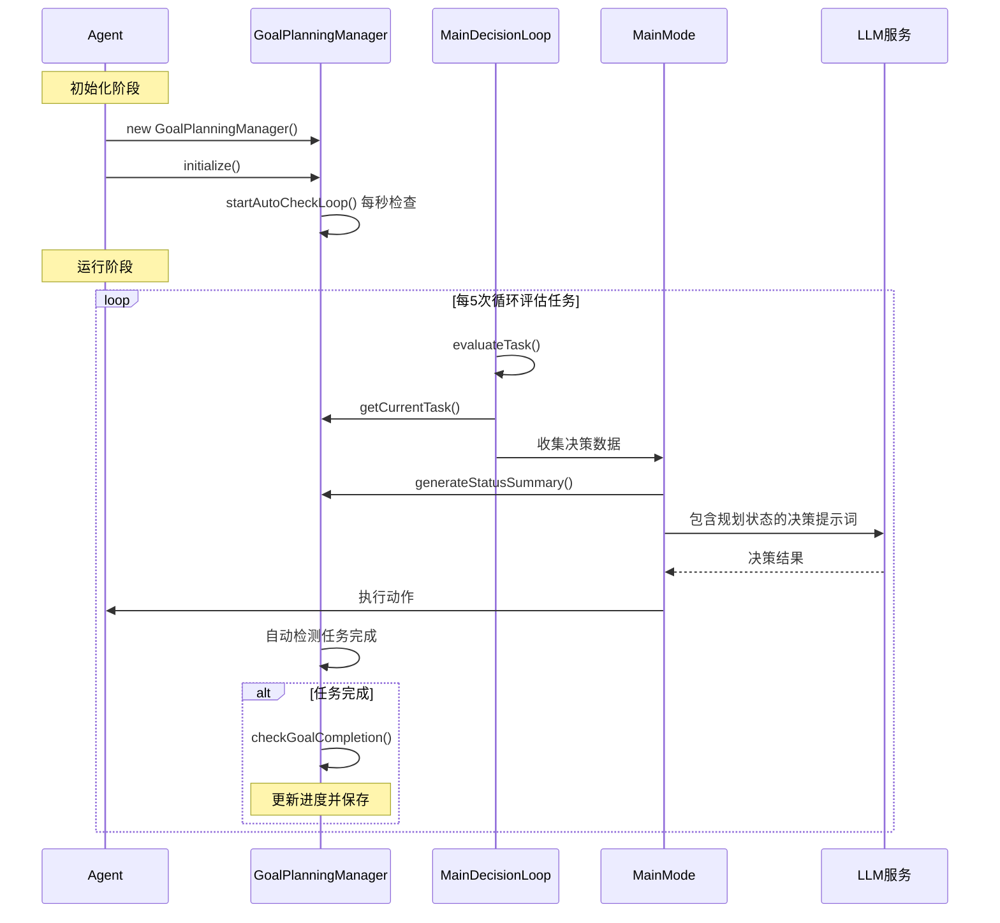

# 规划系统 (Goal-Plan-Task System)

> 本文档介绍 Maicraft-Next 的层次化任务规划系统

---

## 🎯 设计理念

### Maicraft Python 的局限

```python
# ❌ 简单的 to_do_list
todo_list = [
    "收集木头",
    "制作工作台",
    "制作木镐"
]
```

**问题**：

- 扁平结构，无层次关系
- 无法表达任务依赖
- 无进度追踪
- 难以管理复杂任务

### Maicraft-Next 的改进

**三层结构**：Goal → Plan → Task

```typescript
// ✅ 层次化规划
const goal = await planning.createGoal({
  name: '建造房子',
  description: '在当前位置建造一个木质房子',
  priority: 'high',
});

const plan = await planning.createPlan(goal.id, {
  name: '收集材料',
  tasks: [
    { name: '收集64个橡木', tracker: { type: 'inventory', item: 'oak_log', count: 64 } },
    { name: '制作256个木板', tracker: { type: 'inventory', item: 'oak_planks', count: 256 } },
  ],
});

// ✅ 自动进度追踪
console.log(plan.progress); // 45%
```

---

## 🔄 工作流程

### Mermaid 时序图



### 关键代码流程

#### 1. Agent 初始化规划系统

```typescript
// Agent.ts - 初始化
const planningManager = new GoalPlanningManager(gameContext);
await this.state.planningManager.initialize();
```

#### 2. 自动检查循环

```typescript
// GoalPlanningManager.ts - 自动检查
private startAutoCheckLoop(): void {
  this.autoCheckInterval = setInterval(() => {
    this.autoCheckCompletion().catch(error => {
      this.logger.error('自动检查任务完成失败:', {}, error as Error);
    });
  }, 1000); // 每秒检查一次
}
```

#### 3. 决策循环中使用规划状态

```typescript
// MainDecisionLoop.ts - 任务评估
private async evaluateTask(): Promise<void> {
  const { planningManager } = this.state;
  const currentTask = planningManager?.getCurrentTask()?.title || '暂无任务';

  // 构建包含规划状态的评估数据
  const evaluationData = {
    goal: this.state.goal,
    current_task: currentTask,
    // ... 其他数据
  };
}
```

#### 4. 在决策提示词中包含规划信息

```typescript
// PromptDataCollector.ts - 收集规划状态
const planningStatus = planningManager?.generateStatusSummary() || '暂无任务';

// 生成的提示词包含：
// 🎯 当前目标: 建造房子
// 📋 收集材料 (75%)
//   ✅ 收集64个橡木 (100%)
//   🔄 制作256个木板 (50%)
// 🔄 当前任务: 制作256个木板
//    进度: 128/256 橡木板
//    完成条件: 背包中至少有 256 个 oak_planks
```

#### 5. 任务自动完成检测

```typescript
// Task.ts - 自动检测完成
checkCompletion(context: GameContext): boolean {
  const completed = this.tracker.checkCompletion(context);
  if (completed && this.status !== 'completed') {
    this.complete(); // 自动标记完成
  }
  return completed;
}
```

---

## 📐 系统架构

```
Goal (目标)
  ├── Plan 1 (计划)
  │   ├── Task 1.1 (任务)
  │   │   └── Tracker (追踪器)
  │   ├── Task 1.2
  │   │   └── Tracker
  │   └── Task 1.3
  │       └── Tracker
  └── Plan 2
      ├── Task 2.1
      └── Task 2.2
```

### 三层含义

1. **Goal (目标)** - 高层次的目标，如"建造房子"、"探索矿洞"
2. **Plan (计划)** - 实现目标的具体计划，如"收集材料"、"建造地基"
3. **Task (任务)** - 计划中的具体任务，如"收集64个木头"

---

## 💻 基本使用

### 创建目标

```typescript
import { GoalPlanningManager } from '@/core/agent/planning/GoalPlanningManager';

const planning = new GoalPlanningManager(gameContext);

// 创建目标
const goal = await planning.createGoal({
  name: '建造房子',
  description: '在(100, 64, 200)建造一个木质房子',
  priority: 'high',
  metadata: {
    location: { x: 100, y: 64, z: 200 },
    type: 'building',
  },
});
```

### 创建计划

```typescript
// 为目标添加计划
const plan = await planning.createPlan(goal.id, {
  name: '收集材料',
  description: '收集建造所需的木材',
  tasks: [
    {
      name: '收集64个橡木',
      description: '去森林收集橡木原木',
      tracker: {
        type: 'inventory',
        item: 'oak_log',
        count: 64,
      },
    },
    {
      name: '制作256个木板',
      description: '将橡木原木制作成木板',
      tracker: {
        type: 'inventory',
        item: 'oak_planks',
        count: 256,
      },
    },
  ],
});
```

### 追踪进度

```typescript
// 获取进度
const progress = await planning.getProgress(plan.id);
console.log(`计划进度: ${progress}%`);

// 检查任务是否完成
const task = plan.tasks[0];
const isComplete = await planning.checkTaskComplete(task);
console.log(`任务完成: ${isComplete}`);

// 自动更新进度
await planning.updateProgress();
```

### 管理目标

```typescript
// 获取所有目标
const goals = await planning.getAllGoals();

// 获取当前目标
const current = await planning.getCurrentGoal();

// 切换目标
await planning.setCurrentGoal(goal.id);

// 完成目标
await planning.completeGoal(goal.id);

// 取消目标
await planning.cancelGoal(goal.id);
```

---

## 🔧 任务追踪器 (Trackers)

### 内置追踪器类型

#### 1. InventoryTracker - 物品栏追踪

```typescript
{
  type: 'inventory',
  item: 'iron_ore',
  count: 10
}
```

检查物品栏中是否有指定数量的物品。

#### 2. LocationTracker - 位置追踪

```typescript
{
  type: 'location',
  x: 100,
  y: 64,
  z: 200,
  radius: 5
}
```

检查是否到达指定位置（在半径范围内）。

#### 3. CraftTracker - 合成追踪

```typescript
{
  type: 'craft',
  item: 'wooden_pickaxe',
  count: 1
}
```

检查是否完成指定物品的合成。

#### 4. CompositeTracker - 组合追踪

```typescript
{
  type: 'composite',
  operator: 'AND',  // 或 'OR'
  trackers: [
    { type: 'inventory', item: 'diamond', count: 3 },
    { type: 'location', x: 0, y: 64, z: 0, radius: 10 }
  ]
}
```

组合多个追踪器，支持 AND/OR 逻辑。

---

## 🔄 与 Maicraft Python 的对比

| 方面         | Maicraft Python  | Maicraft-Next       |
| ------------ | ---------------- | ------------------- |
| **结构**     | 扁平的 todo_list | 三层 Goal-Plan-Task |
| **层次**     | 无层次关系       | 清晰的层次结构      |
| **进度**     | 无自动追踪       | 自动进度计算        |
| **追踪器**   | 手动检查         | 编程式追踪器        |
| **依赖**     | 无依赖管理       | 支持任务依赖        |
| **复杂任务** | 难以管理         | 易于组织            |

---

## 📚 在 Agent 中使用规划系统

### 在决策循环中

```typescript
// MainDecisionLoop.ts - 实际项目中的使用
async think(): Promise<void> {
  // 1. 定期评估任务（每5次循环）
  if (this.evaluationCounter % 5 === 0) {
    await this.evaluateTask(); // 包含规划状态的评估
  }

  // 2. 执行当前模式逻辑（MainMode）
  await this.executeCurrentMode();
}

// MainMode.ts - 决策时包含规划信息
private async makeDecision(): Promise<void> {
  // 使用 PromptDataCollector 收集包含规划状态的数据
  const promptData = await this.dataCollector!.collectPromptData();

  // promptData.to_do_list 包含规划系统的状态摘要
  const prompt = await this.actionPromptGenerator!.generateActionPrompt({
    ...promptData,
    // 规划状态已自动包含在 to_do_list 中
  });

  const response = await this.llmManager!.chatCompletion(prompt);
  // 执行动作...
}
```

---

## 🚀 最佳实践

### 1. 合理分解任务

```typescript
// ✅ 好：任务具体、可追踪
{
  name: '收集10个铁矿',
  tracker: { type: 'inventory', item: 'iron_ore', count: 10 }
}

// ❌ 差：任务太抽象
{
  name: '准备冒险',
  tracker: null
}
```

### 2. 使用适当的追踪器

```typescript
// ✅ 对于物品收集，使用 inventory tracker
{ type: 'inventory', item: 'iron_ore', count: 10 }

// ✅ 对于移动任务，使用 location tracker
{ type: 'location', x: 100, y: 64, z: 200, radius: 5 }

// ✅ 对于复杂任务，使用 composite tracker
{
  type: 'composite',
  operator: 'AND',
  trackers: [/* 多个追踪器 */]
}
```

### 3. 设置合理的优先级

```typescript
// 紧急任务
await planning.createGoal({
  name: '逃离危险',
  priority: 'critical',
});

// 重要任务
await planning.createGoal({
  name: '建造房子',
  priority: 'high',
});

// 日常任务
await planning.createGoal({
  name: '整理物品栏',
  priority: 'normal',
});
```

### 4. 定期更新进度

```typescript
// 实际项目中自动更新（GoalPlanningManager内部实现）
private startAutoCheckLoop(): void {
  this.autoCheckInterval = setInterval(() => {
    this.autoCheckCompletion().catch(error => {
      this.logger.error('自动检查任务完成失败:', {}, error as Error);
    });
  }, 1000); // 每秒自动检查，无需手动调用
}
```

### 5. 创建规划的实际代码

```typescript
// Agent.ts - 设置目标时自动创建规划
setGoal(description: string): void {
  (this.state as any).goal = description;
  this.state.planningManager.createGoal(description);
  this.logger.info(`🎯 设置新目标: ${description}`);
}

// 在代码中创建具体任务（实际使用时通过LLM生成）
async function createMiningPlan(planningManager: GoalPlanningManager) {
  const goal = planningManager.createGoal('收集钻石');

  const plan = planningManager.createPlan({
    title: '钻石开采计划',
    description: '开采钻石矿石',
    goalId: goal.id,
    tasks: [
      new Task({
        title: '找到钻石矿',
        description: '探索Y=12以下的区域寻找钻石',
        tracker: new LocationTracker(0, 5, 0, 50), // 到达Y=5附近
      }),
      new Task({
        title: '收集钻石矿石',
        description: '挖掘并收集钻石矿石',
        tracker: new InventoryTracker('diamond_ore', 5),
      }),
    ],
  });

  planningManager.setCurrentPlan(plan.id);
}
```

---

## 📚 完整示例

```typescript
// 创建"建造房子"目标
const goal = await planning.createGoal({
  name: '建造房子',
  description: '建造一个简单的木质房子',
  priority: 'high',
});

// 计划1: 收集材料
const plan1 = await planning.createPlan(goal.id, {
  name: '收集材料',
  tasks: [
    {
      name: '收集64个橡木',
      tracker: { type: 'inventory', item: 'oak_log', count: 64 },
    },
    {
      name: '制作256个木板',
      tracker: { type: 'inventory', item: 'oak_planks', count: 256 },
    },
    {
      name: '制作工作台',
      tracker: { type: 'craft', item: 'crafting_table', count: 1 },
    },
  ],
});

// 计划2: 建造地基
const plan2 = await planning.createPlan(goal.id, {
  name: '建造地基',
  tasks: [
    {
      name: '到达建造地点',
      tracker: { type: 'location', x: 100, y: 64, z: 200, radius: 5 },
    },
    {
      name: '放置地基方块',
      tracker: { type: 'custom', checkFn: () => checkFoundation() },
    },
  ],
});

// 自动更新进度
await planning.updateProgress();
console.log(`目标进度: ${goal.progress}%`);
```

---

## 📚 相关文档

- [代理系统](agent-system.md) - 了解规划系统在 Agent 中的使用
- [记忆系统](memory-system.md) - 了解如何配合记忆系统使用

---

_最后更新: 2025-11-01_
